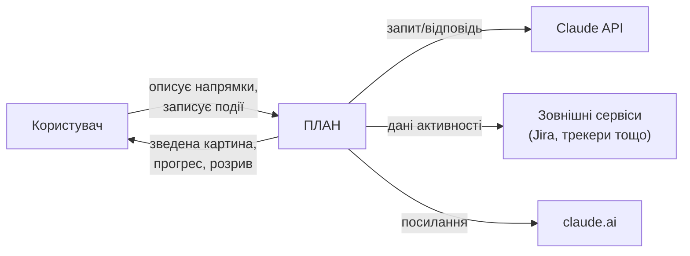
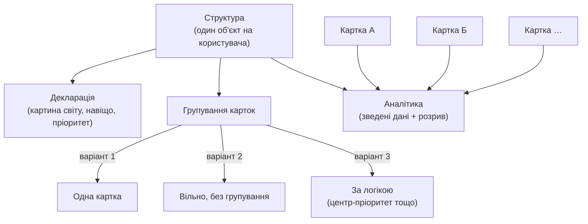
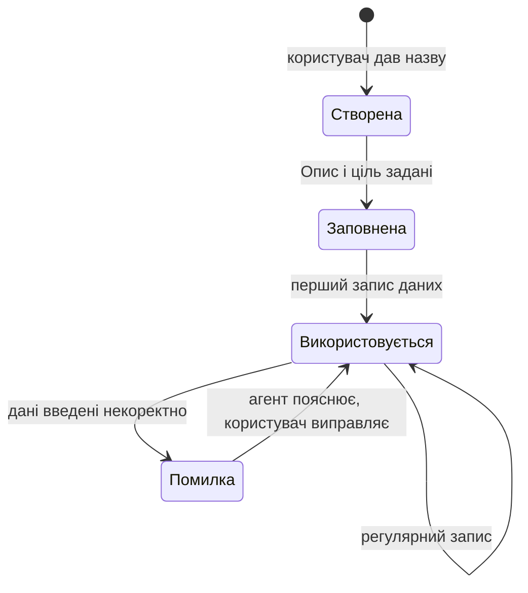
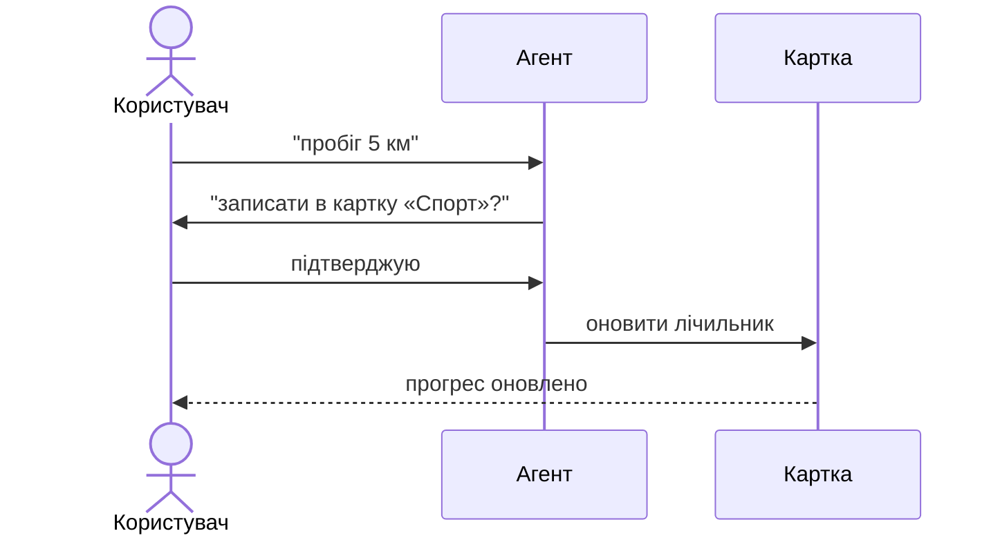
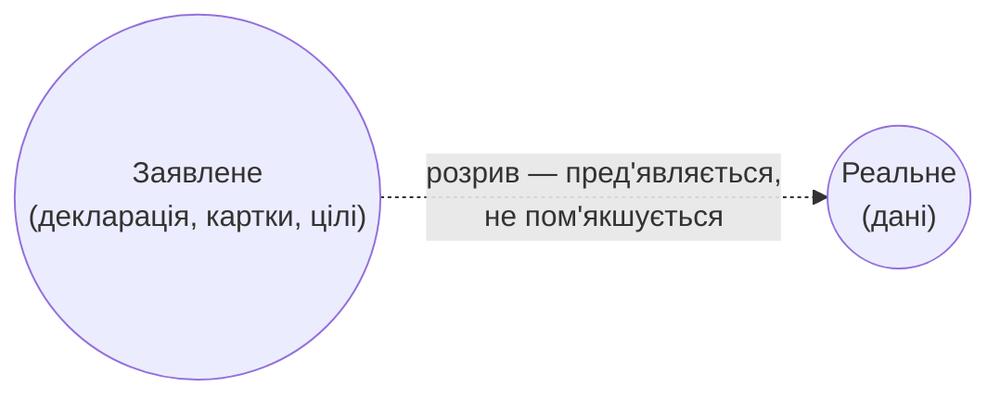

# PRODUCT-BOOK.md — Книга опису продукту ПЛАН

> План книги, статус і шаблон блоку — [DELIVERY-PLAN.md §Книга опису продукту](DELIVERY-PLAN.md), рішення [D-49](DECISIONS.md#d-49), [D-51](DECISIONS.md#d-51). Ця книга — не робочий документ щосесійного контексту (не входить у список «Контекст — прочитати на початку сесії» в `CLAUDE.md`); Клод звертається до неї на редагування, узгодження похідних документів або прямий запит.
>
> Продовження — практична перевірка книги через шлях користувача: [`PRODUCT-BOOK_OWNER-QUESTIONNAIRE.md`](PRODUCT-BOOK_OWNER-QUESTIONNAIRE.md).

**Стан:** книга завершена повністю — усі 4 фази (D-49). Фаза 1 (написання): блоки 1 «Проєкт», 2 «Структура», 3 «Картка», 4 «Агент», 5 «Інстанс», 6 «Філософія» написано й вичитано 2026-08-21/22; розділ «Мовою професій» (п.8, ПРОД-1) — 4 профілі (топ-менеджер, програміст, філософ, педагог — психотерапевта прибрано), затверджено 2026-08-23. Фаза 2 (затвердження): Андрій прочитав книгу цілком і підтвердив 2026-08-23 — «так, це правильно». Фаза 3 (звірка існуючих документів за книгою) — завершена того ж дня.

---

## Блок 1 — Проєкт

**1. Суть**

Сервіс, за допомогою якого користувач формалізує, структурує та веде свій план життя.

**2. Що робить / дає людині**

- Зводить ключові метрики всіх життєвих напрямків в одну картину.
- Показує результативність напрямку у відсотках просування.
- Показує розрив між тим, що людина заявила про себе (декларація, розкладка карток, цілі), і тим, що показують дані (чесно, без пом'якшення).
- Дає можливість оцінити межі ефективності та керувати загальним навантаженням на кожен аспект життя.
- Дозволяє змінювати ієрархію й пріоритетність напрямків.
- Дає рекомендації шкіл, концепцій і методик у профільних напрямках.

**3. Юзер сторі**

- Як людина, аспекти життя якої розкидані по інструментах (таск-трекери, нотатки, календарі), я хочу звести ключові напрямки в одну картину, щоб бачити стан справ цілком, не збираючи це вручну.
- Як людина, що ставить собі цілі, я хочу бачити розрив між заявленим і реальним, щоб чесно оцінювати прогрес, а не лише власне відчуття.
- Як людина з кількома напрямками життя одночасно, я хочу керувати їхньою пріоритетністю, щоб розуміти, чи справді я працюю над важливим.
- Як людина, що веде активний спосіб життя я хочу оцінювати межі моєї ефективності в кожному аспекті.
- Як людина, що хоче бути щасливою, я хочу розподіляти зусилля між тим, що дає прогрес у житті, та відпочинком, увагою до себе й сім'ї.

**4. Юзер кейс**

Кейс 1 — зведення розосереджених даних:
Дано: користувач веде облік прочитаних книг в Excel, а кар'єрні цілі — в нотатнику.
Коли: він заводить у сервіс ПЛАН напрямки «Навчання» й «Кар'єра», задає цілі й починає записувати події через агента.
Тоді: він бачить прогрес по кожному напрямку у відсотках і зведену картину обох одразу — без ручного зведення таблиць.

Кейс 2 — виявлення розриву:
Дано: користувач задекларував «здоров'я» головним пріоритетом і розклав картки відповідно.
Коли: він відкриває аналітику через кілька тижнів.
Тоді: ПЛАН показує, що фактичні дані по «здоров'ю» рухаються повільніше за інші напрямки, попри заявлений пріоритет — і прямо демонструє цей розрив.

**5. Схема**

**6. Межі** (чого тут свідомо немає)

- Технічна архітектура (бекенд, конектори, стек, зберігання) — це ADR і `architecture-map.md`, не рівень продукту.
- Устрій картки й агента (стани, ролі, налаштування) — окремі блоки «Картка» і «Агент» далі в цій книзі.
- Опис мовою різних професій (ПРОД-1) — останній розділ книги, повертаємось до нього наприкінці.

**7. Джерело**

`Product_Brief.md`; `Product_Vision.md` §1, §2, §7–9; `design-review.md` блок 00 (п.1, 3, 4); `idea-brief.md` §1–4; рішення D-42, D-44, D-45.

**8. Мовою різних професій (ПРОД-1)**

Мета розділу — не маркетинг, а перевірка розуміння: якщо продукт не описується чужим словником, значить ми самі не до кінця розуміємо, що це.

**Топ-менеджер.**
**Сервіс ПЛАН — це система стратегічного управління особистим портфелем зон відповідальності, власними нафвжливішими зонами життя.**
Людина визначає ключові напрями життя, їхню пріоритетність, цілі та показники результативності. Сервіс показує динаміку кожного напряму, їхній баланс і конкуренцію за обмежені ресурси — час, увагу та зусилля. Він окремо показує розрив між декларованими пріоритетами та тим, куди ресурси спрямовуються фактично і який результат це дає. Це інструмент стратегічного перегляду, перепріоритизації та балансування життєвих напрямів на основі фактичних показників, а не суб'єктивного відчуття.

**Програміст.**
**Сервіс ПЛАН — це observability-рівень для мого життя як системи.** Людина сама задає її desired state: які частини системи для неї важливі, яких результатів вона хоче і який між ними пріоритет.
Це не таск-трекер окремих дій, а feedback loop над усією системою.
Сервіс збирає фактичний runtime і показує current state: де є рух, як різні частини системи конкурують за спільні ресурси та де виникає drift між тим, що було задекларовано, і тим, як користувач поводиться фактично. Це дає можливість не «дебажити» власне життя за відчуттями, а бачити його поведінку через дані й на цій основі змінювати пріоритети та конфігурацію плану й пріорітетів.

**Філософ.**
**Сервіс ПЛАН — це інструмент практичної перевірки власного уявлення про те, як ти живеш.** Людина формулює, що для неї важливо, яким вона бачить співвідношення різних сфер свого життя і куди хоче рухатись. ПЛАН зіставляє це самовизначення з практикою — з тим, куди фактично йдуть час, увага і зусилля та який рух відбувається в кожній сфері. Так стає видимою дистанція між проголошеними цінностями і способом життя. Сервіс не відповідає на питання,  **як правильно жити** , а дає фактичну основу для рефлексії: чи відповідає мій спосіб дії тому, ким я себе вважаю і що вважаю важливим. Це мета фокус на власне життя.

**Педагог.**
**Сервіс ПЛАН — це система саморегульованого розвитку, в якій людина сама формує свою індивідуальну траєкторію.** Вона визначає напрями, цілі та пріоритети, а сервіс забезпечує постійний моніторинг прогресу й фактичний зворотний зв'язок щодо того, як ця траєкторія реалізується. ПЛАН дозволяє побачити не лише досягнутий результат, а й розбіжність між поставленими цілями, заявленими пріоритетами та реальною діяльністю. Це не зовнішнє оцінювання і не виставлення оцінки — це інструмент рефлексії та самоконтролю, який дає людині дані для корекції власної траєкторії розвитку.

*Сформульовано в діалозі з Андрієм 2026-08-22, за завданням ПРОД-1 ([DELIVERY-PLAN.md](DELIVERY-PLAN.md#прод-1--опис-продукту-словником-3-5-різних-професій)); 4 профілі, затверджено 2026-08-23.*

---

## Блок 2 — Структура

**1. Суть**

Структура — єдиний на користувача об'єкт верхнього рівня: власна декларація «картина світу, навіщо, пріоритет», розташування карток одна відносно одної та зведена аналітика по всіх картках разом.

**2. Що робить / дає людині**

- Користувач сам розкладає картки в порядку, який відображає його реальні пріоритети — вибирає один зі способів розкладки (одна картка / вільно, без порядку / за логікою — наприклад, найважливіше в центрі), і завжди може перетягуванням змінити пізніше.
- Тримає власну декларацію верхнього рівня — картину світу і принципи, за якими діє людина, — окремо від декларації кожної окремої картки.
- Показує зведену аналітику: прогрес усіх карток разом і розрив між заявленим пріоритетом та фактично вкладеними зусиллями.
- Це розташування — єдине, що враховується при підрахунку навантаження і реальної пріоритетності (чи людина справді працює над важливим). Ні на що інше воно не впливає.

**3. Юзер сторі**

- Як людина з кількома напрямками життя, я хочу розташувати картки за власною логікою пріоритетів, щоб бачити структуру свого життя такою, якою я сам її розумію.
- Як людина, що змінює пріоритети з часом, я хочу перетягуванням міняти розташування карток, щоб структура завжди відповідала поточному стану, а не застарілому рішенню.
- Як людина, що хоче чесно оцінювати себе, я хочу бачити зведену аналітику по всіх напрямках одразу, а не заходити в кожну картку окремо.

**4. Юзер кейс**

Кейс 1 — зміна пріоритету:
Дано: користувач тримає картку «Кар'єра» в центрі схеми як головний пріоритет.
Коли: пріоритети в житті змінюються, і «Здоров'я» стає важливішим.
Тоді: користувач перетягує картку «Здоров'я» в центр — Структура одразу враховує нове розташування в оцінці навантаження й фактичної пріоритетності.

Кейс 2 — зведена аналітика:
Дано: у користувача заведено п'ять карток різних напрямків життя.
Коли: він відкриває екран аналітики Структури.
Тоді: бачить прогрес усіх карток одночасно і розрив між заявленими пріоритетами й фактичними даними — без переходу в кожну картку окремо.

**5. Схема**

**6. Межі** (чого тут свідомо немає)

- Устрій самої картки (Опис / Дані / Відстеження) — окремий блок «Картка» далі в цій книзі.
- Механіка агента — як саме він формулює декларацію разом з користувачем і рахує розрив — окремий блок «Агент».
- Пороги «добре / погано» для ефективності метрик — відкрите питання (Q-6), рішення ще нема, тут не описується.

**7. Джерело**

`Product_Vision.md` §6; `design-review.md` блок 2 (Найвищий рівень — Структура; Дві декларації; Зведена таблиця рівнів); рішення D-23, D-25, D-29, D-38, D-44.

---

## Блок 3 — Картка

**1. Суть**

Картка — generic-механізм (один і той самий код для будь-якої зони життя): описує одну зону — здоров'я, кар'єра тощо, — і різниться від картки до картки лише даними, які в неї вносить конкретний користувач.

**2. Що робить / дає людині**

- Тримає мінімальний набір: **Опис** (навіщо ведеться цей напрямок, коротким текстом), **Дані** (метрики — кількість, опційна частота, ціль у часі) і **Відстеження** (тільки цифри й прогрес, без текстового висновку).
- Приймає дані кількома шляхами в один і той самий блок — текстом, голосом чи будь-яким вкладенням, яке приймає Claude (як сам факт запису або як деталізація), у чат з агентом (з підтвердженням) — і з підключених зовнішніх джерел (спортивний трекер, Jira, Google Docs/пошта тощо).
- Проходить кілька станів свого життя — від щойно створеної до тієї, що активно ведеться, — і кожен перехід між ними зберігається з часовою міткою як сигнал реальної роботи, а не просто факт існування запису.
- Один і той самий механізм обслуговує будь-яку нову зону життя — не треба окремо "розробляти" картку під кожен новий напрямок.

**3. Юзер сторі**

- Як людина, що починає новий напрямок життя, я хочу створити картку кількома діями, щоб не витрачати час на технічне налаштування.
- Як людина, що записує прогрес щодня, я хочу просто написати текстом чи надіслати будь-що інше, що розуміє агент, щоб потрібна картка оновилась сама — без ручного заповнення форм.
- Як людина, що іноді помиляється при вводі даних, я хочу відразу почути, в чому проблема, а не виявити помилку значно пізніше.

**4. Юзер кейс**

Кейс 1 — створення картки і перший запис:
Дано: користувач хоче почати вести напрямок «Спорт».
Коли: він створює картку, дає їй назву, коротко описує навіщо (Опис), а потім пише в чат «пробіг 5 км».
Тоді: агент перепитує підтвердження запису, і картка переходить зі стану «заповнена» у стан «використовується» — цифра прогресу оновлюється.

Кейс 2 — помилка вводу:
Дано: користувач веде картку «Фінанси» і вводить суму з опискою.
Коли: агент помічає невідповідність під час запису.
Тоді: агент одразу пояснює, в чому проблема, і просить уточнити — замість того щоб мовчки зберегти помилкові дані.

Кейс 3 — вкладення як факт і як деталізація:
Дано: користувач читає книгу.
Коли: він фотографує сторінку, на якій зупинився, без жодного тексту.
Тоді: агент розпізнає книгу й сторінку з фото і оновлює лічильник — фото замінило запис повністю. Той самий принцип працює для будь-якого вкладення (документ, скрін) і для іншого випадку — коли воно лише доповнює текст деталями, а не замінює його.

**5. Схема**

**6. Межі** (чого тут свідомо немає)

- Механіка агента — як саме він розбирає текст, підтверджує запис і пояснює помилки — окремий блок «Агент».
- Конкретний набір полів кожної реальної картки користувача (чим саме відрізняється «Здоров'я» від «Кар'єри») — окремий блок «Інстанс».
- Пороги «добре / погано» для оцінки метрик — відкрите питання (Q-6), рішення ще нема.
- Максимальна кількість карток і щільність розкладки на схемі — відкриті питання, не вирішено.

**7. Джерело**

`design-review.md` блок 1 (generic-механізм), блок 2 (мінімальний набір Опис/Дані/Відстеження), блок 4 (стани картки), блок 5 (модель метрики); рішення D-23, D-28, D-30, D-31, D-54.

---

## Блок 4 — Агент

**1. Суть**

Агент — один суцільний персонаж, не набір ролей по рівнях: уся взаємодія з ПЛАНом іде через нього, і саме користувач обирає, яким саме цей персонаж буде.

**2. Що робить / дає людині**

- Приймає надходження кількома каналами — текст, голос, будь-яке вкладення, яке приймає Claude, і дані з підключених зовнішніх джерел — і перетворює будь-яке сире надходження на оновлення потрібної картки, завжди з підтвердженням перед записом.
- Дотримується правил користувача — куратоване меню категорій плюс власне сформульоване правило — і спільного для всіх базового системного промпту ПЛАНу.
- За замовчуванням не проявляє ініціативи в житті людини (сам не пропонує нову ціль, не радить без питання); користувач може обрати характер — мовчазний консультант / друг / той, хто мотивує й нагадує — і тоді ініціатива агента стає дорученою, а не самовільною.
- Пам'ятає користувача гібридно: довгострокові значущі рішення й факти плюс коротке сире вікно останніх сесій, щоб не «забувати» щойно сказане раніше, ніж воно встигло стати рішенням.

**3. Юзер сторі**

- Як людина, що не хоче морочитись із формами, я хочу просто сказати, написати чи показати (фото, файл) агенту, що сталось, щоб потрібна картка оновилась сама.
- Як людина зі своїми принципами спілкування, я хочу задати правило на кшталт «не радь мені, якщо я не питаю», щоб агент дотримувався його завжди, а не інколи.
- Як людина, що любить, коли їй нагадують, я хочу обрати характер «друг, що мотивує», щоб агент сам за розкладом ініціював розмову, а не мовчав, поки я не звернусь першим.

**4. Юзер кейс**

Кейс 1 — запис через текст:
Дано: користувач щойно пробіг 5 км і хоче це зафіксувати.
Коли: він пише агенту в чат «пробіг 5 км».
Тоді: агент перепитує «записати в картку "Спорт"?», отримує підтвердження і оновлює лічильник — сам користувач жодної форми не заповнював.

Кейс 2 — правило й характер:
Дано: користувач обрав характер «мовчазний консультант» і додав правило «не радь, якщо не питаю».
Коли: він ділиться подією, не просячи поради.
Тоді: агент лише фіксує подію мовчки, без непроханих порад — бо і правило, і обраний характер це прямо визначають.

**5. Схема**

Sequence-діаграма для кейсу 1 (запис через текст):

**6. Межі** (чого тут свідомо немає)

- Технічна реалізація пам'яті, розпізнавання мови, зображень і файлів та синтезу голосу — рівень архітектури (ADR), не продукту.
- Конкретний перелік підтримуваних форматів вкладень і категорій у меню правил — технічні деталі, тут не розписуються.
- Голосова розмова як окремий канал — заявлена в межах продукту, але економіка й межі використання (Q-11) лишаються відкритим питанням.

**7. Джерело**

`design-review.md` блок 00, блок 2 (Правила агента, Пам'ять), блок 5 (потік запису з підтвердженням); рішення D-25, D-26, D-27, D-31, D-35, D-37, D-41, D-54.

---

## Блок 5 — Інстанс

**1. Суть**

Інстанс — конкретна картка, яку реально завів користувач для своєї зони життя (наприклад, «Здоров'я» чи «Кар'єра»): той самий generic-механізм із блоку «Картка», але вже заповнений даними саме цієї людини.

**2. Що робить / дає людині**

- Ідентифікується назвою, яку бачить користувач (наприклад «Спорт»), і внутрішнім унікальним ідентифікатором під капотом — назву можна змінити будь-коли, ідентифікатор лишається незмінним.
- Наповнюється власним Описом, цілями метрик і фактичними даними — той самий шаблон картки, але значення в ньому належать конкретній зоні життя конкретної людини.
- Дозволяє перевизначити правила агента саме для цієї картки (наприклад, інакше поводитись у «Фінансах», ніж у «Спорті»), якщо базових глобальних налаштувань не досить.
- Отримує допомогу агента при заповненні лише на прямий запит користувача, і перед порадою — обов'язкове уточнювальне опитування, а не готовий шаблон одразу.

**3. Юзер сторі**

- Як людина, що заводить нову картку, я хочу дати їй зрозумілу назву, щоб впізнавати серед інших без плутанини.
- Як людина з різними потребами в різних зонах життя, я хочу задати окреме правило саме для «Фінансів», відмінне від загального, щоб агент поводився доречно саме тут.
- Як людина, що не знає, яку ціль поставити, я хочу попросити агента допомогти саме з цією карткою, щоб отримати пораду під мою ситуацію, а не готовий шаблон.

**4. Юзер кейс**

Кейс 1 — створення нового інстансу:
Дано: користувач хоче почати вести «Фінанси».
Коли: натискає «створити картку», дає назву «Фінанси» — під капотом система одразу присвоює унікальний ідентифікатор.
Тоді: з'являється порожня картка цього типу, готова до заповнення опису й цілей.

Кейс 2 — допомога при заповненні:
Дано: користувач створив картку «Медитація», але не знає, яку ціль поставити.
Коли: він просить агента допомогти.
Тоді: агент спершу опитує («як часто плануєш?», «навіщо це тобі?») і лише тоді пропонує конкретну ціль — а не готовий шаблон одразу.

**5. Схема**

Свідомо пропущено. Інстанс — це перелік полів конкретної картки (назва, ідентифікатор, Опис, дані, перевизначені правила), а не потік дій у часі — діаграма тут не додає розуміння понад те, що вже сказано словами вище.

**6. Межі** (чого тут свідомо немає)

- Сам механізм картки (Опис / Дані / Відстеження, стани життєвого циклу) — блок «Картка» вище, тут не повторюється.
- Бібліотека типів блоків-метрик — деталь рівня «Тип картки» (generic-механізм), не рівня конкретного інстансу.
- Максимальна кількість інстансів на користувача — відкрите питання, тут не вирішується.

**7. Джерело**

`design-review.md` блок 7 (Створення й налаштування інстансу), зведена таблиця рівнів (блок 2); рішення D-23, D-27, D-31.

---

## Блок 6 — Філософія

*Інший шаблон блоку — без юзер сторі й кейсів: проблема у світі → наша відповідь → чому так → схема → джерело. Пункт «мовою різних професій» переїжджає в блок «Проєкт» (крок 7 плану книги).*

**1. Проблема у світі**

Людина, яка намагається тримати своє життя під контролем (веде нотатки, таск-трекери, календарі), стикається з тим, що це життя розмазане між дрібницями й глибиною окремих напрямків — стратегічного рівня, розуміння руху життя в цілому, немає. Дані розподілені між окремими інструментами, а спроби оцінити себе зводяться до суб'єктивного відчуття («здоров'я на 7 з 10»), не до фактів. Існуючі інструменти на ринку йдуть у бік проактивного коучингу — агента, що підштовхує й мотивує, — і жоден не показує чесний факт.

**2. Наша відповідь**

Сервіс ПЛАН показує і рух, і розрив: не лише прогрес по кожному напрямку, а чесну різницю між тим, що людина про себе заявила (декларація, розкладка карток, цілі), і тим, що показують дані — без пом'якшення. Продукт не оцінює й не втішає — пред'являє факт у момент аналізу, а що з ним робити, вирішує сама людина. Структуру свого життя (розкладку карток, пріоритети) задає сама людина, а не нав'язана ззовні рамка.

**3. Чому так**

Самосприйняття й дані розходяться, а комфорт має звичку ховати цей розрив. Якщо продукт пом'якшує розбіжність заради зручності користувача, він перестає бути дзеркалом і починає показувати не факт, а те, що приємно побачити. Тому вибір продукту/рішення на якому базується продукт — чесність важливіша за комфорт, а право розпоряджатись цією чесністю лишається за людиною: агент ніколи не перетворюється на «лайф-коуча», що підштовхує до рішень, а лишається технічним виконавцем. Це і свідома розбіжність із конкретними конкурентами: серед них оцінка себе — суб'єктивний повзунок («здоров'я на 7 з 10»), а не факт, а найжвавіший за проактивністю продукт побудований на коучингу, що сам мотивує й підштовхує. ПЛАН іде проти обох напрямків: показує факт, а не відчуття, і мовчить, поки не спитають.

**4. Схема**

**5. Джерело**

`Product_Vision.md` §1; `idea-brief.md` §2 (Problem), §6 (Competitive analysis); рішення D-31, D-42, D-44.
