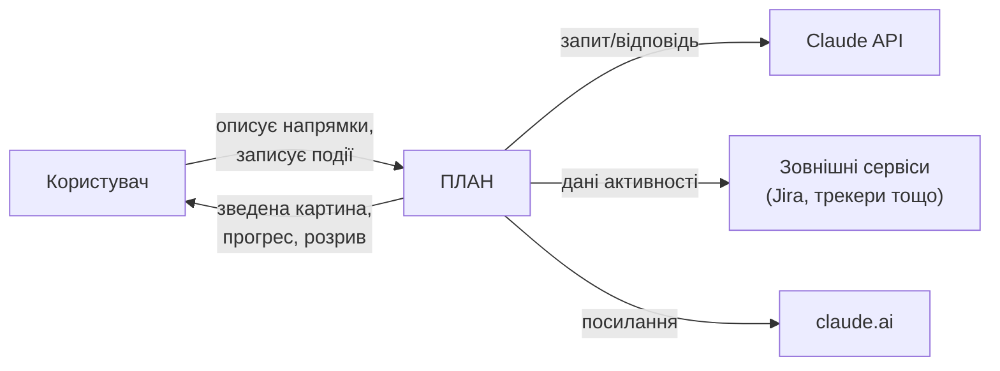
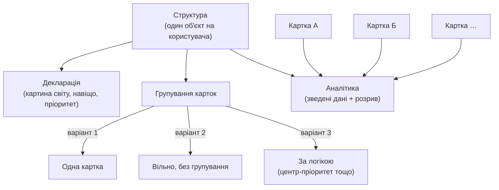
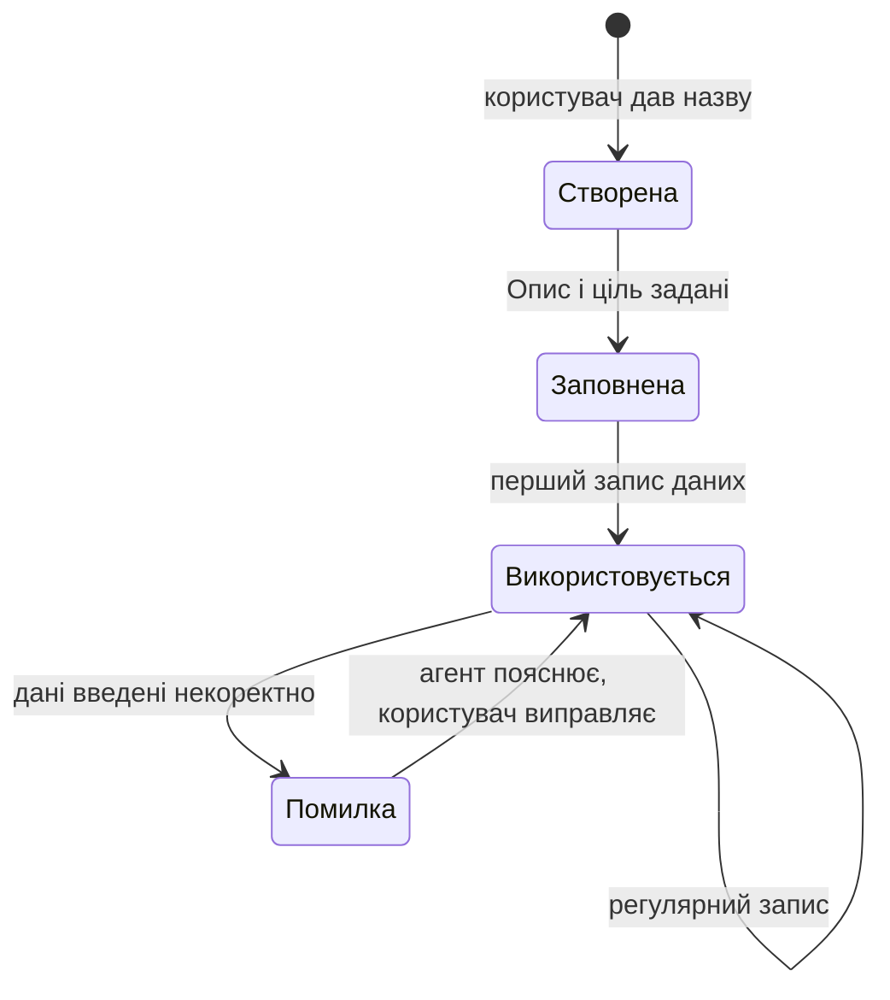

# PRODUCT-BOOK.md — Книга опису продукту ПЛАН

> План книги, статус і шаблон блоку — [DELIVERY-PLAN.md §Книга опису продукту](DELIVERY-PLAN.md), рішення [D-49](DECISIONS.md#d-49), [D-51](DECISIONS.md#d-51). Ця книга — не робочий документ щосесійного контексту (не входить у список «Контекст — прочитати на початку сесії» в `CLAUDE.md`); Клод звертається до неї на редагування, узгодження похідних документів або прямий запит.

**Стан:** у роботі. Блок 1 «Проєкт» і блок 2 «Структура» написано й вичитано 2026-08-21/22. Блок 3 «Картка» написано начорно 2026-08-22 — зараз Андрій читає й дороблює його до кінця. Наступний блок («Агент») стартує після цього.

---

## Блок 1 — Проєкт

**1. Суть**

Сервіс, за допомогою якого користувач формалізує, структурує та веде свій план життя.

**2. Що робить / дає людині**

- Зводить ключові метрики всіх життєвих напрямків в одну картину.
- Показує результативність напрямку у відсотках просування.
- Показує розрив між тим, що людина заявила про себе (декларація, розкладка карток, цілі), і тим, що показують дані (чесно, без пом'якшення).
- Дає можливість оцінити межі ефективності та керувати загальним навантаженням на кожен аспект життя.
- Дозволяє змінювати ієрархію й пріоритетність напрямків.
- Дає рекомендації шкіл, концепцій і методик у профільних напрямках.

**3. Юзер сторі**

- Як людина, аспекти життя якої розкидані по інструментах (таск-трекери, нотатки, календарі), я хочу звести ключові напрямки в одну картину, щоб бачити стан справ цілком, не збираючи це вручну.
- Як людина, що ставить собі цілі, я хочу бачити розрив між заявленим і реальним, щоб чесно оцінювати прогрес, а не лише власне відчуття.
- Як людина з кількома напрямками життя одночасно, я хочу керувати їхньою пріоритетністю, щоб розуміти, чи справді я працюю над важливим.
- Як людина, що веде активний спосіб життя я хочу оцінювати межі моєї ефективності в кожному аспекті.
- Як людина, що хоче бути щасливою, я хочу розподіляти зусилля між тим, що дає прогрес у житті, та відпочинком, увагою до себе й сім'ї.

**4. Юзер кейс**

Кейс 1 — зведення розосереджених даних:
Дано: користувач веде облік прочитаних книг в Excel, а кар'єрні цілі — в нотатнику.
Коли: він заводить у сервіс ПЛАН напрямки «Навчання» й «Кар'єра», задає цілі й починає записувати події через агента.
Тоді: він бачить прогрес по кожному напрямку у відсотках і зведену картину обох одразу — без ручного зведення таблиць.

Кейс 2 — виявлення розриву:
Дано: користувач задекларував «здоров'я» головним пріоритетом і розклав картки відповідно.
Коли: він відкриває аналітику через кілька тижнів.
Тоді: ПЛАН показує, що фактичні дані по «здоров'ю» рухаються повільніше за інші напрямки, попри заявлений пріоритет — і прямо демонструє цей розрив.

**5. Схема**

**6. Межі** (чого тут свідомо немає)

- Технічна архітектура (бекенд, конектори, стек, зберігання) — це ADR і `architecture-map.md`, не рівень продукту.
- Устрій картки й агента (стани, ролі, налаштування) — окремі блоки «Картка» і «Агент» далі в цій книзі.
- Опис мовою різних професій (ПРОД-1) — останній розділ книги, повертаємось до нього наприкінці.

**7. Джерело**

`Product_Brief.md`; `Product_Vision.md` §1, §2, §7–9; `design-review.md` блок 00 (п.1, 3, 4); `idea-brief.md` §1–4; рішення D-42, D-44, D-45.

---

## Блок 2 — Структура

**1. Суть**

Структура — єдиний на користувача об'єкт верхнього рівня: власна декларація «картина світу, навіщо, пріоритет», розташування карток одна відносно одної та зведена аналітика по всіх картках разом.

**2. Що робить / дає людині**

- Користувач сам розкладає картки в порядку, який відображає його реальні пріоритети — вибирає один зі способів розкладки (одна картка / вільно, без порядку / за логікою — наприклад, найважливіше в центрі), і завжди може перетягуванням змінити пізніше.
- Тримає власну декларацію верхнього рівня — картину світу і принципи, за якими діє людина, — окремо від декларації кожної окремої картки.
- Показує зведену аналітику: прогрес усіх карток разом і розрив між заявленим пріоритетом та фактично вкладеними зусиллями.
- Це розташування — єдине, що враховується при підрахунку навантаження і реальної пріоритетності (чи людина справді працює над важливим). Ні на що інше воно не впливає.

**3. Юзер сторі**

- Як людина з кількома напрямками життя, я хочу розташувати картки за власною логікою пріоритетів, щоб бачити структуру свого життя такою, якою я сам її розумію.
- Як людина, що змінює пріоритети з часом, я хочу перетягуванням міняти розташування карток, щоб структура завжди відповідала поточному стану, а не застарілому рішенню.
- Як людина, що хоче чесно оцінювати себе, я хочу бачити зведену аналітику по всіх напрямках одразу, а не заходити в кожну картку окремо.

**4. Юзер кейс**

Кейс 1 — зміна пріоритету:
Дано: користувач тримає картку «Кар'єра» в центрі схеми як головний пріоритет.
Коли: пріоритети в житті змінюються, і «Здоров'я» стає важливішим.
Тоді: користувач перетягує картку «Здоров'я» в центр — Структура одразу враховує нове розташування в оцінці навантаження й фактичної пріоритетності.

Кейс 2 — зведена аналітика:
Дано: у користувача заведено п'ять карток різних напрямків життя.
Коли: він відкриває екран аналітики Структури.
Тоді: бачить прогрес усіх карток одночасно і розрив між заявленими пріоритетами й фактичними даними — без переходу в кожну картку окремо.

**5. Схема**

**6. Межі** (чого тут свідомо немає)

- Устрій самої картки (Опис / Дані / Відстеження) — окремий блок «Картка» далі в цій книзі.
- Механіка агента — як саме він формулює декларацію разом з користувачем і рахує розрив — окремий блок «Агент».
- Пороги «добре / погано» для ефективності метрик — відкрите питання (Q-6), рішення ще нема, тут не описується.

**7. Джерело**

`Product_Vision.md` §6; `design-review.md` блок 2 (Найвищий рівень — Структура; Дві декларації; Зведена таблиця рівнів); рішення D-23, D-25, D-29, D-38, D-44.

---

## Блок 3 — Картка

**1. Суть**

Картка — generic-механізм (один і той самий код для будь-якої зони життя): описує одну зону — здоров'я, кар'єра тощо, — і різниться від картки до картки лише даними, які в неї вносить конкретний користувач.

**2. Що робить / дає людині**

- Тримає мінімальний набір: **Опис** (навіщо ведеться цей напрямок, коротким текстом), **Дані** (метрики — кількість, опційна частота, ціль у часі) і **Відстеження** (тільки цифри й прогрес, без текстового висновку).
- Приймає дані двома шляхами в один і той самий блок — вручну через чат з агентом (з підтвердженням) і з підключених зовнішніх джерел (спортивний трекер, Jira тощо).
- Проходить кілька станів свого життя — від щойно створеної до тієї, що активно ведеться, — і кожен перехід між ними зберігається з часовою міткою як сигнал реальної роботи, а не просто факт існування запису.
- Один і той самий механізм обслуговує будь-яку нову зону життя — не треба окремо "розробляти" картку під кожен новий напрямок.

**3. Юзер сторі**

- Як людина, що починає новий напрямок життя, я хочу створити картку кількома діями, щоб не витрачати час на технічне налаштування.
- Як людина, що записує прогрес щодня, я хочу просто написати текстом «прочитав книгу» в чат, щоб потрібна картка оновилась сама — без ручного заповнення форм.
- Як людина, що іноді помиляється при вводі даних, я хочу відразу почути, в чому проблема, а не виявити помилку значно пізніше.

**4. Юзер кейс**

Кейс 1 — створення картки і перший запис:
Дано: користувач хоче почати вести напрямок «Спорт».
Коли: він створює картку, дає їй назву, коротко описує навіщо (Опис), а потім пише в чат «пробіг 5 км».
Тоді: агент перепитує підтвердження запису, і картка переходить зі стану «заповнена» у стан «використовується» — цифра прогресу оновлюється.

Кейс 2 — помилка вводу:
Дано: користувач веде картку «Фінанси» і вводить суму з опискою.
Коли: агент помічає невідповідність під час запису.
Тоді: агент одразу пояснює, в чому проблема, і просить уточнити — замість того щоб мовчки зберегти помилкові дані.

**5. Схема**

**6. Межі** (чого тут свідомо немає)

- Механіка агента — як саме він розбирає текст, підтверджує запис і пояснює помилки — окремий блок «Агент».
- Конкретний набір полів кожної реальної картки користувача (чим саме відрізняється «Здоров'я» від «Кар'єри») — окремий блок «Інстанс».
- Пороги «добре / погано» для оцінки метрик — відкрите питання (Q-6), рішення ще нема.
- Максимальна кількість карток і щільність розкладки на схемі — відкриті питання, не вирішено.

**7. Джерело**

`design-review.md` блок 1 (generic-механізм), блок 2 (мінімальний набір Опис/Дані/Відстеження), блок 4 (стани картки), блок 5 (модель метрики); рішення D-23, D-28, D-30, D-31.
