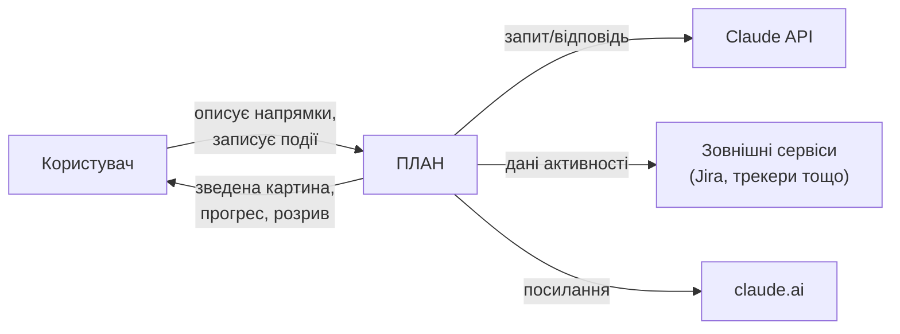

# PRODUCT-BOOK.md — Книга опису продукту ПЛАН

> План книги, статус і шаблон блоку — [DELIVERY-PLAN.md §Книга опису продукту](DELIVERY-PLAN.md), рішення [D-49](DECISIONS.md#d-49), [D-51](DECISIONS.md#d-51). Ця книга — не робочий документ щосесійного контексту (не входить у список «Контекст — прочитати на початку сесії» в `CLAUDE.md`); Клод звертається до неї на редагування, узгодження похідних документів або прямий запит.

**Стан:** у роботі. Блок 1 «Проєкт» написано начорно 2026-08-21 — зараз Андрій читає й дороблює його до кінця. Наступний блок («Структура») стартує після цього.

---

## Блок 1 — Проєкт

**1. Суть**

Сервіс, за допомогою якого користувач описує та веде свій план життя.

**2. Що робить / дає людині**

- Зводить ключові метрики всіх життєвих напрямків в одну картину й показує рух кожного у відсотках просування.
- Показує розрив між тим, що людина заявила про себе (декларація, розкладка карток, цілі), і тим, що показують дані — чесно, без пом'якшення.
- Дозволяє змінювати ієрархію й пріоритетність напрямків, коли міняється саме життя.
- Дає рекомендації шкіл, концепцій і методик у профільних напрямках.

**3. Юзер сторі**

- Як людина, чиє життя розкидане по інструментах (таск-трекери, нотатки, календарі), я хочу звести ключові напрямки в одну картину, щоб бачити стан справ цілком, не збираючи це вручну.
- Як людина, що ставить собі цілі, я хочу бачити розрив між заявленим і реальним, щоб чесно оцінювати прогрес, а не лише власне відчуття.
- Як людина з кількома напрямками життя одночасно, я хочу керувати їхньою пріоритетністю, щоб розуміти, чи справді я працюю над важливим.

**4. Юзер кейс**

Кейс 1 — зведення розкиданих даних:
Дано: користувач веде облік прочитаних книг в Excel, а кар'єрні цілі — в нотатнику.
Коли: він заводить у ПЛАН напрямки «Навчання» й «Кар'єра», задає цілі й починає записувати події через агента.
Тоді: він бачить прогрес по кожному напрямку у відсотках і зведену картину обох одразу — без ручного зведення таблиць.

Кейс 2 — виявлення розриву:
Дано: користувач задекларував «здоров'я» головним пріоритетом і розклав картки відповідно.
Коли: він відкриває аналітику через кілька тижнів.
Тоді: ПЛАН показує, що фактичні дані по «здоров'ю» рухаються повільніше за інші напрямки, попри заявлений пріоритет — і прямо демонструє цей розрив.

**5. Схема**

**6. Межі** (чого тут свідомо немає)

- Технічна архітектура (бекенд, конектори, стек, зберігання) — це ADR і `architecture-map.md`, не рівень продукту.
- Устрій картки й агента (стани, ролі, налаштування) — окремі блоки «Картка» і «Агент» далі в цій книзі.
- Опис мовою різних професій (ПРОД-1) — останній розділ книги, повертаємось до нього наприкінці.

**7. Джерело**

`Product_Brief.md`; `Product_Vision.md` §1, §2, §7–9; `design-review.md` блок 00 (п.1, 3, 4); `idea-brief.md` §1–4; рішення D-42, D-44, D-45.
