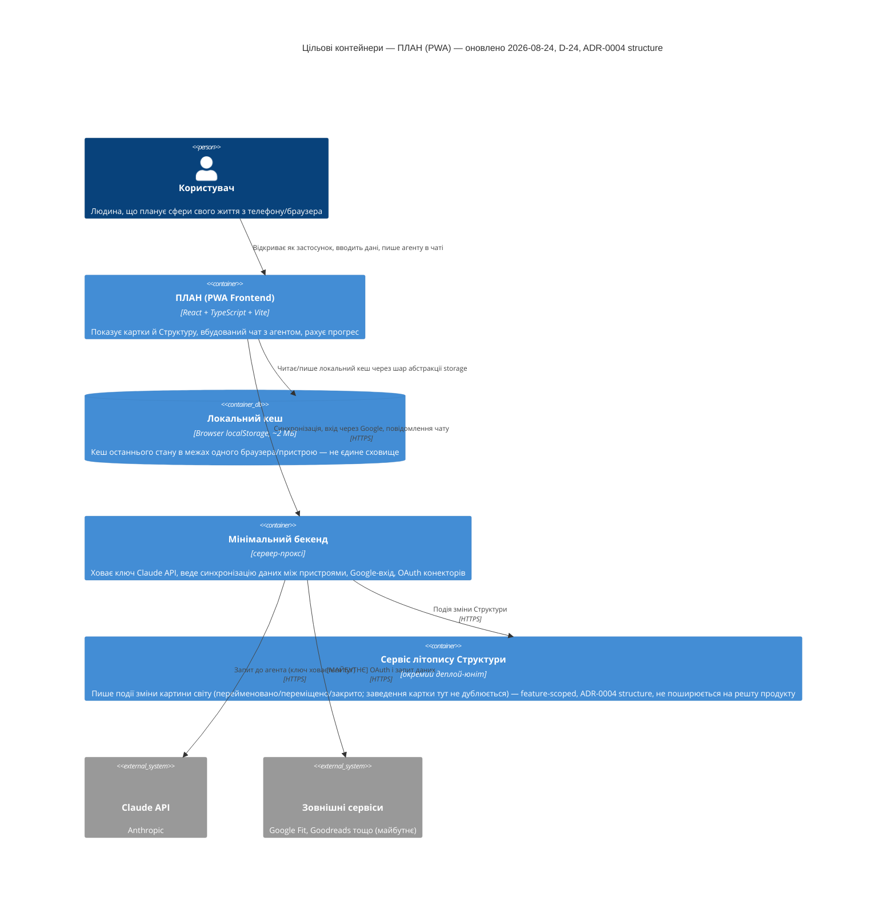

# Architecture map — ПЛАН (claude-workspace)

> Це **фундамент-ціль** (target baseline) для нового проєкту "ПЛАН" — застосунку з "картками", що допомагають людині планувати різні сфери життя (навчання, здоров'я, кар'єра тощо). Перша картка — `life-area-card`, **generic/universal тип** ([DECISIONS D-23](./DECISIONS.md)): один код, дані користувача (наприклад «Навчання» — прогрес книг/курсів/сертифікацій) — лише приклад наповнення, не жорсткий домен. Мапу згенеровано `survey` під час foundation-сесії (greenfield-режим, бо репозиторій був порожній); технічні описи нижче писались до вибору generic-моделі й бекенда (D-23…D-33) — оновлено 2026-08-16 у ключових місцях, позначено де саме. **Оновлено 2026-08-18 (D-37…D-39):** характер агента обирає користувач; прогрес рахується через частки виконання цілей, одиниці між собою не складаються; з'явилась нова сутність даних — історія змін Структури (див. «Сховища даних»). **Оновлено 2026-08-24 (`/sdd:design structure`):** Структура спроєктована архітектурно — власний модуль `structure/` (не `shared/priority/`), клієнтський перерахунок агрегату, last-write-wins синхронізація офлайн-конфліктів, і новий контейнер — окремий сервіс літопису Структури (feature-scoped рішення, `structure/adr/0004`, не поширюється на решту продукту). Деталі: [`features/structure/sad.md`](features/structure/sad.md). `implement` матеріалізує цей план у реальний код через `docs/features/_scaffold/tasks.json`. Рішення нижче взято з РЕКОМЕНДОВАНИХ ("Recommended") варіантів, бо користувач не встиг підтвердити питання (був відсутній). **Це чернетка для перегляду** — онови файл або скажи мені перегенерувати його, якщо щось хочеш змінити.

## Стек (Stack)

- Мова / рантайм: TypeScript (типізований JavaScript — типи ловлять помилки ДО запуску програми) на Node.js (для інструментів збірки; сам застосунок працює в браузері)
- Фреймворк: React 18+ (компонентна бібліотека для інтерфейсу — кожна "картка" = один React-компонент)
- Збірка / dev-сервер: Vite (швидкий інструмент, який запускає застосунок локально та збирає його для продакшн)
- Доступ на телефоні: PWA (Progressive Web App — сайт, який браузер телефону дозволяє "встановити" як іконку на головний екран; працює на весь екран, частково офлайн)
- Стилізація: Tailwind CSS (набір готових CSS-класів прямо в розмітці — швидко верстати картки, що перевертаються, і адаптивність під телефон)
- Тести: Vitest + React Testing Library (стандартна пара тестових інструментів для проєктів на Vite)
- Лінтер / форматер: ESLint + Prettier (автоматично ловлять помилки стилю коду та вирівнюють форматування)
- Дані: `localStorage` як локальний кеш (~2 МБ, через окремий шар абстракції) + мінімальний бекенд-сервер, що ховає ключ Claude API, веде синхронізацію між пристроями й Google-вхід ([D-24](./DECISIONS.md), оновлено 2026-08-16 — раніше тут стояло «без бекенду на старті»)
- База бекенда: PostgreSQL ([D-59](./DECISIONS.md#d-59), [ADR-0005](./adr/0005-backend-datastore.md), оновлено 2026-08-23) — джерело правди для даних карток і синхронізації, поверх безкоштовного хостингу (Supabase/Neon/Render) на цьому етапі

## C4 — цільова система (що будуємо)

## Інвентар модулів (цільовий)

| Модуль | Шлях | Шари | Де підключається | Відповідальність |
|---|---|---|---|---|
| app-shell | `plan/app/src/app/` | UI-shell | `plan/app/src/app/main.tsx` | Кореневий layout, сітка карток, навігація між картками |
| card:life-area-card | `plan/app/src/cards/life-area-card/` | UI + логіка розрахунку | `plan/app/src/app/main.tsx` (реєстрація картки) | **Generic**: довільна назва й Опис, довільна кількість блоків-метрик (кількість + опційна частота + ціль у часі) → розрахунок прогресу (факт/ціль × 100%) → відображення на звороті картки. «Навчання» (книга/курс/сертифікація) — приклад наповнення, не жорсткий тип |
| shared/ui | `plan/app/src/shared/ui/` | UI-примітиви | імпортується картками | Спільна "картка, що перевертається" (CardShell), кнопки, поля вводу |
| shared/storage | `plan/app/src/shared/storage/` | доступ до даних | імпортується картками | Абстракція над `localStorage` (тепер кеш) — підміняється на виклик бекенда без переписування UI |
| structure | `plan/app/src/structure/` | UI + логіка агрегату | `plan/app/src/app/main.tsx` (реєстрація, окремо від `cards/`) | Єдиний на користувача об'єкт: декларація «картина світу», розкладка карток (3 режими), екран Літопис-Аналітика (зведені числа). Не generic-картка й не розмножується (D-29). Власний топ-рівень модуль замість заготовки `shared/priority/` — [ADR-0003 structure](features/structure/adr/0003-own-top-level-structure-module.md) |
| app/backend-client | `plan/app/src/shared/backend/` (заготовка, ще не створена) | мережа | імпортується `app/` | **Нове (D-24):** клієнт до мінімального бекенда — синхронізація, чат з агентом, Google-вхід |

## Конвенції (правила, яким має відповідати нова картка)

- **Реєстрація картки-типу:** `life-area-card` — один код назавжди (`domain/`, `ui/`, `index.ts`), зареєстрований у `plan/app/src/app/main.tsx`. **Нова картка користувача — це новий запис даних, не нова папка коду** ([D-23](./DECISIONS.md), оновлено 2026-08-16). Правило залежностей — [ADR-0004](./adr/0004-scaffold-architecture.md)
- **Обробка помилок:** валідація вводу всередині картки, повідомлення про помилку показується прямо на лицьовій стороні картки (не alert/confirm — вони блокують інтерфейс)
- **ID:** `crypto.randomUUID()` для будь-яких записів, що зберігаються (наприклад, позиція навчання)
- **Зберігання даних:** тільки через `plan/app/src/shared/storage/` (жодна картка не звертається до `localStorage` напряму) — це і є "шар абстракції", що дозволить пізніше підключити бекенд
- **Версія схеми сховища:** ключ `schemaVersion` в `localStorage`, що дозволяє в майбутньому мігрувати старі збережені дані на новий формат
- **Тести:** `*.test.tsx` поруч із компонентом; логіку розрахунків (чисті функції) тестуємо окремо від UI
- **Міжмодульна комунікація:** прямі React-пропси/контекст в межах картки; спільний стан між картками (майбутній `shared/priority`) — через React Context
- **UI / стилізація:** Tailwind CSS, спільні примітиви з `plan/app/src/shared/ui/` (в першу чергу — `CardShell`, компонент картки, що перевертається)

## Сховища даних

| Сховище | Рушій | Доступ через | Примітки |
|---|---|---|---|
| Локальний кеш браузера | `localStorage` (Web Storage API), ~2 МБ | `plan/app/src/shared/storage/` | Кеш останнього стану, не єдине сховище |
| База на бекенді | PostgreSQL, сервер-проксі (D-24, [D-59](./DECISIONS.md#d-59)) | `plan/app/src/shared/backend/` (заготовка) | Джерело правди для синхронізації між пристроями; без жорсткого ліміту, на відміну від кешу |
| Сховище літопису Структури | Окрема база/схема (конкретний рушій — предмет `data-model`), окремий деплой-юніт | сервіс літопису Структури ([ADR-0004 structure](features/structure/adr/0004-separate-service-for-structure-history-log.md)) | **Уточнено 2026-08-24 — оновлює попередній запис.** Історія змін Структури (D-39) — події з часовою міткою (перейменовано / переміщено / закрито; заведення картки тут не дублюється — воно вже в історії самої картки), які пишуться з першого дня, хоч показуються пізніше — тепер живе в окремому сервісі, НЕ в базі мінімального бекенда, як передбачалось раніше. Feature-scoped рішення (`structure`), не поширюється на решту продукту |

## Migrations

СУБД — PostgreSQL ([D-59](./DECISIONS.md#d-59), [ADR-0005](./adr/0005-backend-datastore.md)). Конкретний інструмент міграцій (наприклад `node-pg-migrate`, `Prisma Migrate`, `golang-migrate` тощо) ще не обраний — бекенд жодного разу не піднімався (DELIVERY-PLAN «Розробка» 5%). Скіли, що генерують SQL-міграції (`sdd:data-model`), поки що **staging-ують** їх у `docs/features/<slug>/migrations/` з фіче-локальною нумерацією — `implement` призначить реальний номер і підключить конкретний інструмент, коли бекенд вперше scaffold-иться.

## Frontend / UI foundation (цільовий — тільки-но починаємо)

- **Component library / design system:** власний, в `plan/app/src/shared/ui/` (стартуємо з нуля — проєкт новий)
- **Design tokens:** Tailwind-конфіг, `tailwind.config.ts` (кольори/відступи/типографіка задаються там)
- **Styling approach:** Tailwind CSS (utility-класи прямо в JSX)
- **Shared primitives:** `CardShell` (картка, що перевертається — flip-анімація), `Button`, `NumberField`, `TextField` — усі в `plan/app/src/shared/ui/`
- **State / data-fetching:** React `useState`/`useContext` для локального стану; чи додавати React Query під запити до бекенда — рішення ще не ухвалено, мережевий API тепер реальний (D-24), а не гіпотетичний
- **Closest UI precedent:** ще немає (перша картка `life-area-card` стане еталоном для наступних карток)

## Де жити новій фічі / найближчі прецеденти

- Нова картка користувача (здоров'я/кар'єра/…) → новий запис даних через уже наявний `life-area-card`, **не нова папка коду** (D-23)
- Новий тип блоку-метрики (не лише «кількість+ціль», наприклад нотатка) → бібліотека типів усередині `life-area-card/domain/`, без переписування коду інших карток (D-23, п.2)
- Новий спільний UI-примітив → `plan/app/src/shared/ui/`, за зразком `CardShell`
- Інтеграція з конектором (Google Fit, Goodreads тощо) → через мінімальний бекенд (D-24), не напряму з браузера — OAuth-токени зберігаються на сервері

## Обмеження та відомий технічний борг

- **Синхронізація тепер є (D-24)** — попередній запис «дані не синхронізуються» застарів; актуальний компроміс — локальний кеш ~2 МБ, база на бекенді без такого ліміту
- Прогрес переважно вводиться вручну/через чат з агентом; готових інтеграцій конекторів (Google Fit, Goodreads тощо) ще немає — місце під них закладено на рівні бекенда (D-24), конкретні інтеграції не реалізовані
- Структура (D-29) тепер повністю спроєктована архітектурно — [`features/structure/sad.md`](features/structure/sad.md) (§4–§5: клієнтський перерахунок агрегату, last-write-wins синхронізація, окремий модуль `structure/`, окремий сервіс літопису); реалізації (`implement`) ще не було

## Узгодження з авторським документом архітектури

Авторського `docs/architecture.md` в репозиторії не було — цей файл є першоджерелом (foundation), від якого відштовхуються всі наступні фічі.
