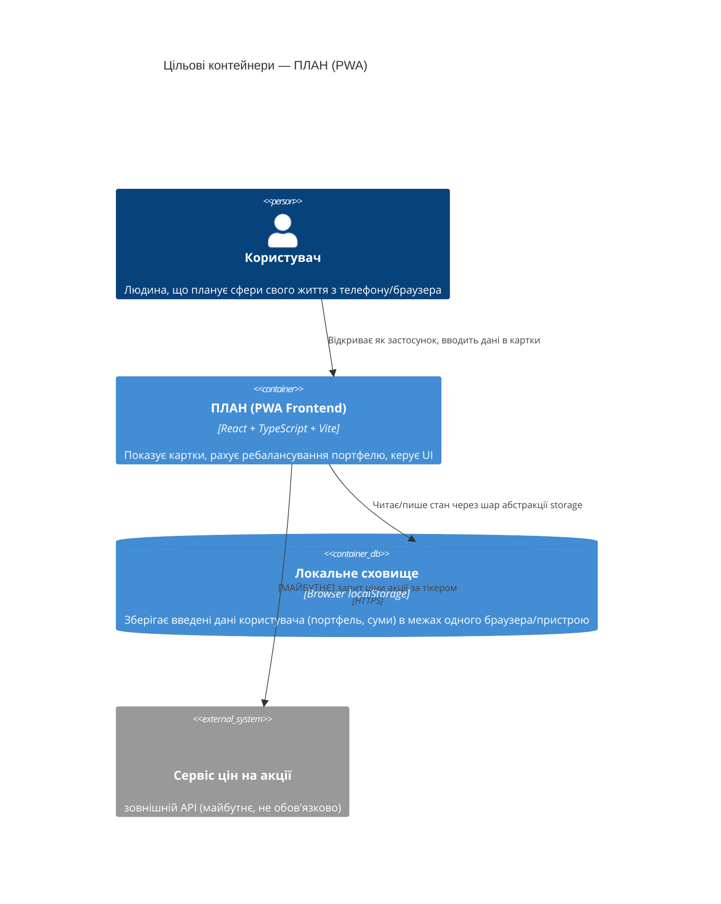

# Architecture map — ПЛАН (claude-workspace)

> Це **фундамент-ціль** (target baseline) для нового проєкту "ПЛАН" — застосунку з "картками",
> що допомагають людині планувати різні сфери життя (фінанси, здоров'я, кар'єра тощо). Перша
> картка — калькулятор ребалансування портфелю акцій. Мапу згенеровано `survey` під час
> foundation-сесії (greenfield-режим, бо репозиторій був порожній). `implement` матеріалізує цей
> план у реальний код через `plan/features/_scaffold/tasks.json`.
>
> Рішення нижче взято з РЕКОМЕНДОВАНИХ ("Recommended") варіантів, бо користувач не встиг
> підтвердити питання (був відсутній). **Це чернетка для перегляду** — онови файл або скажи мені
> перегенерувати його, якщо щось хочеш змінити.

## Стек (Stack)

- Мова / рантайм: TypeScript (типізований JavaScript — типи ловлять помилки ДО запуску програми) на Node.js (для інструментів збірки; сам застосунок працює в браузері)
- Фреймворк: React 18+ (компонентна бібліотека для інтерфейсу — кожна "картка" = один React-компонент)
- Збірка / dev-сервер: Vite (швидкий інструмент, який запускає застосунок локально та збирає його для продакшн)
- Доступ на телефоні: PWA (Progressive Web App — сайт, який браузер телефону дозволяє "встановити" як іконку на головний екран; працює на весь екран, частково офлайн)
- Стилізація: Tailwind CSS (набір готових CSS-класів прямо в розмітці — швидко верстати картки, що перевертаються, і адаптивність під телефон)
- Тести: Vitest + React Testing Library (стандартна пара тестових інструментів для проєктів на Vite)
- Лінтер / форматер: ESLint + Prettier (автоматично ловлять помилки стилю коду та вирівнюють форматування)
- Дані: без бекенду на старті — все зберігається локально в браузері (`localStorage`) через окремий шар абстракції (деталі нижче)

## C4 — цільова система (що будуємо)

## Інвентар модулів (цільовий)

| Модуль | Шлях | Шари | Де підключається | Відповідальність |
|---|---|---|---|---|
| app-shell | `plan/app/src/app/` | UI-shell | `plan/app/src/app/main.tsx` | Кореневий layout, сітка карток, навігація між картками |
| card:portfolio-rebalancing-card | `plan/app/src/cards/portfolio-rebalancing-card/` | UI + логіка розрахунку | `plan/app/src/app/main.tsx` (реєстрація картки) | Введення портфелю/акцій → розрахунок цільових часток (закріплені задаються вручну, вільні ділять залишок порівну) → рекомендація докупити/продати в цілих штуках |
| shared/ui | `plan/app/src/shared/ui/` | UI-примітиви | імпортується картками | Спільна "картка, що перевертається" (CardShell), кнопки, поля вводу |
| shared/storage | `plan/app/src/shared/storage/` | доступ до даних | імпортується картками | Абстракція над `localStorage` — щоб пізніше підмінити на бекенд без переписування UI |
| shared/priority | `plan/app/src/shared/priority/` (заготовка, не будується в MVP) | доступ до даних | — | МАЙБУТНЄ: спільна модель пріоритету/виконання плану для всіх карток |

## Конвенції (правила, яким має відповідати нова картка)

- **Реєстрація картки:** нова картка = нова папка в `plan/app/src/cards/<назва>/` з `domain/` (чисті правила, без React), `ui/` (React-компоненти) і `index.ts` (публічний вхід), зареєстрована в `plan/app/src/app/main.tsx`. Правило залежностей — [ADR-0004](./adr/0004-scaffold-architecture.md)
- **Обробка помилок:** валідація вводу всередині картки, повідомлення про помилку показується прямо на лицьовій стороні картки (не alert/confirm — вони блокують інтерфейс)
- **ID:** `crypto.randomUUID()` для будь-яких записів, що зберігаються (наприклад, рядок портфелю)
- **Зберігання даних:** тільки через `plan/app/src/shared/storage/` (жодна картка не звертається до `localStorage` напряму) — це і є "шар абстракції", що дозволить пізніше підключити бекенд
- **Версія схеми сховища:** ключ `schemaVersion` в `localStorage`, що дозволяє в майбутньому мігрувати старі збережені дані на новий формат
- **Тести:** `*.test.tsx` поруч із компонентом; логіку розрахунків (чисті функції) тестуємо окремо від UI
- **Міжмодульна комунікація:** прямі React-пропси/контекст в межах картки; спільний стан між картками (майбутній `shared/priority`) — через React Context
- **UI / стилізація:** Tailwind CSS, спільні примітиви з `plan/app/src/shared/ui/` (в першу чергу — `CardShell`, компонент картки, що перевертається)

## Сховища даних

| Сховище | Рушій | Доступ через | Примітки |
|---|---|---|---|
| Локальне сховище браузера | `localStorage` (Web Storage API) | `plan/app/src/shared/storage/` | Дані живуть лише на одному пристрої/браузері; немає синхронізації; майбутній бекенд — окреме ADR |

## Frontend / UI foundation (цільовий — тільки-но починаємо)

- **Component library / design system:** власний, в `plan/app/src/shared/ui/` (стартуємо з нуля — проєкт новий)
- **Design tokens:** Tailwind-конфіг, `tailwind.config.ts` (кольори/відступи/типографіка задаються там)
- **Styling approach:** Tailwind CSS (utility-класи прямо в JSX)
- **Shared primitives:** `CardShell` (картка, що перевертається — flip-анімація), `Button`, `NumberField`, `TextField` — усі в `plan/app/src/shared/ui/`
- **State / data-fetching:** React `useState`/`useContext` для локального стану; React Query — НЕ додаємо, поки немає реального мережевого API (додасться разом з майбутнім бекендом/stockApi)
- **Closest UI precedent:** ще немає (перша картка `portfolio-rebalancing-card` стане еталоном для наступних карток)

## Де жити новій фічі / найближчі прецеденти

- Нова "картка" (фінанси/здоров'я/кар'єра) → `plan/app/src/cards/<slug>/`, за зразком `portfolio-rebalancing-card` (перший прецедент, буде створено при `implement` фічі)
- Новий спільний UI-примітив → `plan/app/src/shared/ui/`, за зразком `CardShell`
- Майбутня інтеграція з зовнішнім API цін на акції → окремий модуль `plan/app/src/shared/stock-price/` + ADR про спосіб виклику (напряму з браузера чи через невеликий сервер-проксі, залежно від CORS-обмежень постачальника даних)

## Обмеження та відомий технічний борг

- Дані не синхронізуються між пристроями (свідомий компроміс MVP, зафіксовано в ADR-0003) — новий пристрій = порожній портфель
- Ціна акції вводиться вручну (немає ще підключення до зовнішнього API) — закладено місце (`shared/stock-price/`), але не реалізовано
- Спільна модель "пріоритету та виконання плану" між картками (§Мета проєкту) — ще не спроєктована, лише зарезервоване місце `shared/priority/`; дизайн — окрема майбутня фіча

## Узгодження з авторським документом архітектури

Авторського `docs/architecture.md` в репозиторії не було — цей файл є першоджерелом (foundation), від якого відштовхуються всі наступні фічі.
