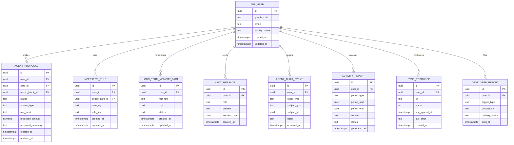

# Data model — agent

> База: PostgreSQL ([D-59](../../DECISIONS.md#d-59), [ADR-0005](../../adr/0005-backend-datastore.md)), той самий інстанс, що й `life-area-card`/`structure` — worker читає ту саму базу за власним розкладом ([ADR-0002](adr/0002-shared-database-plus-schedule-for-worker.md)), довгострокова пам'ять живе поруч із картками ([ADR-0003](adr/0003-long-term-memory-in-shared-database.md)). PK-стратегія: UUID, app-generated через `crypto.randomUUID()` — той самий підхід, що й `card`/`structure` ([architecture-map.md §Конвенції](../../architecture-map.md)). Аудит-колонки, статуси й видалення підтверджені з Андрієм 2026-08-27 (greenfield, конвенції репозиторію вже встановлені двома попередніми фічами — цей прохід їх наслідує, не вигадує заново).

**Рішення цього проходу:**
- **`app_user` створюється тут** — `life-area-card/data-model.md` і `structure/data-model.md` обидва навмисно відклали FK на таблицю користувачів, позначивши власника «ймовірно `agent`» (там же й живе `infra/auth.ts`, Google-вхід D-33). FK-обмеження в `card.owner_user_id` і `structure.owner_user_id` **не додаються цим проходом** — це окрема міграція тих фіч, коли вони її промотують; тут лише створюється сама таблиця, яку вони зможуть référencer.
- **`long_term_memory_fact` — м'яке видалення** (`status`), як і решта продукту (`card.status`, `entry.status`) — підтверджено з Андрієм.

**Крос-фічева залежність порядку промоції:** `agent_proposal.card_id`/`.metric_block_id` і `imperative_rule.scope_card_id` — FK на `card(id)`/`metric_block(id)` з `life-area-card`. `/sdd:implement` має промотувати міграції `life-area-card` **раніше** за `agent`, інакше ці FK не накладуться на порожню базу. Позначено тут, бо це вперше в проєкті одна фіча посилається на таблицю іншої.

## ER diagram

## Entities

### `app_user`

| Column | Type | Constraints | Notes |
|---|---|---|---|
| `id` | UUID | PK, app-generated | `crypto.randomUUID()` |
| `google_sub` | TEXT | NOT NULL, UNIQUE | Google OAuth `sub`-claim — стабільний ідентифікатор особи (D-33) |
| `email` | TEXT | NOT NULL | з Google-профілю при вході |
| `display_name` | TEXT | NULL | опційно, з Google-профілю |
| `created_at` | timestamptz | NOT NULL DEFAULT now() | момент першого входу |
| `updated_at` | timestamptz | NOT NULL DEFAULT now() | профіль може оновитись при повторному вході |

**Aggregate root:** root.
**Access patterns:** пошук користувача при вході за `google_sub` (AC-06 авторизація) → унікальний індекс.
**Constraints:** UNIQUE на `google_sub`.

### `agent_proposal`

| Column | Type | Constraints | Notes |
|---|---|---|---|
| `id` | UUID | PK, app-generated | |
| `user_id` | UUID | NOT NULL, FK → `app_user(id)` ON DELETE CASCADE | |
| `card_id` | UUID | NULL, FK → `card(id)` ON DELETE SET NULL | NULL, доки картку не визначено (AC-05, неоднозначна картка) |
| `metric_block_id` | UUID | NULL, FK → `metric_block(id)` ON DELETE SET NULL | NULL до вибору блоку |
| `status` | TEXT | NOT NULL DEFAULT 'active', CHECK (`status` IN ('active','confirmed','dropped')) | `dropped` — мовчазне відкидання (AC-03) або відмова, `confirmed` — термінальний стан після запису |
| `source_type` | TEXT | NOT NULL, CHECK (`source_type` IN ('text','attachment')) | AC-01 vs AC-10 |
| `raw_input` | TEXT | NOT NULL | оригінальне повідомлення/опис вкладення |
| `proposed_amount` | NUMERIC | NULL | величина, яку агент пропонує записати |
| `proposed_summary` | TEXT | NOT NULL | людський опис пропозиції, показаний користувачу |
| `created_at` | timestamptz | NOT NULL DEFAULT now() | |
| `updated_at` | timestamptz | NOT NULL DEFAULT now() | зсувається при уточненні (AC-02b) |

**Aggregate root:** root (власна обмежена зона агента; `card`/`metric_block` — зовнішні, слабкі посилання, не батьки).
**Access patterns:** читання активної пропозиції користувача (Flow 1/3/5 agent/sad.md §6) → унікальний частковий індекс; FK-покриття `user_id`/`card_id`/`metric_block_id` — окремі повні індекси (частковий індекс нижче покриває лише активні рядки, не весь FK).
**Constraints:** FK → `app_user(id)`, FK → `card(id)`, FK → `metric_block(id)`; CHECK на `status`/`source_type`; **UNIQUE частковий індекс** — одна активна пропозиція на користувача (домен-інваріант §4 SAD, AC-03).

### `imperative_rule`

| Column | Type | Constraints | Notes |
|---|---|---|---|
| `id` | UUID | PK, app-generated | |
| `user_id` | UUID | NOT NULL, FK → `app_user(id)` ON DELETE CASCADE | |
| `scope_card_id` | UUID | NULL, FK → `card(id)` ON DELETE SET NULL | NULL = глобальне правило; заповнено = перевизначення на картці (AC-12) |
| `category` | TEXT | NULL, CHECK (`category` IN ('data','correction','survey','context_clarification','owner_impact','reminder')) | 6 категорій D-27 (дані/корекція/опитування/уточнення контексту/вплив на власника/нагадування) |
| `rule_text` | TEXT | NULL | власний текст правила (D-35, AC-14) |
| `created_at` | timestamptz | NOT NULL DEFAULT now() | |
| `updated_at` | timestamptz | NOT NULL DEFAULT now() | |

**Aggregate root:** root.
**Access patterns:** читання активних правил користувача (Flow 6 agent/sad.md §6: глобальні + card-override) → індекс на `(user_id, scope_card_id)` (заодно покриває FK на `user_id`); FK-покриття `scope_card_id` — окремий частковий індекс (здебільшого NULL для глобальних правил).
**Constraints:** FK → `app_user(id)`, FK → `card(id)`; CHECK на `category`; **CHECK** (`category IS NOT NULL OR rule_text IS NOT NULL`) — правило не може бути порожнім (ні категорії, ні тексту).

### `long_term_memory_fact`

| Column | Type | Constraints | Notes |
|---|---|---|---|
| `id` | UUID | PK, app-generated | |
| `user_id` | UUID | NOT NULL, FK → `app_user(id)` ON DELETE CASCADE | |
| `fact_text` | TEXT | NOT NULL | ім'я третьої особи вже прибране перед записом (§8 Privacy) |
| `topic` | TEXT | NULL | опційний тег для пошуку «тієї самої теми» (AC-09) |
| `status` | TEXT | NOT NULL DEFAULT 'active', CHECK (`status` IN ('active','deleted')) | м'яке видалення («забудь, що…») — підтверджено з Андрієм, той самий підхід, що й `card.status` |
| `created_at` | timestamptz | NOT NULL DEFAULT now() | |
| `updated_at` | timestamptz | NOT NULL DEFAULT now() | редагування факту (AC редагування пам'яті) |

**Aggregate root:** root.
**Access patterns:** пошук факту за темою при новій сесії (Flow 11 agent/sad.md §6, AC-09) → частковий індекс на `(user_id, topic)` де `status = 'active'`; FK-покриття `user_id` — окремий повний індекс (частковий вище покриває лише активні рядки).
**Constraints:** FK → `app_user(id)`; CHECK на `status`.

### `chat_message`

| Column | Type | Constraints | Notes |
|---|---|---|---|
| `id` | UUID | PK, app-generated | |
| `user_id` | UUID | NOT NULL, FK → `app_user(id)` ON DELETE CASCADE | |
| `role` | TEXT | NOT NULL, CHECK (`role` IN ('user','agent')) | |
| `content` | TEXT | NOT NULL | текст повідомлення |
| `session_date` | DATE | NOT NULL | календарний день = одиниця «сесія» короткострокової пам'яті (D-26); проставляється застосунком при записі |
| `created_at` | timestamptz | NOT NULL DEFAULT now() | |

**Aggregate root:** root (сирий лог, без дітей).
**Access patterns:** коротке вікно поточної сесії (Flow 12 agent/sad.md §6, AC-15) → індекс на `(user_id, session_date, created_at)`; визначення першого запуску для онбордингу (Flow 15, AC-13) → перевірка «чи є хоч один рядок для `user_id`», той самий індекс обслуговує.
**Constraints:** FK → `app_user(id)`; CHECK на `role`.

### `agent_audit_event`

| Column | Type | Constraints | Notes |
|---|---|---|---|
| `id` | UUID | PK, app-generated | |
| `user_id` | UUID | NOT NULL, FK → `app_user(id)` ON DELETE CASCADE | |
| `event_type` | TEXT | NOT NULL, CHECK (`event_type` IN ('proposal_created','proposal_updated','proposal_confirmed','proposal_dropped','guard_passed','guard_failed','memory_fact_edited','memory_fact_deleted','account_deleted','resource_sync_failed')) | §8 Crosscutting Events — за зразком `card_lifecycle_event`, але окрема таблиця (інші сутності). `account_deleted`/`resource_sync_failed` додано 2026-08-29 (AC-17/AC-18b, D-89) — `account_deleted` пишеться **до** видалення `app_user` (інакше сам аудит-рядок каскадно зникне) |
| `subject_type` | TEXT | NOT NULL, CHECK (`subject_type` IN ('proposal','guard','memory_fact','account','sync_resource')) | `account`/`sync_resource` додано 2026-08-29 (D-89) для нових `event_type` |
| `subject_id` | UUID | NULL | поліморфне посилання (на `agent_proposal.id` або `long_term_memory_fact.id`) — **без DB-рівня FK навмисно**, дві можливі цілі; цілісність на рівні коду `<!-- TBD: перевірка коректності subject_id — домен-рівень, не DB -->` |
| `detail` | TEXT | NULL | вільний текст (наприклад, яке правило порушено/дотримано) |
| `occurred_at` | timestamptz | NOT NULL DEFAULT now() | |

**Aggregate root:** root (append-only лог, ніколи не редагується/видаляється).
**Access patterns:** аудит-слід користувача хронологічно (QG-1 §10 SAD — перевірка «немає запису без відповідної події підтвердження») → індекс на `(user_id, occurred_at DESC)`; пошук за предметом → індекс на `(subject_type, subject_id)`.
**Constraints:** FK → `app_user(id)`; CHECK на `event_type`/`subject_type`.

### `activity_report`

| Column | Type | Constraints | Notes |
|---|---|---|---|
| `id` | UUID | PK, app-generated | |
| `user_id` | UUID | NOT NULL, FK → `app_user(id)` ON DELETE CASCADE | |
| `period_type` | TEXT | NOT NULL, CHECK (`period_type` IN ('weekly','monthly','quarterly')) | D-70 |
| `period_start` | DATE | NOT NULL | |
| `period_end` | DATE | NOT NULL | |
| `content` | TEXT | NOT NULL | сформований звіт (пасивний запис, D-70/D-43) |
| `status` | TEXT | NOT NULL DEFAULT 'generated', CHECK (`status` IN ('generated','dead_letter')) | `dead_letter` — запис не вдався після retry (Flow 14 agent/sad.md §6), потребує ручної перевірки |
| `generated_at` | timestamptz | NOT NULL DEFAULT now() | |

**Aggregate root:** root (власність `agent-worker`, окремий контейнер §5 SAD).
**Access patterns:** ідемпотентність — чи звіт за період уже існує (Flow 14, AC-11) → унікальний індекс на `(user_id, period_type, period_start)`; перелік звітів користувача → індекс на `(user_id, generated_at DESC)`.
**Constraints:** FK → `app_user(id)`; CHECK на `period_type`/`status`; UNIQUE на `(user_id, period_type, period_start)`.

### `sync_resource`

*Додано 2026-08-29 (US-12, AC-18/AC-18b, D-89, Крок 3 опитувальника).*

| Column | Type | Constraints | Notes |
|---|---|---|---|
| `id` | UUID | PK, app-generated | |
| `user_id` | UUID | NOT NULL, FK → `app_user(id)` ON DELETE CASCADE | |
| `url` | TEXT | NOT NULL | посилання на зовнішній ресурс (Google Doc/Sheet тощо), яке додав користувач |
| `status` | TEXT | NOT NULL DEFAULT 'active', CHECK (`status` IN ('active','error')) | `error` — останній запуск синхронізації не зміг записати туди (AC-18b), причина в `last_error` |
| `last_synced_at` | timestamptz | NULL | NULL, доки жодної успішної синхронізації ще не було |
| `last_error` | TEXT | NULL | коротке пояснення для банера в налаштуваннях (AC-18b), NULL коли `status = 'active'` |
| `created_at` | timestamptz | NOT NULL DEFAULT now() | |

**Aggregate root:** root (власність `agent-worker`, той самий контейнер, що й `activity_report` — щоденний розклад, ADR-0002, той самий патерн, інша періодичність).
**Access patterns:** ресурси одного користувача (SCR-04 `ResourceList`) → індекс на `user_id`; щоденний прохід `worker`'а по всіх активних ресурсах → індекс на `status` де `status = 'active'`.
**Constraints:** FK → `app_user(id)`; CHECK на `status`.

### `developer_report`

*Додано 2026-08-29 (US-14, AC-20/AC-20b, D-89, Крок 3 опитувальника).*

| Column | Type | Constraints | Notes |
|---|---|---|---|
| `id` | UUID | PK, app-generated | |
| `user_id` | UUID | NULL, FK → `app_user(id)` ON DELETE SET NULL | NULL допустимо — агент може виявити технічну помилку поза контекстом конкретного користувача; `SET NULL`, не `CASCADE` (звіт про баг не повинен зникнути разом з акаунтом, що його спричинив) |
| `trigger_type` | TEXT | NOT NULL, CHECK (`trigger_type` IN ('agent_detected','user_requested')) | AC-20 vs AC-20b |
| `description` | TEXT | NOT NULL | опис проблеми — від агента (AC-20) або переказ слів користувача (AC-20b) |
| `delivery_status` | TEXT | NOT NULL DEFAULT 'sent', CHECK (`delivery_status` IN ('sent','failed')) | лист на пошту розробника; `failed` — потребує ручної перевірки, той самий підхід, що `activity_report.status = 'dead_letter'` |
| `sent_at` | timestamptz | NOT NULL DEFAULT now() | |

**Aggregate root:** root (append-only лог, ніколи не редагується/видаляється — той самий підхід, що `agent_audit_event`).
**Access patterns:** ретроспективний перегляд надісланих звітів (підтримка/дебаг) → індекс на `sent_at DESC`.
**Constraints:** FK → `app_user(id)` (`SET NULL`); CHECK на `trigger_type`/`delivery_status`.

## Indexes

| Index | Columns | Query it serves |
|---|---|---|
| `uq_app_user_google_sub` | `app_user(google_sub)` | пошук користувача при вході (AC-06) |
| `uq_agent_proposal_active_user` | `agent_proposal(user_id)` WHERE `status = 'active'` | одна активна пропозиція на користувача (§4 SAD, AC-03) |
| `idx_agent_proposal_user` | `agent_proposal(user_id)` | FK-покриття (partial-унікальний вище не покриває всі статуси) |
| `idx_agent_proposal_card` | `agent_proposal(card_id)` | FK-покриття `card(id)` |
| `idx_agent_proposal_metric_block` | `agent_proposal(metric_block_id)` | FK-покриття `metric_block(id)` |
| `idx_imperative_rule_user_scope` | `imperative_rule(user_id, scope_card_id)` | читання активних правил (глобальних + card-override) перед відповіддю агента (Flow 6 sad.md §6); заодно FK-покриття `user_id` |
| `idx_imperative_rule_scope_card` | `imperative_rule(scope_card_id)` WHERE `scope_card_id IS NOT NULL` | FK-покриття `card(id)` (частковий — здебільшого NULL) |
| `idx_long_term_memory_fact_user_topic` | `long_term_memory_fact(user_id, topic)` WHERE `status = 'active'` | пошук факту за темою в новій сесії (AC-09) |
| `idx_long_term_memory_fact_user` | `long_term_memory_fact(user_id)` | FK-покриття (partial-індекс вище не покриває видалені факти) |
| `idx_chat_message_user_session` | `chat_message(user_id, session_date, created_at)` | коротке вікно поточної сесії (AC-15) + перевірка першого запуску (AC-13); заодно FK-покриття `user_id` |
| `idx_agent_audit_event_user_time` | `agent_audit_event(user_id, occurred_at DESC)` | аудит-трейл користувача хронологічно (QG-1); заодно FK-покриття `user_id` |
| `idx_agent_audit_event_subject` | `agent_audit_event(subject_type, subject_id)` | пошук подій за конкретною пропозицією/фактом |
| `uq_activity_report_period` | `activity_report(user_id, period_type, period_start)` | ідемпотентність автозвіту (AC-11, Flow 14); заодно FK-покриття `user_id` |
| `idx_activity_report_user_time` | `activity_report(user_id, generated_at DESC)` | перелік звітів користувача |
| `idx_sync_resource_user` | `sync_resource(user_id)` | ресурси одного користувача (AC-18, SCR-04); заодно FK-покриття |
| `idx_sync_resource_active` | `sync_resource(status)` WHERE `status = 'active'` | щоденний прохід `worker`'а по активних ресурсах (AC-18) |
| `idx_developer_report_sent` | `developer_report(sent_at DESC)` | ретроспективний перегляд надісланих звітів (AC-20/AC-20b) |

## Test fixtures

- `buildAppUser({ googleSub, email, displayName })` — користувач з дефолтним `user-<uuid>@example.test`.
- `buildAgentProposal({ userId, cardId, metricBlockId, status, sourceType, proposedAmount })` — пропозиція, за замовчуванням `status: 'active'`.
- `buildImperativeRule({ userId, scopeCardId, category, ruleText })` — правило; `buildGlobalRule(...)` і `buildCardOverrideRule(...)` як зручні обгортки.
- `buildLongTermMemoryFact({ userId, factText, topic, status })` — факт, за замовчуванням `status: 'active'`.
- `buildChatMessage({ userId, role, content, sessionDate })` — повідомлення чату.
- `buildAgentAuditEvent({ userId, eventType, subjectType, subjectId })` — подія аудит-логу.
- `buildActivityReport({ userId, periodType, periodStart, periodEnd, status })` — звіт активності, за замовчуванням `status: 'generated'`.
- `buildSyncResource({ userId, url, status, lastSyncedAt, lastError })` — ресурс синхронізації, за замовчуванням `status: 'active'`.
- `buildDeveloperReport({ userId, triggerType, description, deliveryStatus })` — звіт про проблему, за замовчуванням `triggerType: 'user_requested'`, `deliveryStatus: 'sent'`.
