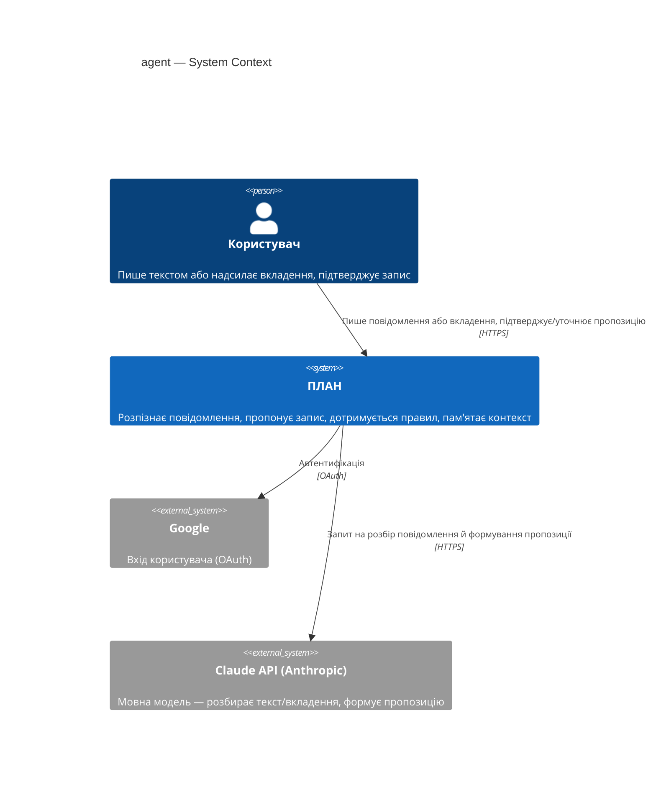
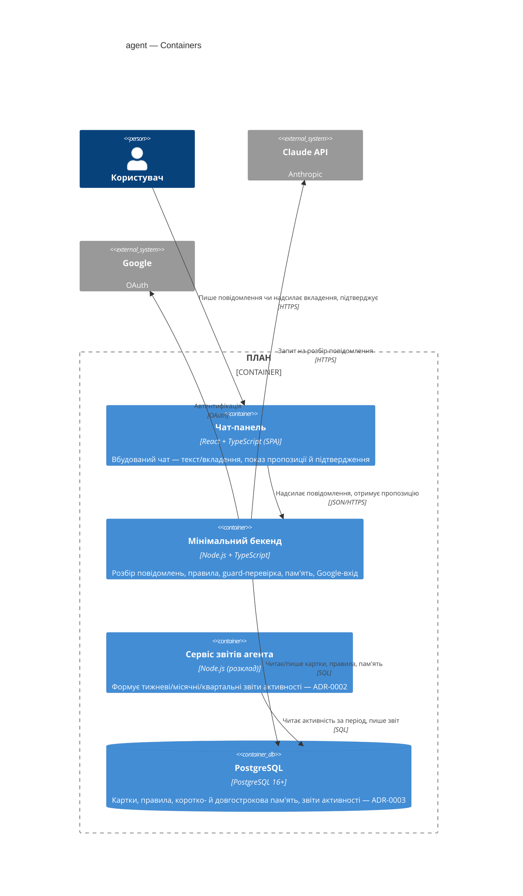

# Software Architecture Document — agent

<!-- 12 Arc42 sections. Empty section → <!-- N/A: <one-line reason> -->. -->
<!-- C4 Context (L1) lives inline in §3. C4 Container (L2) lives inline in §5. -->
<!-- Numbers in §10 come VERBATIM from spec.md §6 NFR — no inventing, no rounding. -->

## 1. Introduction and goals

**Intent.** Агент — єдиний суцільний співрозмовник продукту ПЛАН (D-25), з яким користувач розмовляє текстом чи надсилає вкладення. Він перетворює вільне повідомлення на конкретну пропозицію запису в потрібній картці, завжди чекає явного підтвердження перед записом, дотримується правил користувача (куратоване меню + власне сформульоване правило) і памʼятає контекст між сесіями — без окремої форми ручного вводу.

**Top-3 quality goals (1-liners; full scenarios in §10):**

1. **Довіра до запису** — жоден запис у картку не стається без явного підтвердження користувача; мовчазного запису не буває (D-30, AC-02/AC-03).
2. **Швидкість діалогу** — p95 ≤4000 мс від повідомлення до пропозиції, p95 ≤1000 мс від підтвердження до оновленого лічильника (spec §6 NFR).
3. **Конфіденційність довгострокової памʼяті** — нова чутлива поверхня даних (факти про життя людини); Security review Required (spec §6.1).

**Stakeholders.**

| Role | Interest | Sign-off owner? |
|---|---|---|
| user (CONTEXT.md) | Розмовляє з агентом, довіряє йому запис своїх даних і особисті правила | No |
| Tech Lead | Схвалення SAD | Yes |
| Security Lead | Схвалення через нову чутливу поверхню даних (довгострокова памʼять) | Yes |

<!-- Decision overrides (¶4) — populated by the critic resolution loop, empty otherwise. -->

## 2. Constraints

**Technical.**
- TypeScript на Node.js — той самий стек, що й фронтенд (architecture-map.md)
- «Мінімальний бекенд» (сервер-проксі, D-24) — агент живе тут; ще жодного разу не піднімався в коді (DELIVERY-PLAN «Розробка» 5%)
- PostgreSQL 16+ ([D-59](../../DECISIONS.md#d-59)) — база бекенда, джерело правди для карток і синхронізації
- Claude API (Anthropic) — постачальник LLM, ключ ховається на бекенді (architecture-map.md C4)
- PWA-фронтенд (React 18+ + Vite + Tailwind) — вбудований чат з агентом, той самий стек, що й `life-area-card`/`structure`

**Organisational.**
- Одна людина (Андрій) у темпі ~1–2 год/тиждень — Клод як асистент розробки
- Жорсткого дедлайну немає

**Conventions.**
- [`architecture-map.md`](../../architecture-map.md) — повний перелік конвенцій продукту
- Обробка помилок: на лицьовій стороні чату, ніколи `alert`/`confirm`
- ID: `crypto.randomUUID()` для будь-яких збережених записів
- Зберігання на клієнті: лише через `shared/storage/` (кеш, не єдине джерело)

**Regulatory / external.**
- spec.md §6.1: Security review — **Required**, нова чутлива поверхня даних (довгострокова памʼять: факти, можливо ім'я, здоров'я, рішення)
- Дані класифіковані як confidential; авторизація прив'язана до Google-входу (D-33), кожен запит скерований лише на дані свого користувача (AC-06)

## 3. Context and scope

Агент — єдиний канал прямого вводу продукту ПЛАН (D-25): користувач пише текстом або надсилає вкладення, агент розпізнає ймовірний запис, чекає підтвердження, дотримується особистих правил користувача і памʼятає контекст між сесіями.

<!-- brownfield: N/A — greenfield-фіча; «мінімальний бекенд» (D-24), де живе агент, ще жодного разу не піднімався в коді (architecture-map.md, DELIVERY-PLAN «Розробка» 5%) -->

**External systems (in / out):**

| Actor or system | Type | Interaction |
|---|---|---|
| user | Person | Пише повідомлення чи надсилає вкладення, підтверджує/уточнює пропозицію, задає правила |
| Google | System (external) | Вхід користувача (OAuth, D-33) — успадковано з `life-area-card` |
| Claude API (Anthropic) | System (external) | Мовна модель — розбирає вільний текст/вкладення, формує пропозицію запису й пояснення |

**C4 Context (L1):**



## 4. Solution strategy

**Target surfaces (frontmatter `target_surfaces`): `backend-service`, `web-frontend`, `worker`** — [ADR-0001](adr/0001-split-agent-across-three-surfaces.md). Чат-логіка й розбір повідомлень живуть на бекенді; вбудований чат — новий UI-контейнер у вже наявній PWA; звіти активності (AC-11) — окремий контейнер зі своїм розкладом, ізольований від latency-критичного шляху чату.

**Top strategic choices (the seeds for ADRs):**

1. **Спільна база + власний розклад для worker** — [ADR-0002](adr/0002-shared-database-plus-schedule-for-worker.md). `worker` читає ту саму PostgreSQL-базу, що й `backend-service`, і сам вирішує, коли час формувати черговий звіт (тижневий/місячний/квартальний) — без окремої черги/брокера, бо тригер часовий, не подієвий (AC-11, Availability 99.0%).
2. **Довгострокова памʼять — у тій самій базі, що й картки** — [ADR-0003](adr/0003-long-term-memory-in-shared-database.md). Нова чутлива поверхня даних (US-06/AC-09) читається на кожному повідомленні в реальному часі, тому живе поруч із картками в одній транзакційній межі, не в окремому сервісі (на відміну від літопису Структури, де інша природа доступу).
3. **Примус правил: prompt + post-hoc guard-перевірка** — [ADR-0004](adr/0004-prompt-plus-post-hoc-guard-for-rule-enforcement.md). Найгостріший ризик фічі (`devils-advocate`, spec §1): саме лише покладання на системний промпт не гарантує дотримання правила (AC-07/AC-08/AC-12/AC-14) і не робить порушення видимим. Backend прогонятиме кожну відповідь агента окремою легкою перевіркою перед показом користувачу.

**UI-архітектура (web-frontend surface):** SPA — чат-компонента живе в тій самій React SPA, що й решта ПЛАНу (D-1, ADR-0001 фронтенд-стек); альтернатива (SSR) вже виключена існуючим стеком, тож без окремого ADR.

**Життєвий цикл пропозиції, що чекає підтвердження (AC-03), закриває спірне питання spec §8:** одна активна пропозиція на користувача, без TTL. Наступне повідомлення або оновлює її (уточнення, AC-02b), або — якщо тематично не повʼязане — стара мовчки відкидається (нічого не записується, AC-03), а нове стає активною пропозицією. Одномодульно й реверсивно (1 з 3 критеріїв блaст-радіуса) — рішення лишається inline, без ADR.

**Cache tier:** немає (v1) — один бекенд-інстанс (Availability §6), латency-бюджет (§6 NFR) переважно йде на виклик Claude API, не на читання бази; додавати кеш немає підстави без виміряного навантаження. Reversible/low-stakes — inline, без ADR, за замовчуванням репозиторію.

Кожне тактичне рішення в наступних секціях трасується до одного з цих чотирьох стовпів. Тактичне рішення, що суперечить стратегічному вибору, — червоний прапорець, виносити в §11.

## 5. Building block view

Шарова/гексагональна архітектура — той самий принцип, що вже діє на фронтенді (`domain/` + `ui/`, [ADR-0004 scaffold architecture](../../adr/0004-scaffold-architecture.md)): чиста доменна логіка окремо від доставки. На бекенді — `domain/app/infra/ports` ([ADR-0005](adr/0005-layered-domain-app-infra-ports-backend.md)), перша фіча, що реально встановлює цю конвенцію для «мінімального бекенда» (D-24). `worker` — окремий топ-рівень модуль коду, дзеркалить власний C4-контейнер ([ADR-0001](adr/0001-split-agent-across-three-surfaces.md)), за зразком того, як `structure` окремо від `cards/`.

**Internal decomposition (backend, `plan/backend/src/`):**

```
plan/backend/src/
├── agent/
│   ├── domain/
│   │   ├── proposal.ts       # стан пропозиції: одна активна, оновлення уточненням (AC-02b), без TTL
│   │   ├── rules.ts          # доменна модель правил (глобальні + card-override, AC-08/AC-12)
│   │   ├── guard.ts          # логіка post-hoc перевірки дотримання правила — ADR-0004
│   │   └── memory.ts         # доменна модель короткострокового вікна + довгострокових фактів
│   ├── app/
│   │   ├── handle-message.ts # use-case: повідомлення/вкладення → пропозиція (AC-01/AC-10)
│   │   ├── confirm.ts        # use-case: підтвердження → запис у картку (AC-02/AC-03)
│   │   └── ask-agent.ts      # оркеструє виклик Claude API + guard-перевірку
│   ├── infra/
│   │   ├── claude-client.ts  # виклик Claude API (ключ ховається тут, D-24)
│   │   ├── postgres-repo.ts  # читання/запис карток, правил, пам'яті (ADR-0003)
│   │   └── auth.ts           # Google-вхід (D-33), скоуп на користувача (AC-06)
│   └── ports/
│       └── chat-handler.ts   # HTTP-хендлер чату — контракт лише в /sdd:api agent
└── agent-worker/
    ├── domain/
    │   └── report.ts         # доменна модель activity-report (CONTEXT.md), розрахунок за період
    ├── app/
    │   └── generate-report.ts # use-case: «чий звіт зараз» → пасивний запис (AC-11)
    └── infra/
        └── schedule.ts        # розклад тижневий/місячний/квартальний, читає ту саму базу — ADR-0002
```

**C4 Container (L2):**



## 6. Runtime view

<!-- 🎯 Why: the RUNTIME FLOW of 1–2 critical scenarios — who talks to whom, when, in what order.
     Without §6, §5 is just boxes with no life.
     📋 Write: a Mermaid sequenceDiagram. Participants are names from §5 (don't invent new ones).
     Messages are semantic («saves a draft»), NO HTTP verbs / paths / status codes — endpoint-level
     sequences arrive at the `api` stage.
     📌 e.g. «author → web: composes draft → web → content API: save». Seed the primary flow(s) here;
     the `sequences` stage then covers every §5 AC (no cap). Never N/A for M+; XS/S keeps ≥1 happy-path flow. -->

**Critical flow 1: <flow name>**

```mermaid
sequenceDiagram
    actor Actor
    participant Web
    participant Service
    participant Store
    Actor->>Web: <action>
    Web->>Service: <call>
    Service->>Store: <write>
    Store-->>Service: ok
    Service-->>Web: result
    Web-->>Actor: confirmation
```

**Critical flow 2: <e.g. async event propagation>** — <if applicable, otherwise N/A>.

## 7. Deployment view

<!-- 🎯 Why: the TOPOLOGY DevOps must know without reading the deploy charts — how many replicas,
     where the background worker lives, AT WHAT NUMBERS we scale.
     📋 Write: 2–3 sentences on topology + monitoring + concrete threshold numbers.
     📌 e.g. «500 authors → partition by quarter» (not «we'll think about scale later»).
     🎯 N/A allowed for XS/S that reuses an existing deployment unit with no change.
     Deployment-diagram scaffold → templates/deployment.md. -->

<Topology in 2–3 sentences. Where it runs, replicas, scaling thresholds.>

**Monitoring:**
- <Metrics — e.g. `<metric_name>`>
- <Alerts — e.g. «worker lag > 10 min → page on-call»>
- <Tracing — e.g. spans on the request boundary>

**Scaling thresholds:**
- <e.g. comfortable in one table up to N rows/year>
- <e.g. partition by quarter above N rows/year>

<!-- For XS/S with no deployment change: <!-- N/A: reuses existing deployment unit, no infra change --> -->

## 8. Crosscutting concepts

<!-- 🎯 Why: CROSS-CUTTING PATTERNS spanning several modules: logging, errors, authorization, ID
     strategy, events, caching. ⭐ The second-densest section. A pattern inside one module is NOT
     here; a project-wide convention belongs in the convention file.
     📋 Write: a table — concept / convention / where defined. One row per concept.
     📌 e.g. «sortable time-based IDs generated in the app layer» as a default from the convention file. -->

| Concept | Convention | Where defined |
|---|---|---|
| Logging | <e.g. structured, fields `module=<name>`> | <convention file §X or here> |
| Authentication | <e.g. token-based via middleware> | <convention file §X> |
| Error handling | <e.g. domain sentinel → ports error mapping → JSON> | <convention file §X> |
| ID strategy | <e.g. sortable time-based ID in the app layer> | <convention file §X> |
| Internationalisation | <e.g. N/A, single language> | — |
| Observability | <e.g. tracing on the request boundary> | — |
| Events | <module-specific patterns, if any> | <here> |

## 9. Architecture decisions

<!-- 🎯 Why: the REVERSE INDEX onto the adr/ folder. `ls adr/` gives the files; §9 gives the
     semantics — why they exist, which SAD section they attach to, what status.
     📋 Write: a 4-column table, one row per ADR. Mixed status is fine.
     📌 e.g. «0001 | Store content as a table of typed blocks | Accepted | §4». -->

| # | Title | Status | Section |
|---|---|---|---|
| 0001 | Split agent across three target surfaces: backend-service, web-frontend, worker | Accepted | §4 |
| 0002 | Worker integrates with backend-service via the shared database and its own schedule | Accepted | §4 |
| 0003 | Store long-term agent memory in the shared backend database | Accepted | §4 |
| 0004 | Enforce user imperative rules via system prompt plus a post-hoc guard check | Accepted | §4 |
| 0005 | Layer the backend as domain/app/infra/ports | Accepted | §5 |

ADR files live under `docs/features/<slug>/adr/NNNN-<title>.md`.

## 10. Quality requirements

<!-- 🎯 Why: the QUALITY TREE — take a goal from §1 and break it into concrete leaves: tests,
     metrics, configs, drills. ⭐ Without §10, §1 is a manifesto. With §10 each declaration maps
     to something PROVABLE.
     📋 Write: per §1 goal — When / Then / How-verify. Numbers from spec §6 NFR VERBATIM (don't
     round ≤250ms to ≤300ms — that's a critic F6 hit).
     📌 e.g. «p95 ≤ 500 ms on a block update, verified by a 100 req/s load test». -->

Each top-3 goal from §1 expanded into a full scenario:

**QG-1. <quality attribute>**
- **When:** <trigger condition>
- **Then:** <expected behaviour with numbers from spec §6 NFR>
- **How verify:** <test / chaos drill / load test / metric>

**QG-2. <quality attribute>**
- **When:** <trigger>
- **Then:** <expected>
- **How verify:** <how>

**QG-3. <quality attribute>**
- **When:** <trigger>
- **Then:** <expected>
- **How verify:** <how>

## 11. Risks and technical debt

<!-- 🎯 Why: ⭐ collects EVERYTHING that can break — not only the technical. Without §11 risks get
     discussed at standups and lost; debt lives only in the head of whoever accepted it.
     📋 Write: a risk/debt table — severity — mitigation — owner. Accepted debt in its own block.
     📌 The first risk is often a product risk, not a technical one. That's normal. -->

<!-- Severity literals: Low / Medium / High for regular risks; "Open question" for rows created by
     a Save-as-OQ resolution during the Socratic walk (see references/socratic.md). -->

| Risk / debt | Severity | Mitigation | Owner |
|---|---|---|---|
| <e.g. Worker lag may reach hours during a downstream outage> | Medium | <alert >10 min, on-call playbook, retry backoff> | <DevOps> |
| <e.g. No event-schema versioning in v1> | Medium | <ADR-NNNN planned for v2, tolerate unknown fields> | <Backend> |
| Open architectural decision: <decision-headline> | Open question | Resolve before <stage trigger or YYYY-MM-DD>; <inline rationale from the Save-as-OQ> | <owner> |

**Accepted debt (acceptable in v1, plan to fix later):**
- <e.g. the entity is immutable / unversioned — OK for v1, may need audit versioning in v2>

## 12. Glossary

<!-- 🎯 Why: ⭐ the DOMAIN GLOSSARY that ends arguments a year later («checkpoint — weekly or
     biweekly? quarter — calendar or fiscal?»).
     📋 Write: a term / meaning table. Business + technical terms mixed.
     📌 e.g. «Lesson | a unit inside a course made of blocks (text, video)». -->

| Term | Meaning |
|---|---|
| <e.g. domain object A> | <its meaning in this domain> |
| <e.g. domain object B> | <its meaning> |
| <e.g. domain invariant name> | <the rule, in plain language> |
