# Software Architecture Document — agent

<!-- 12 Arc42 sections. Empty section → <!-- N/A: <one-line reason> -->. -->
<!-- C4 Context (L1) lives inline in §3. C4 Container (L2) lives inline in §5. -->
<!-- Numbers in §10 come VERBATIM from spec.md §6 NFR — no inventing, no rounding. -->

## 1. Introduction and goals

**Intent.** Агент — єдиний суцільний співрозмовник продукту ПЛАН (D-25), з яким користувач розмовляє текстом чи надсилає вкладення. Він перетворює вільне повідомлення на конкретну пропозицію запису в потрібній картці, завжди чекає явного підтвердження перед записом, дотримується правил користувача (куратоване меню + власне сформульоване правило) і памʼятає контекст між сесіями — без окремої форми ручного вводу.

**Top-3 quality goals (1-liners; full scenarios in §10):**

1. **Довіра до запису** — жоден запис у картку не стається без явного підтвердження користувача; мовчазного запису не буває (D-30, AC-02/AC-03).
2. **Швидкість діалогу** — p95 ≤4000 мс від повідомлення до пропозиції, p95 ≤1000 мс від підтвердження до оновленого лічильника (spec §6 NFR).
3. **Конфіденційність довгострокової памʼяті** — нова чутлива поверхня даних (факти про життя людини); Security review Required (spec §6.1).

**Stakeholders.**

| Role | Interest | Sign-off owner? |
|---|---|---|
| user (CONTEXT.md) | Розмовляє з агентом, довіряє йому запис своїх даних і особисті правила | No |
| Tech Lead | Схвалення SAD | Yes |
| Security Lead | Схвалення через нову чутливу поверхню даних (довгострокова памʼять) | Yes |

**Decision overrides (post-critic, 2026-08-26):**
- §8 Events: власна таблиця аудит-логу агента перевищує явне покриття будь-якого AC зі spec §5 — виправдано spec §6.1 «Security review Required» (нова чутлива поверхня даних), не конкретним acceptance criterion. Critic [F2], override прийнято.

## 2. Constraints

**Technical.**
- TypeScript на Node.js — той самий стек, що й фронтенд (architecture-map.md)
- «Мінімальний бекенд» (сервер-проксі, D-24) — агент живе тут; ще жодного разу не піднімався в коді (DELIVERY-PLAN «Розробка» 5%)
- PostgreSQL 16+ ([D-59](../../DECISIONS.md#d-59)) — база бекенда, джерело правди для карток і синхронізації
- Claude API (Anthropic) — постачальник LLM, ключ ховається на бекенді (architecture-map.md C4)
- PWA-фронтенд (React 18+ + Vite + Tailwind) — вбудований чат з агентом, той самий стек, що й `life-area-card`/`structure`

**Organisational.**
- Одна людина (Андрій) у темпі ~1–2 год/тиждень — Клод як асистент розробки
- Жорсткого дедлайну немає

**Conventions.**
- [`architecture-map.md`](../../architecture-map.md) — повний перелік конвенцій продукту
- Обробка помилок: на лицьовій стороні чату, ніколи `alert`/`confirm`
- ID: `crypto.randomUUID()` для будь-яких збережених записів
- Зберігання на клієнті: лише через `shared/storage/` (кеш, не єдине джерело)

**Regulatory / external.**
- spec.md §6.1: Security review — **Required**, нова чутлива поверхня даних (довгострокова памʼять: факти, можливо ім'я, здоров'я, рішення)
- Дані класифіковані як confidential; авторизація прив'язана до Google-входу (D-33), кожен запит скерований лише на дані свого користувача (AC-06)

## 3. Context and scope

Агент — єдиний канал прямого вводу продукту ПЛАН (D-25): користувач пише текстом або надсилає вкладення, агент розпізнає ймовірний запис, чекає підтвердження, дотримується особистих правил користувача і памʼятає контекст між сесіями.

<!-- brownfield: N/A — greenfield-фіча; «мінімальний бекенд» (D-24), де живе агент, ще жодного разу не піднімався в коді (architecture-map.md, DELIVERY-PLAN «Розробка» 5%) -->

**External systems (in / out):**

| Actor or system | Type | Interaction |
|---|---|---|
| user | Person | Пише повідомлення чи надсилає вкладення, підтверджує/уточнює пропозицію, задає правила |
| Google | System (external) | Вхід користувача (OAuth, D-33) — успадковано з `life-area-card` |
| Claude API (Anthropic) | System (external) | Мовна модель — розбирає вільний текст/вкладення, формує пропозицію запису й пояснення |

**C4 Context (L1):**

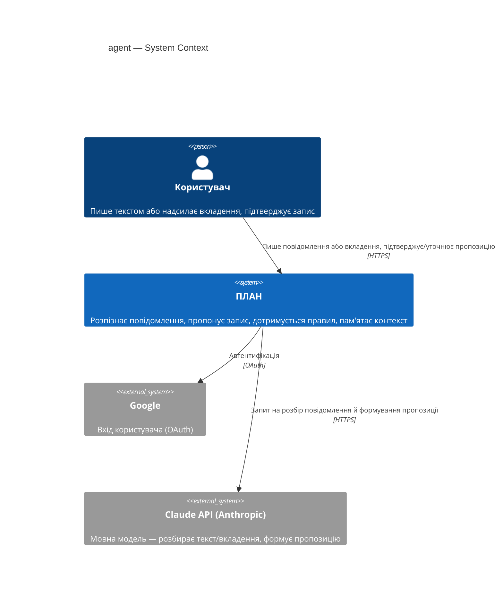

## 4. Solution strategy

**Target surfaces (frontmatter `target_surfaces`): `backend-service`, `web-frontend`, `worker`** — [ADR-0001](adr/0001-split-agent-across-three-surfaces.md). Чат-логіка й розбір повідомлень живуть на бекенді; вбудований чат — новий UI-контейнер у вже наявній PWA; звіти активності (AC-11) — окремий контейнер зі своїм розкладом, ізольований від latency-критичного шляху чату.

**Top strategic choices (the seeds for ADRs):**

1. **Спільна база + власний розклад для worker** — [ADR-0002](adr/0002-shared-database-plus-schedule-for-worker.md). `worker` читає ту саму PostgreSQL-базу, що й `backend-service`, і сам вирішує, коли час формувати черговий звіт (тижневий/місячний/квартальний) — без окремої черги/брокера, бо тригер часовий, не подієвий (AC-11, Availability 99.0%).
2. **Довгострокова памʼять — у тій самій базі, що й картки** — [ADR-0003](adr/0003-long-term-memory-in-shared-database.md). Нова чутлива поверхня даних (US-06/AC-09) читається на кожному повідомленні в реальному часі, тому живе поруч із картками в одній транзакційній межі, не в окремому сервісі (на відміну від літопису Структури, де інша природа доступу).
3. **Примус правил: prompt + post-hoc guard-перевірка** — [ADR-0004](adr/0004-prompt-plus-post-hoc-guard-for-rule-enforcement.md). Найгостріший ризик фічі (`devils-advocate`, spec §1): саме лише покладання на системний промпт не гарантує дотримання правила (AC-07/AC-08/AC-12/AC-14) і не робить порушення видимим. Backend прогонятиме кожну відповідь агента окремою легкою перевіркою перед показом користувачу.

**UI-архітектура (web-frontend surface):** SPA — чат-компонента живе в тій самій React SPA, що й решта ПЛАНу (D-1, ADR-0001 фронтенд-стек); альтернатива (SSR) вже виключена існуючим стеком, тож без окремого ADR.

**Життєвий цикл пропозиції, що чекає підтвердження (AC-03), закриває спірне питання spec §8:** одна активна пропозиція на користувача, без TTL. Наступне повідомлення або оновлює її (уточнення, AC-02b), або — якщо тематично не повʼязане — стара мовчки відкидається (нічого не записується, AC-03), а нове стає активною пропозицією. Одномодульно й реверсивно (1 з 3 критеріїв блaст-радіуса) — рішення лишається inline, без ADR.

**Видалення/редагування факту з довгострокової памʼяті (закриває spec §8 abuse case «отруєння/невидалюваність памʼяті», `devils-advocate`):** користувач видаляє чи виправляє факт командою в чаті («забудь, що…») — той самий канал прямого вводу (D-25), не окремий екран налаштувань. Агент шукає факт, пропонує підтвердження видалення — той самий патерн confirm, що й для запису (AC-02/AC-03). Reversible/single-module — inline, без ADR.

**Поріг впевненості для пропозиції vs уточнюючого питання (AC-01 vs AC-05, KPI-3 ≥90% без уточнення):** не фіксований числовий поріг у v1 — Claude сам вирішує в межах одного запиту «пропоную X» чи «уточнюю» за текстом повідомлення й кількістю карток користувача. Явний калібрований поріг навмисно не вводимо; KPI-3 вимірюється постфактум, поріг переглядається, якщо метрика не досягається.

**Cache tier:** немає (v1) — один бекенд-інстанс (Availability §6), латency-бюджет (§6 NFR) переважно йде на виклик Claude API, не на читання бази; додавати кеш немає підстави без виміряного навантаження. Reversible/low-stakes — inline, без ADR, за замовчуванням репозиторію.

Кожне тактичне рішення в наступних секціях трасується до одного з цих чотирьох стовпів. Тактичне рішення, що суперечить стратегічному вибору, — червоний прапорець, виносити в §11.

## 5. Building block view

Шарова/гексагональна архітектура — той самий принцип, що вже діє на фронтенді (`domain/` + `ui/`, [ADR-0004 scaffold architecture](../../adr/0004-scaffold-architecture.md)): чиста доменна логіка окремо від доставки. На бекенді — `domain/app/infra/ports` ([ADR-0005](adr/0005-layered-domain-app-infra-ports-backend.md)), перша фіча, що реально встановлює цю конвенцію для «мінімального бекенда» (D-24). `worker` — окремий топ-рівень модуль коду, дзеркалить власний C4-контейнер ([ADR-0001](adr/0001-split-agent-across-three-surfaces.md)), за зразком того, як `structure` окремо від `cards/`.

**Internal decomposition (backend, `plan/backend/src/`):**

```
plan/backend/src/
├── agent/
│   ├── domain/
│   │   ├── proposal.ts       # стан пропозиції: одна активна, оновлення уточненням (AC-02b), без TTL
│   │   ├── rules.ts          # доменна модель правил (глобальні + card-override, AC-08/AC-12) — 6 категорій D-27 (дані/корекція/опитування/уточнення контексту/вплив на власника/нагадування), остаточний склад v1
│   │   ├── guard.ts          # логіка post-hoc перевірки дотримання правила — ADR-0004
│   │   └── memory.ts         # доменна модель короткострокового вікна (D-26; одиниця "сесія" = календарний день) + довгострокових фактів (з видаленням/редагуванням за командою, §4)
│   ├── app/
│   │   ├── handle-message.ts # use-case: повідомлення/вкладення → пропозиція (AC-01/AC-10)
│   │   ├── confirm.ts        # use-case: підтвердження → запис у картку (AC-02/AC-03)
│   │   └── ask-agent.ts      # оркеструє виклик Claude API + guard-перевірку
│   ├── infra/
│   │   ├── claude-client.ts  # виклик Claude API (ключ ховається тут, D-24)
│   │   ├── postgres-repo.ts  # читання/запис карток, правил, пам'яті (ADR-0003)
│   │   └── auth.ts           # Google-вхід (D-33), скоуп на користувача (AC-06)
│   └── ports/
│       └── chat-handler.ts   # HTTP-хендлер чату — контракт лише в /sdd:api agent
└── agent-worker/
    ├── domain/
    │   └── report.ts         # доменна модель activity-report (CONTEXT.md), розрахунок за період
    ├── app/
    │   └── generate-report.ts # use-case: «чий звіт зараз» → пасивний запис (AC-11)
    └── infra/
        └── schedule.ts        # розклад тижневий/місячний/квартальний, читає ту саму базу — ADR-0002
```

**C4 Container (L2):**

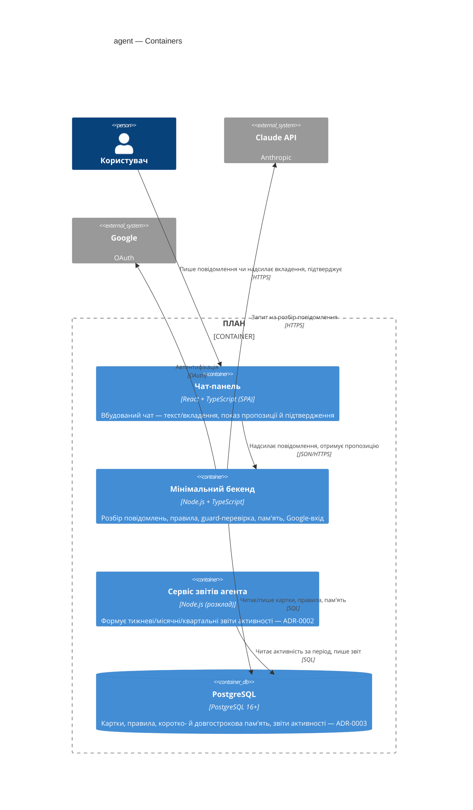

## 6. Runtime view

design лише «сіє» найкритичніші сценарії — `/sdd:sequences agent` далі покриє кожен AC §5 spec.md окремою діаграмою чи гілкою.

**Critical flow 1: щасливий шлях — повідомлення → пропозиція → підтвердження (AC-01/AC-02/AC-02b)**

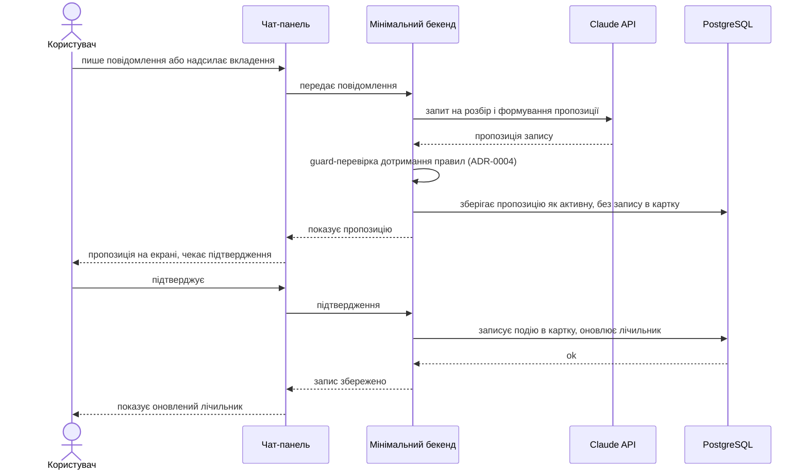

**Critical flow 2: Claude API недоступний (закриває spec §8 OQ, AC-03)**

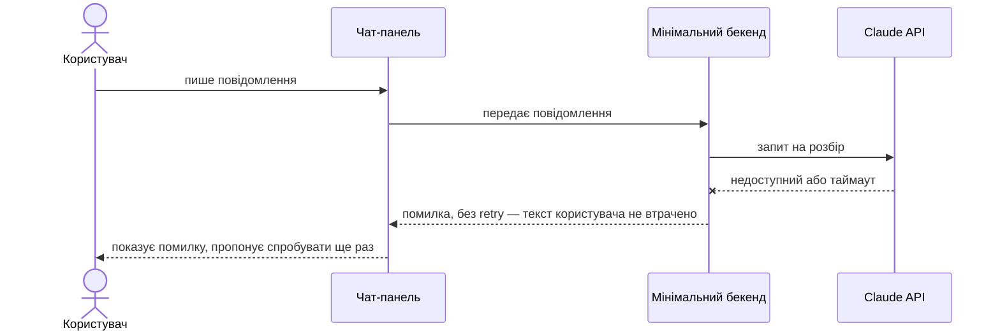

**Critical flow 3: вкладення (фото) → пропозиція, включно з нерозпізнаним вкладенням (AC-10/AC-10b)**

```mermaid
sequenceDiagram
    actor User as Користувач
    participant ChatUi as Чат-панель
    participant Backend as Мінімальний бекенд
    participant Claude as Claude API
    participant DB as PostgreSQL

    Note over User,ChatUi: precondition: користувач має активну картку, надсилає лише вкладення, без тексту
    User->>ChatUi: надсилає вкладення (фото) без тексту
    ChatUi->>Backend: передає вкладення
    Backend->>Claude: запит на розпізнавання вкладення як факту
    alt вкладення розпізнано як самодостатній факт
        Claude-->>Backend: пропозиція запису на основі вкладення
        Backend->>Backend: guard-перевірка дотримання правил (ADR-0004)
        Backend->>DB: зберігає пропозицію як активну, без запису в картку
        Backend-->>ChatUi: показує пропозицію
        ChatUi-->>User: пропозиція на екрані, чекає підтвердження
    else вкладення нерозпізнане, нечитабельне або непідтримуваного типу
        Claude-->>Backend: не вдалось виділити факт
        Backend-->>ChatUi: пояснює, чому не може обробити вкладення, просить текстовий опис
        ChatUi-->>User: показує пояснення і прохання надіслати текст
    end
    Note over Backend,DB: postcondition: у гілці успіху пропозиція чекає підтвердження (той самий цикл, що й Flow 1); у гілці помилки нічого не збережено
```

**Critical flow 4: прив'язка до свого акаунта і прибирання третьої особи з тексту (AC-06)**

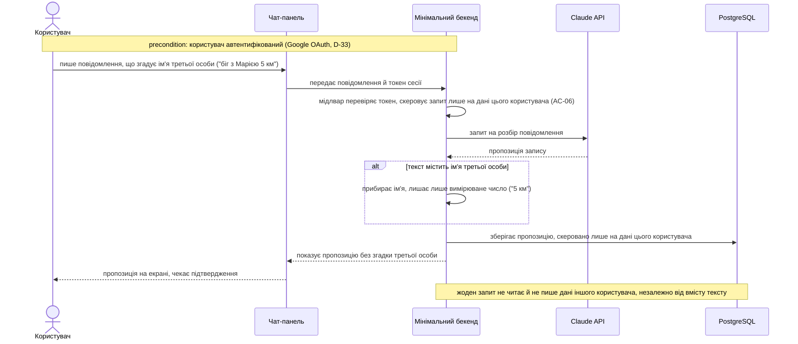

**Critical flow 5: пропозиція мовчки відкидається без підтвердження (AC-03)**

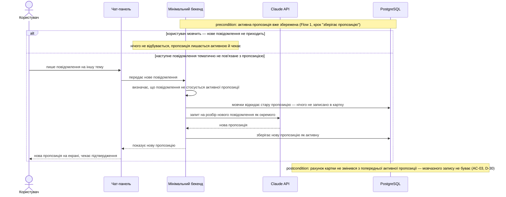

**Critical flow 6: власне правило дотримується у відповіді (AC-07)**

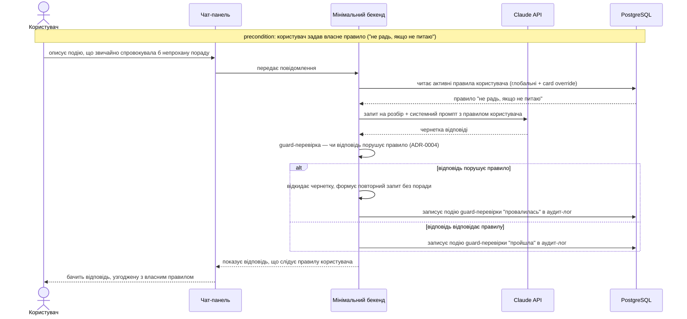

**Critical flow 7: формулювання правила в діалозі з перевіркою на несуперечливість (AC-14)**

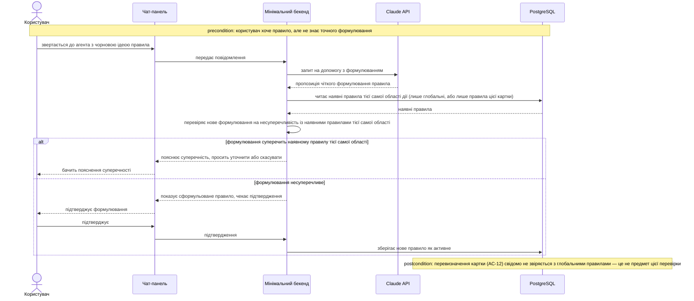

**Critical flow 8: вибір категорій правил з готового меню (AC-08)**

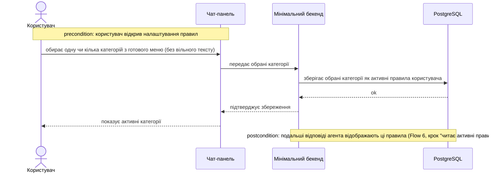

**Critical flow 9: перевизначення правила на конкретній картці (AC-12)**

```mermaid
sequenceDiagram
    actor User as Користувач
    participant ChatUi as Чат-панель
    participant Backend as Мінімальний бекенд
    participant DB as PostgreSQL

    Note over User,ChatUi: precondition: користувач перебуває на конкретній картці, хоче інакшу поведінку саме тут
    User->>ChatUi: задає перевизначення правила для цієї картки
    ChatUi->>Backend: передає перевизначення + ідентифікатор картки
    Backend->>DB: зберігає перевизначення, прив'язане до цієї картки
    DB-->>Backend: ok
    Backend-->>ChatUi: підтверджує збереження
    ChatUi-->>User: показує, що на цій картці діє перевизначене правило
    Note over Backend,DB: postcondition: глобальне правило лишається чинним для решти карток; перевизначення свідомо переважає глобальне саме тут (§4, не суперечність)
```

**Critical flow 10: суперечливі або незрозумілі дані — агент просить уточнення (AC-04)**

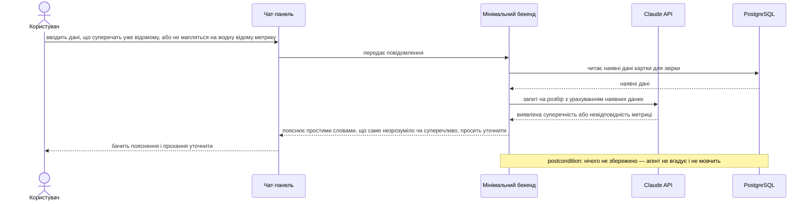

**Critical flow 11: довгострокова пам'ять — врахування факту з минулої сесії (AC-09)**

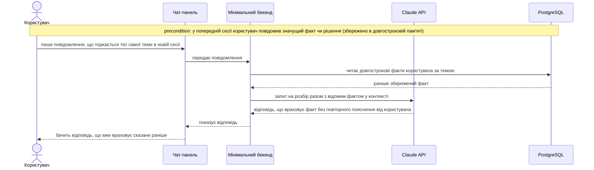

**Critical flow 12: коротке сире вікно пам'яті в межах поточної сесії (AC-15)**

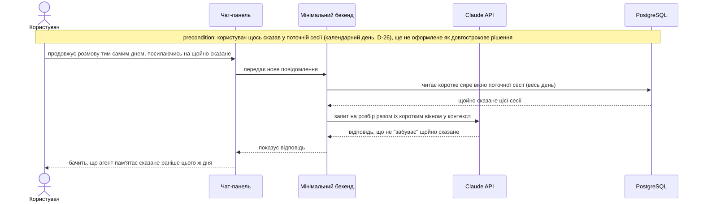

**Critical flow 13: неоднозначна картка — агент питає або пропонує створити нову (AC-05)**

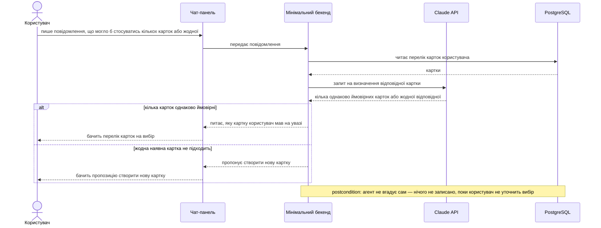

**Critical flow 14: автоматичний звіт активності (AC-11) — async, worker**

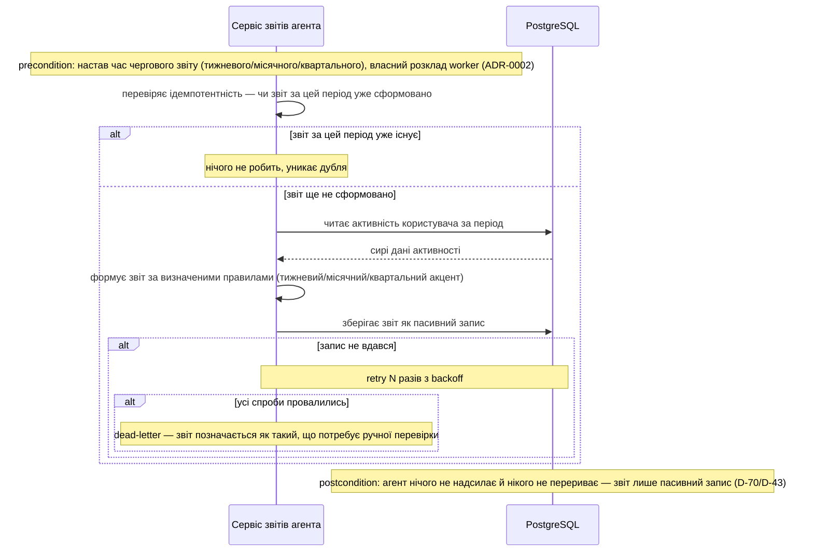

**Critical flow 15: онбординг — вітання і короткий гайд при першому запуску (AC-13)**

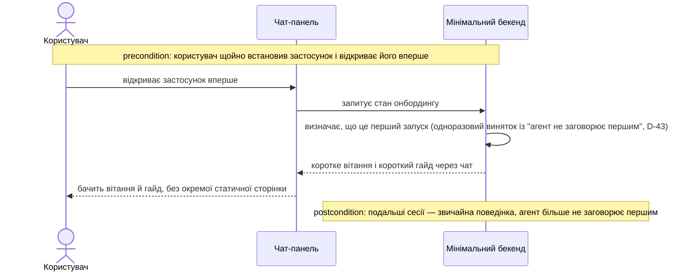

**Coverage check (`/sdd:sequences`, крок 7).**

*Use-case pass (§4):* усі 9 US мають ≥1 потік — US-01→Flow 1/3/4, US-02→Flow 1/2/5, US-03→Flow 6/7, US-04→Flow 8/9, US-05→Flow 10, US-06→Flow 11/12, US-07→Flow 13, US-08→Flow 14, US-09→Flow 15.

*AC pass (§5):* усі 17 AC показані — AC-01/AC-02/AC-02b→Flow 1, AC-03→Flow 5 (дедиковано; Flow 2 позначений як AC-03, але фактично зображає інший сценарій — див. прапорець нижче), AC-04→Flow 10, AC-05→Flow 13, AC-06→Flow 4, AC-07→Flow 6, AC-08→Flow 8, AC-09→Flow 11, AC-10/AC-10b→Flow 3, AC-11→Flow 14, AC-12→Flow 9, AC-13→Flow 15, AC-14→Flow 7, AC-15→Flow 12.

**Flagged for review (не автоправка — рішення design/людини):**
- Flow 2 (existing, заголовок «закриває AC-03») по суті зображає відмову зовнішньої системи (Claude API недоступний), не буквальний AC-03 («користувач не підтвердив»). Дедикований Flow 5 тепер покриває буквальний AC-03; заголовок Flow 2 варто звірити з design при наступному проході — можливо, точніше «AC-03 accepted debt / Availability», не сам AC-03.
- Жодного нового учасника поза §5 не знадобилось (Worker = вже задекларований контейнер «Сервіс звітів агента»).

## 7. Deployment view

**Topology.** `backend-service` (чат) і `worker` (звіти активності) — **окремі C4-контейнери, межа логічна** (ADR-0001/0002 Neutral): повільний виклик Claude API в чаті не повинен блокувати формування квартального звіту й навпаки. На старті вони можуть тимчасово ділити один фізичний процес/деплой (наприклад `node-cron` у тому самому Node-процесі) — фізичне розділення на окремі деплой-юніти відкладається до реального навантаження, контейнерна межа лишається логічною вже зараз. Обидва читають ту саму PostgreSQL 16+ (D-59). Один інстанс кожного — без реплік, без autoscaling: масштаб (Андрій + фокус-група 30+, D-55) цього не потребує.

**Monitoring.** Мінімум для v1: структуровані логи (конвенція фіксується в §8 Crosscutting concepts) + ручна перевірка Андрієм при потребі. Жодних окремих алертів/трейсингу — соло-розробник без чергування on-call, масштаб не виправдовує інфраструктуру спостережності.

**Scaling thresholds.** Свідомо не фіксуємо конкретне число зараз — дивись відкрите питання в §11 (коли один інстанс кожного контейнера й один Postgres перестають вистачати).

## 8. Crosscutting concepts

| Concept | Convention | Where defined |
|---|---|---|
| Logging | Структуровані логи, поле `module=<name>` (наприклад `module=agent.guard`) — мінімум для v1, без окремого агрегатора (§7 Monitoring) | тут |
| Authentication | Google OAuth (D-33), токен перевіряється мідлваром `infra/auth.ts` перед кожним викликом use-case | [D-33](../../DECISIONS.md#d-33) · §5 |
| Error handling | Domain-sentinel `Ok<T>ǀErr<E>`, ніколи не `throw` для очікуваної помилки (Claude недоступний, правило порушено); `app` мапить `Err` у ports-помилку; `ports`/HTTP — у JSON `{code, message}` | [ADR-0006](adr/0006-domain-sentinel-for-expected-errors.md) |
| ID strategy | `crypto.randomUUID()` для будь-якого збереженого запису (пропозиція, подія аудит-логу, звіт) | §2 Conventions |
| Internationalisation | N/A — один інтерфейс, українська мова; продукт не оголошував i18n у жодному з попередніх рішень | — |
| Observability | N/A понад §7 (логи + ручна перевірка) — трейсинг і метрики не виправдані масштабом v1 | §7 |
| Events | Власний аудит-лог агента: подія на кожну зміну стану пропозиції (створена/оновлена/підтверджена/відкинута), на кожен результат guard-перевірки (пройшла/провалилась) і на кожне видалення/редагування факту довгострокової пам'яті (§4) — за зразком таблиці переходів стану картки у `life-area-card` (D-68, `life-area-card/data-model.md`), але окрема таблиця в domain-моделі `agent`, бо факти інші (пропозиція, правило, а не картка). Обґрунтування: чутлива поверхня даних, security review Required (spec §6.1) — не покриття конкретного AC (§1 ¶4 override) | тут; таблиця — предмет `/sdd:data-model agent` |
| Rate limiting | 60 повідомлень/годину на користувача — захист проти спаму й економіки важкого вводу (spec §6.1 abuse case, `devils-advocate`); блокує скрипт-атаки, не заважає живому діалогу | тут |
| Privacy — третя особа в тексті | Агент прибирає ім'я третьої особи з тексту перед записом у довгострокову пам'ять, лишає лише вимірюване число («біг з Марією 5 км» → «5 км») — чуже ім'я ніколи не потрапляє в пам'ять користувача (spec §6.1 abuse case, AC-06) | тут |

## 9. Architecture decisions

<!-- 🎯 Why: the REVERSE INDEX onto the adr/ folder. `ls adr/` gives the files; §9 gives the
     semantics — why they exist, which SAD section they attach to, what status.
     📋 Write: a 4-column table, one row per ADR. Mixed status is fine.
     📌 e.g. «0001 | Store content as a table of typed blocks | Accepted | §4». -->

| # | Title | Status | Section |
|---|---|---|---|
| 0001 | Split agent across three target surfaces: backend-service, web-frontend, worker | Accepted | §4 |
| 0002 | Worker integrates with backend-service via the shared database and its own schedule | Accepted | §4 |
| 0003 | Store long-term agent memory in the shared backend database | Accepted | §4 |
| 0004 | Enforce user imperative rules via system prompt plus a post-hoc guard check | Accepted | §4 |
| 0005 | Layer the backend as domain/app/infra/ports | Accepted | §5 |
| 0006 | Use a domain sentinel result for expected errors, never throw | Accepted | §8 |

ADR files live under `docs/features/<slug>/adr/NNNN-<title>.md`.

## 10. Quality requirements

Each top-3 goal from §1 expanded into a full scenario:

**QG-1. Довіра до запису**
- **When:** агент сформував пропозицію запису (AC-01) і показав її користувачу.
- **Then:** запис у картку стається лише після явного підтвердження (AC-02/AC-03); жоден мовчазний запис неможливий — кожна зміна стану пропозиції (створена/оновлена/підтверджена/відкинута) лишає слід в аудит-логі (§8 Events).
- **How verify:** інтеграційний тест на щасливий шлях (§6 Critical flow 1) + негативний тест «повідомлення без підтвердження → рахунок картки не змінився»; аудит-лог перевіряється на відсутність запису без відповідної події підтвердження. Механізм примусу власного правила (AC-07) вже ухвалено — prompt + post-hoc guard-перевірка (ADR-0004); **відкритим лишається лише числове значення цільової точності** (spec §6 NFR ставить «TBD», не число) → §11.

**QG-2. Швидкість діалогу**
- **When:** користувач надсилає повідомлення чи підтверджує пропозицію.
- **Then:** p95 ≤ 4000 ms від повідомлення до появи пропозиції (AC-01, spec §6 NFR) — та сама ціль і для шляху з вкладенням (AC-10), виміряна окремо; p95 ≤ 1000 ms від підтвердження до оновленого лічильника (AC-02, spec §6 NFR); throughput ≥ 5 req/s на інстанс (spec §6 NFR).
- **How verify:** навантажувальний smoke-тест перед запуском на заглушці Claude API (тестує пропускну здатність бекенда, не латентність зовнішнього провайдера) + вимір p95 обох латентностей (текст і вкладення окремо) на тому ж прогоні; структуровані логи (§7/§8) як джерело метрики — окремого APM немає в v1.

**QG-3. Конфіденційність довгострокової памʼяті**
- **When:** запит торкається довгострокової пам'яті користувача (читання при кожному повідомленні, AC-09) або намагається дістатись чужих даних (abuse case, spec §6.1).
- **Then:** кожен запит скерований лише на дані свого користувача (AC-06); Availability 99.0% на місячному вікні (spec §6 NFR, один бекенд-проксі без резервування); Security review — **Required** перед запуском (spec §6.1) через нову чутливу поверхню даних.
- **How verify:** AC-06 тест на крос-користувацьку ізоляцію (запит користувача A не бачить даних користувача B); sign-off Security Lead (§1 Stakeholders) як gate перед релізом; місячний Availability рахується за логами аптайму backend-service (§7).

## 11. Risks and technical debt

| Risk / debt | Severity | Mitigation | Owner |
|---|---|---|---|
| Дисципліна sentinel-конвенції (ADR-0006): спокуса кинути звичайний `throw` в `infra/` замість sentinel на межі з `domain` | Medium | Code review за чек-листом (лінтер-правило — пізніше, коли зʼявиться конфігурація) | Андрій |
| Open architectural decision: числове значення цільової точності дотримання власного правила (AC-07) | Open question | Resolve before `/sdd:implement agent` — сам механізм примусу вже ухвалено (ADR-0004, §4); відкрите лише число (spec §6 NFR ставить «TBD») | Андрій |
| Open architectural decision: scaling threshold — коли один інстанс backend/worker/Postgres (§7) перестає вистачати | Open question | Resolve after `/sdd:implement agent` — свідомо не фіксуємо число до перших реальних вимірів навантаження | Андрій |

**Resolved during this design pass (were Open questions in spec §8, closed inline — see §4/§5/§8/§10):**
- Механізм редагування/видалення факту довгострокової пам'яті → команда агенту в чаті з підтвердженням (§4).
- Число ліміту частоти записів проти спаму → 60 повідомлень/годину (§8 Rate limiting).
- Одиниця «сесія» короткострокового вікна пам'яті (D-26) → календарний день (§5 `memory.ts`).
- Склад куратованого меню категорій правил (AC-08) → 6 категорій D-27, остаточний склад v1 (§5 `rules.ts`).
- Третя особа в тексті повідомлення (AC-06 приватність) → ім'я прибирається, лишається число (§8 Privacy).
- Поріг впевненості пропозиція-vs-уточнення (AC-01/AC-05, KPI-3) → без фіксованого числа, вирішує LLM (§4).
- NFR для шляху з вкладенням (AC-10) і параметри throughput-тесту → та сама ціль що й текст, заглушка Claude API (§10 QG-2).

**Accepted debt (acceptable in v1, plan to fix later):**
- Без retry при недоступності Claude API (AC-03, §6 Critical flow 2) — текст користувача не втрачається, повторна спроба лишається дією користувача, не автоматикою. Простій Claude API рахується в межах Availability 99.0% (§6 NFR) — окремого способу відрізнити «наш бекенд лежить» від «Claude недоступний» немає при мінімальному моніторингу (§7), і користувач у обох випадках не отримує відповіді.
- Без кешу (§4 Cache tier) — жодних вимірів навантаження, що виправдали б додавання шару кешування.
- Без реплік і autoscaling (§7) — масштаб v1 (Андрій + фокус-група 30+, D-55) цього не потребує.

## 12. Glossary

| Term | Meaning |
|---|---|
| agent | агент — один суцільний співрозмовник продукту (D-25); v1 без вибору характеру (D-78) (CONTEXT.md) |
| imperative-rule | імперативне правило користувача — куратоване меню (D-27) + власний текст (D-35), примус — ADR-0004 (CONTEXT.md) |
| activity-report | тижневий/місячний/квартальний звіт активності, формує `worker` (D-70), пасивний запис (CONTEXT.md) |
| proposal | пропозиція — стан очікування підтвердження: одна активна на користувача, без TTL; наступне повідомлення або уточнює її, або (якщо тематично не пов'язане) вона мовчки відкидається (§4, AC-02/AC-03) — архітектурний термін цього SAD, не в канонічному глосарії |
| guard-check | post-hoc перевірка дотримання правил перед показом відповіді користувачу — сам системний промпт не гарантує дотримання (ADR-0004) |
| long-term / short-term memory | гібридна пам'ять агента: довгострокова структурована (значущі факти/рішення) + коротке сире вікно останніх сесій (D-26); довгострокова — нова чутлива поверхня даних (spec §6.1) |
| sentinel result | типізований результат `Ok<T>ǀErr<E>` для очікуваної помилки в domain-шарі — ніколи `throw` (ADR-0006) |
