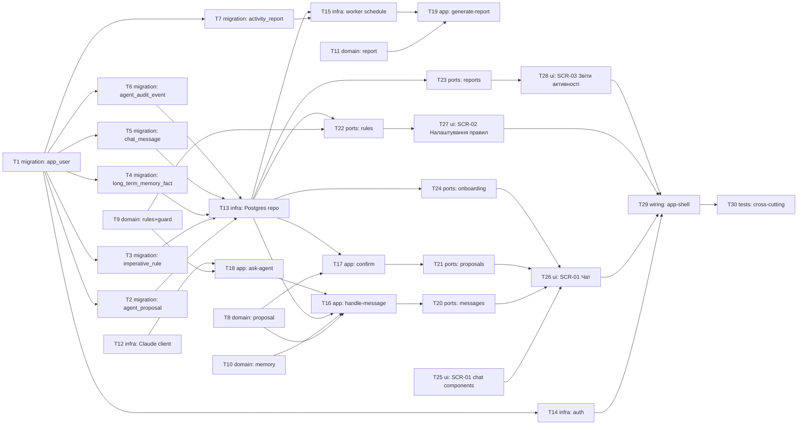

# Epic — agent

> **Spec:** [spec.md](../spec.md) · **Design:** [sad.md](../sad.md) · **Data model:** [data-model.md](../data-model.md) · **API:** [openapi.yaml](../contracts/openapi.yaml) · **Screens:** [screens.md](../screens.md) · **ADRs:** [adr/](../adr/)

## Goal

Реалізувати Агента — єдиний канал прямого вводу продукту ПЛАН (spec.md §2): текст/вкладення → пропозиція → підтвердження, імперативні правила (глобальні + card-override), гібридна памʼять, автоматичні звіти активності. Три поверхні (`backend-service`/`web-frontend`/`worker`, ADR-0001), 7 сутностей БД, 8 API-ендпоінтів, 3 екрани.

## Scope

- **In:** доменна логіка (пропозиція/правила+guard/памʼять/звіт), інфраструктура (Claude-клієнт, Postgres-репо, Google OAuth, worker-розклад), use-case шар, HTTP-ендпоінти, 3 UI-екрани, wiring.
- **Out (spec.md §3):** голосове розпізнавання/синтез (D-41), вибір характеру агента (D-37/D-78, після v1), готові конектори, проактивна ініціатива/нагадування (D-31/D-43), формати вкладень поза фото (`clarify`).

## Task map

## Tasks

See [tracker.md](./tracker.md) for status. Machine contract: [tasks.json](../tasks.json).

| # | Task | Layer | Blocked by | DoD (short) |
|---|---|---|---|---|
| T1 | Create app_user table | migration | — | migration 01 applies/reverts cleanly |
| T2 | Create agent_proposal table | migration | T1 | migration 02 applies/reverts; needs life-area-card promoted first |
| T3 | Create imperative_rule table | migration | T1 | migration 03 applies/reverts; same cross-feature FK note |
| T4 | Create long_term_memory_fact table | migration | T1 | migration 04 applies/reverts cleanly |
| T5 | Create chat_message table | migration | T1 | migration 05 applies/reverts cleanly |
| T6 | Create agent_audit_event table | migration | T1 | migration 06 applies/reverts cleanly |
| T7 | Create activity_report table | migration | T1 | migration 07 applies/reverts; idempotency unique index live |
| T8 | Domain: proposal lifecycle model | domain | — | unit tests for AC-01/02/02b/03/10/10b |
| T9 | Domain: imperative rule model + guard-check enforcement | domain | — | unit tests for AC-07/08/12/14 |
| T10 | Domain: hybrid memory model | domain | — | unit tests for AC-06/09/15 |
| T11 | Domain (agent-worker): activity-report model | domain | — | unit tests for AC-11 period/idempotency |
| T12 | Infra: Claude API client | infra | — | request/response round-trip on stub |
| T13 | Infra: Postgres repo | infra | T2, T3, T4, T5, T6 | scoped reads/writes, owner isolation tested |
| T14 | Infra: Google OAuth + app_user provisioning | infra | T1 | first-login provisioning + reuse tested |
| T15 | Infra (agent-worker): schedule + report persistence | infra | T7, T13 | idempotent write on double-run |
| T16 | App: handle-message use-case | app | T8, T10, T13, T18 | flows 1/3/5/10/11/12/13 tested |
| T17 | App: confirm use-case | app | T8, T13 | confirm + non-active rejection tested |
| T18 | App: ask-agent orchestration | app | T9, T12 | guard discard+retry tested |
| T19 | App (agent-worker): generate-report use-case | app | T11, T15 | passive record + dead_letter tested |
| T20 | Ports: GET/POST /messages handlers | ports | T16 | matches contract exactly (201/422/429/503) |
| T21 | Ports: proposal confirm handlers | ports | T17 | matches contract exactly (200/404/409) |
| T22 | Ports: GET/POST /rules handlers | ports | T9, T13 | matches contract exactly (200/201/409/422) |
| T23 | Ports: GET /reports handler | ports | T13 | cursor page per contract |
| T24 | Ports: GET /onboarding handler | ports | T13 | welcome-once semantics tested |
| T25 | UI: SCR-01 chat components | ui | — | MessageList/ProposalCard/Composer render |
| T26 | UI: SCR-01 Чат screen | ui | T25, T20, T21, T24 | all 9 screens.md states render |
| T27 | UI: SCR-02 Налаштування правил screen | ui | T22 | all 7 screens.md states render |
| T28 | UI: SCR-03 Звіти активності screen | ui | T23 | all 5 screens.md states render |
| T29 | Wiring: register agent module | wiring | T14, T26, T27, T28 | app boots, auth middleware wired |
| T30 | Tests: cross-cutting integration | tests | T29 | cross-user isolation + Claude-outage e2e pass |

## Risks / Hard rules

- **Крос-фічева залежність промоції (нове для проєкту, `data-model.md` _audit):** T2/T3 потребують, щоб міграції `life-area-card` (`card`/`metric_block`) вже застосувались — не автоматизовано в цьому DAG, `implement` має промотувати `life-area-card` раніше.
- **ADR-0004 (prompt + post-hoc guard):** T9/T18 — саме лише покладання на системний промпт не гарантує дотримання правила; guard-перевірка обовʼязкова, не опційна оптимізація.
- **D-30 (мовчазного запису не буває):** T8/T16/T17 — жоден запис у картку не стається без явного підтвердження; тест на «повідомлення без підтвердження → рахунок не змінився» обовʼязковий.
- **§4 SAD (одна активна пропозиція):** T2 (частковий унікальний індекс) + T8 (домен) разом гарантують інваріант на двох рівнях — БД і код.
- **AC-07 §6 NFR (≥95% точність, уточнення 2026-08-27):** T30 або T18 мають включати вимір цієї метрики на реалістичному наборі правил, не лише функціональний тест «одна відповідь дотримується».
- **`sad.md §11` відкрите питання:** scaling threshold (коли один інстанс кожного контейнера/Postgres перестає вистачати) — свідомо не вирішується жодною задачею тут, due after `/sdd:implement`.
