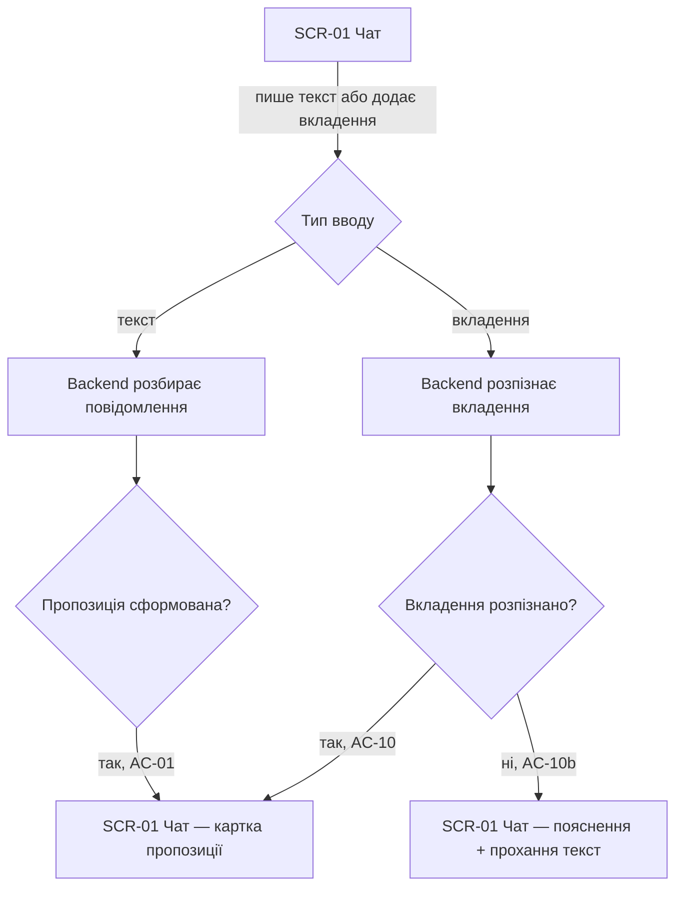
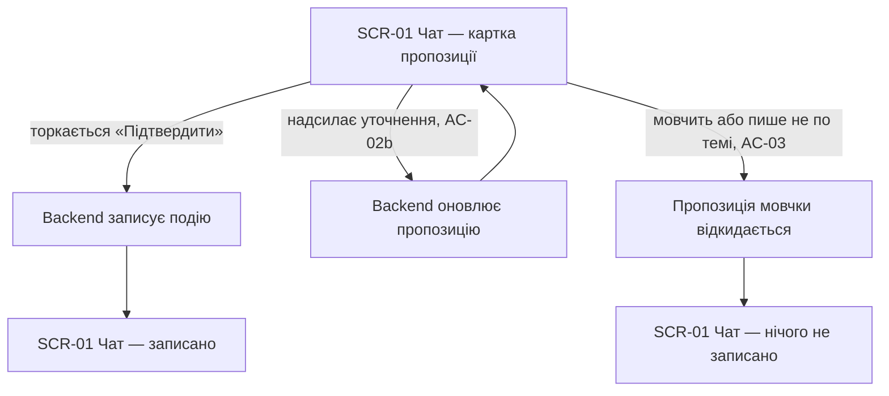
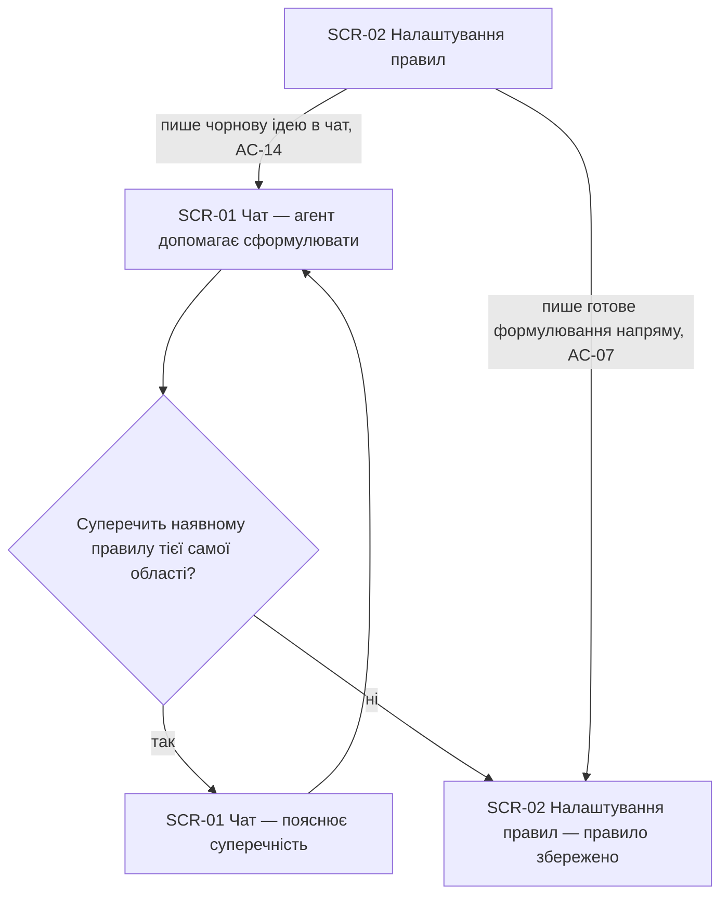
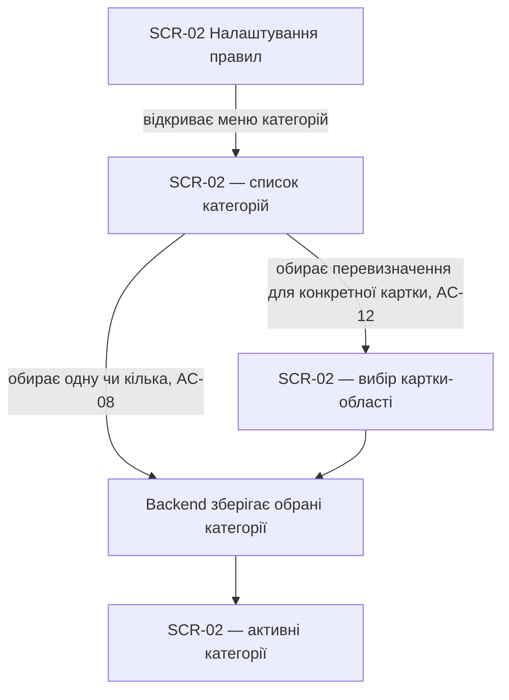
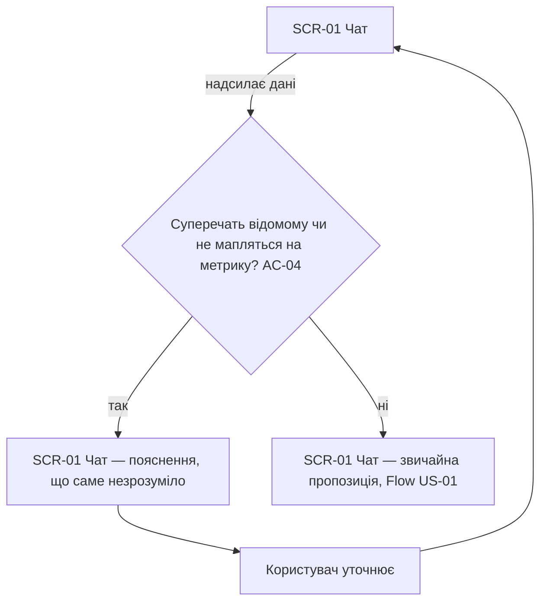
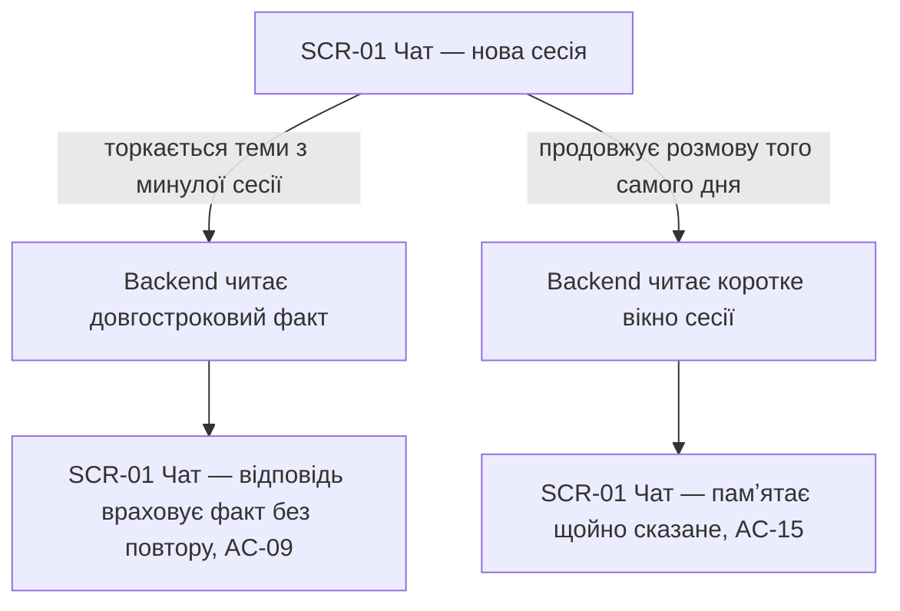
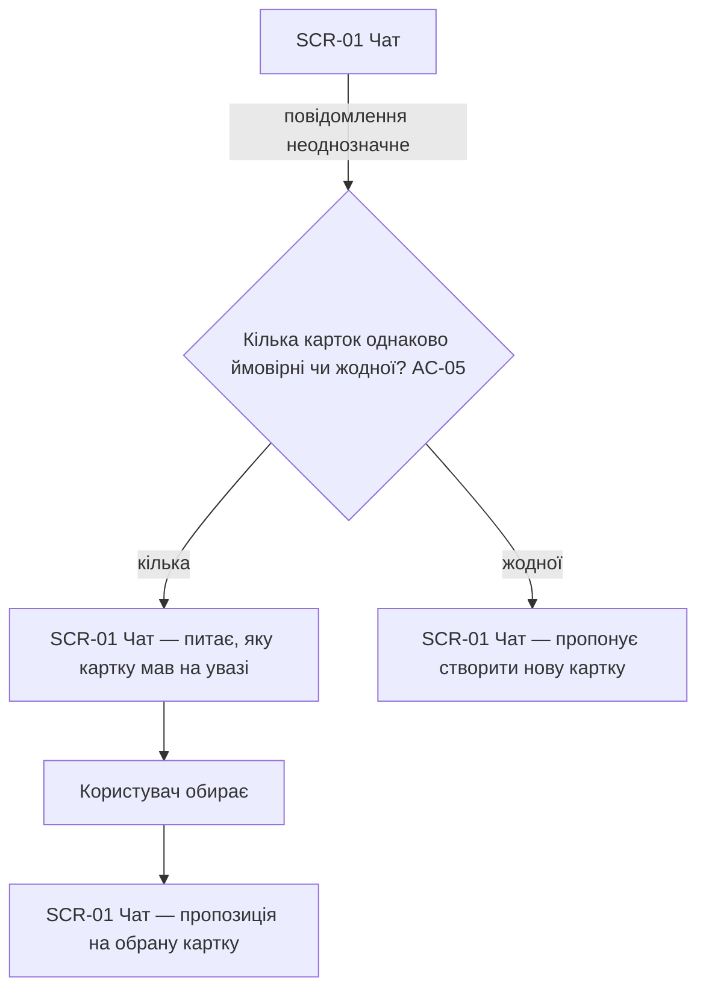
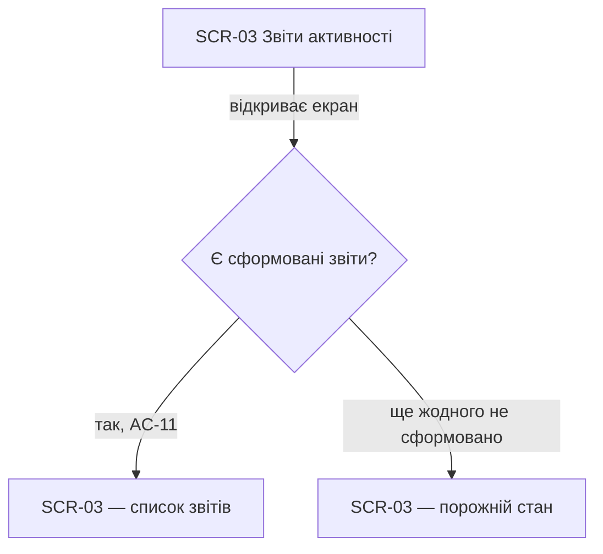
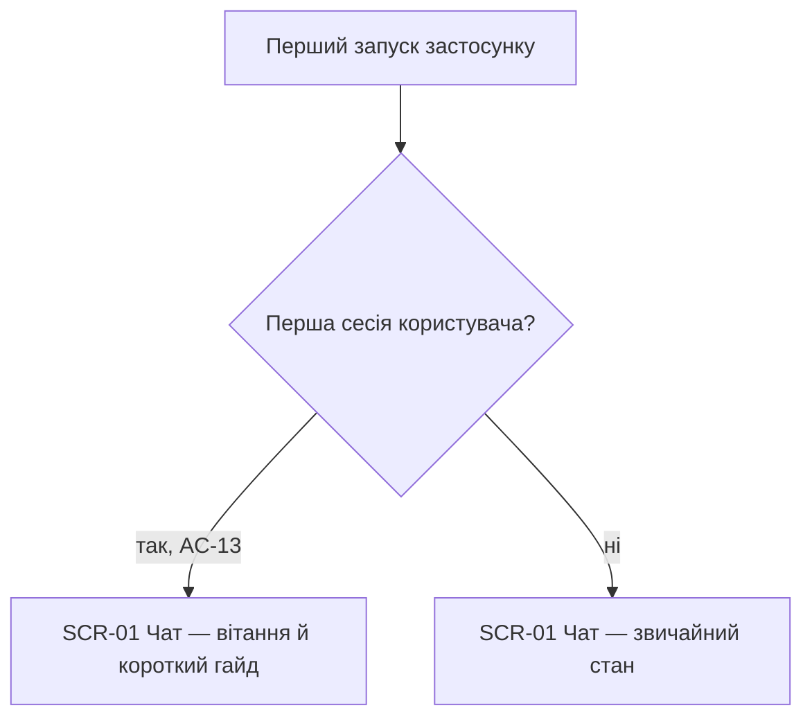

# UX flows — agent

> User flows for every UI-touching §4 user story, produced by `ux-flows` (after `clarify`, before
> `design` — тут ретроактивно, після `api`) і читається `design` (уже зафіксовано, evidence
> post-hoc), `sequences` (SCR-вирівнювання, теж post-hoc), `screens` (деталізує кожен рядок
> інвентарю) і `plan-tests` (e2e-через-UI шляхи). Завжди markdown + mermaid `flowchart` — цей
> артефакт про рух, не про візуальний дизайн.

## Platform decisions

- **Posture:** mobile-first — per `docs/design-system.md` §Platform posture, без відхилення.
- **Модальність:** увесь UI-touching потік агента — **один суцільний чат-екран** (D-25, «агент —
  один суцільний співрозмовник»): пропозиція, уточнення, формулювання правила й онбординг — усе
  спливає в тому самому чаті, не в окремих модалках/сторінках-майстрах.
- **Навігація:** налаштування правил і звіти активності — окремі екрани нижньої навігації (та
  сама схема, що вже задокументована в `structure`/`life-area-card`: «…аналітика → … →
  налаштування»), не вкладені в чат.

## Screen inventory

| ID | Screen | Purpose | Entry | Exit |
|---|---|---|---|---|
| SCR-01 | Чат | Прямий ввід, пропозиції, підтвердження, формулювання правил у діалозі, онбординг | старт застосунку (типовий екран) | навігація на SCR-02/SCR-03 |
| SCR-02 | Налаштування правил | Меню категорій, власний текст правила, card-override | нижня навігація | назад на SCR-01 або звідки прийшли |
| SCR-03 | Звіти активності | Перелік тижневих/місячних/квартальних звітів | нижня навігація | назад |

## Flows

### Flow: US-01 — Записати подію текстом або вкладенням

Користувач пише текст або додає фото. Бекенд розбирає вхід; якщо сформувалась пропозиція (з тексту, AC-01, чи з вкладення, AC-10) — вона зʼявляється карткою в чаті. Якщо вкладення нерозпізнане — агент пояснює причину і просить текстовий опис замість нього (AC-10b), нічого не зберігаючи.

### Flow: US-02 — Підтвердження перед записом

Від картки пропозиції — три шляхи: явне підтвердження записує подію й показує це в чаті (AC-02); повідомлення-уточнення оновлює ту саму пропозицію на місці, не запускаючи новий діалог (AC-02b); мовчання чи повідомлення на іншу тему мовчки відкидає стару пропозицію — рахунок картки не змінюється (AC-03).

### Flow: US-03 — Власне імперативне правило

Користувач або приносить чорнову ідею в чат — агент допомагає сформулювати й перевіряє на несуперечливість із наявними правилами тієї самої області (глобальні з глобальними, card-override — з правилами тієї самої картки), повертаючи діалог, поки конфлікт не зникне (AC-14) — або одразу пише готове правило в налаштуваннях (AC-07). Обидва шляхи закінчуються збереженим правилом.

### Flow: US-04 — Правило з готового меню

Меню категорій — куратований список, без вільного тексту. Вибір категорій без вказаної картки зберігається як глобальне правило (AC-08); вибір із зазначенням конкретної картки зберігається як card-override, що діє лише там, глобальне лишається чинним для решти (AC-12).

### Flow: US-05 — Виправлення помилки вводу

Коли повідомлення суперечить уже відомому чи не відповідає жодній метриці, агент пояснює простими словами, що саме незрозуміло, і просить уточнити — не вгадує і не блокує решту картки (AC-04). Звичайне повідомлення продовжується як у Flow US-01.

### Flow: US-06 — Памʼять між сесіями

Повідомлення в новій сесії, що торкається раніше згаданої теми, отримує відповідь, яка вже враховує збережений факт, без повторного пояснення від користувача (AC-09). У межах того самого календарного дня агент тримає в контексті щойно сказане, навіть якщо воно ще не стало довгостроковим фактом (AC-15).

### Flow: US-07 — Розпізнавання правильної картки

Коли повідомлення могло б стосуватись кількох карток — агент питає, яку саме мав на увазі користувач; коли жодна наявна картка не підходить — пропонує створити нову. У жодному разі не вгадує сам (AC-05).

### Flow: US-08 — Автоматичні звіти активності

Екран лише показує вже сформовані worker'ом тижневі/місячні/квартальні звіти (AC-11) — жодної дії користувача, що запускає формування, тут немає (формування — поза цим флоу, `sad.md §6` Flow 14). До першого звіту екран просто порожній.

### Flow: US-09 — Онбординг через агента

На найпершому запуску агент один раз порушує власне правило «не заговорює першим» (D-43) і подає коротке вітання й гайд прямо в чаті (AC-13). Кожен наступний запуск веде одразу у звичайний стан чату.

## AC coverage

| AC | Shown by | Notes |
|---|---|---|
| AC-01 | Flow US-01 → happy (текст) | |
| AC-02 | Flow US-02 → підтвердження | |
| AC-02b | Flow US-02 → уточнення | |
| AC-03 | Flow US-02 → мовчазне відкидання | |
| AC-04 | Flow US-05 | |
| AC-05 | Flow US-07 | |
| AC-06 | N/A | скорінг доступу — мідлвар бекенда (Bearer-токен), без окремої UI-гілки; той самий підхід, що й у `contracts/api-sync-report.md` |
| AC-07 | Flow US-03 → пряме формулювання | ефект (відповідь слідує правилу) виявляється поведінково в будь-якому чаті, не окремою гілкою |
| AC-08 | Flow US-04 → категорії | |
| AC-09 | Flow US-06 → нова сесія | |
| AC-10 | Flow US-01 → happy (вкладення) | |
| AC-10b | Flow US-01 → нерозпізнане вкладення | |
| AC-11 | Flow US-08 | |
| AC-12 | Flow US-04 → card-override | |
| AC-13 | Flow US-09 | |
| AC-14 | Flow US-03 → цикл конфлікту | |
| AC-15 | Flow US-06 → той самий день | |
