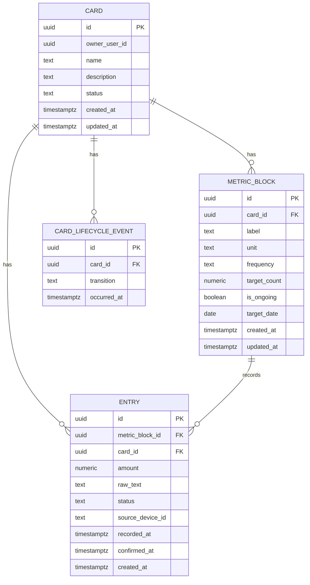

# Data model — life-area-card

> База: PostgreSQL ([D-59](../../DECISIONS.md#d-59), [ADR-0005](../../adr/0005-backend-datastore.md)). PK-стратегія: UUID, генерується в app-шарі через `crypto.randomUUID()` ([architecture-map.md §Конвенції](../../architecture-map.md)) — без DB-default, застосунок завжди передає готовий `id`. Аудит-колонки, статуси й видалення підтверджені з Андрієм 2026-08-23 (greenfield, конвенції репозиторію ще нема).

## ER diagram

## Entities

### `card`

| Column | Type | Constraints | Notes |
|---|---|---|---|
| `id` | UUID | PK, app-generated | `crypto.randomUUID()` |
| `owner_user_id` | UUID | NOT NULL, FK → `app_user(id)` ON DELETE CASCADE | FK додано 2026-08-29, міграція 07 — `agent`'s `app_user` (migration 01) тепер існує. Закриває TBD від 2026-08-23; вмикає каскадне видалення акаунта (agent AC-17, D-89) |
| `name` | TEXT | NOT NULL | без назви картку не створюємо (AC-02) |
| `description` | TEXT | NULL | Опис/«навіщо»; NULL, доки не заповнено (AC-03 блокує лише позначення «заповнена», не саме створення) |
| `status` | TEXT | NOT NULL DEFAULT 'active', CHECK (`status` IN ('active','archived')) | видалення картки (AC-16) — м'яке, як `entry.status`: ніколи фізично не видаляємо, лише позначаємо. `archived`-картки не показуються в колоді |
| `created_at` | timestamptz | NOT NULL DEFAULT now() | |
| `updated_at` | timestamptz | NOT NULL DEFAULT now() | назва/Опис/статус можуть редагуватись |

**Aggregate root:** root.
**Access patterns:** список карток користувача (AC-04) → індекс на `owner_user_id`; список **активних** карток колоди (AC-16) → частковий індекс на `owner_user_id` де `status = 'active'`; список **архівованих** карток (AC-18, 2026-08-29) → частковий індекс на `owner_user_id` де `status = 'archived'`.
**Constraints:** FK на `owner_user_id` — `<!-- TBD: додається окремою міграцією фічею, що володіє users -->`.

### `metric_block`

| Column | Type | Constraints | Notes |
|---|---|---|---|
| `id` | UUID | PK, app-generated | |
| `card_id` | UUID | NOT NULL, FK → `card(id)` ON DELETE CASCADE | індексовано нижче |
| `label` | TEXT | NOT NULL | що саме міряємо, вільний текст користувача |
| `unit` | TEXT | NOT NULL | довільна одиниця (книги, км…), D-30 |
| `frequency` | TEXT | NULL | опційний параметр звірки факту з планом, D-30 |
| `target_count` | NUMERIC | NULL | ціль «X з N»; NULL для чисто частотних цілей без фіксованого підсумку |
| `is_ongoing` | BOOLEAN | NOT NULL DEFAULT false | «постійний процес», без кінцевої дати (AC-05) |
| `target_date` | DATE | NULL | ціль у часі; очікувано NULL коли `is_ongoing = true` — `<!-- TBD: чи забезпечувати CHECK, чи лише на рівні domain-коду -->` |
| `created_at` | timestamptz | NOT NULL DEFAULT now() | |
| `updated_at` | timestamptz | NOT NULL DEFAULT now() | ціль можна змінити |

**Aggregate root:** `card`.
**Access patterns:** читання всіх блоків картки (відкриття картки, AC-09) → індекс на `card_id`.
**Constraints:** FK → `card(id)`.

### `entry`

| Column | Type | Constraints | Notes |
|---|---|---|---|
| `id` | UUID | PK, app-generated | |
| `metric_block_id` | UUID | NOT NULL, FK → `metric_block(id)` ON DELETE CASCADE | індексовано нижче |
| `card_id` | UUID | NOT NULL, FK → `card(id)` ON DELETE CASCADE | денормалізовано для швидкого читання історії картки (AC-13) |
| `amount` | NUMERIC | NOT NULL | величина цього запису, додається до лічильника блоку |
| `raw_text` | TEXT | NULL | що сказав користувач — показ в історії (US-12) |
| `status` | TEXT | NOT NULL DEFAULT 'pending', CHECK (`status` IN ('pending','confirmed','rejected')) | ADR-0002. Виправлення/відкат (AC-12) — позначаємо `rejected`, ніколи фізично не видаляємо (підтверджено з Андрієм) |
| `source_device_id` | TEXT | NULL | для виявлення близького за часом конфлікту (AC-06) |
| `recorded_at` | timestamptz | NOT NULL DEFAULT now() | коли подія сталась/надійшла |
| `confirmed_at` | timestamptz | NULL | коли статус перейшов у `confirmed`/`rejected` |
| `created_at` | timestamptz | NOT NULL DEFAULT now() | |

**Aggregate root:** `card` (через `metric_block`).
**Access patterns:** перерахунок прогресу блоку (ADR-0001) → індекс на `metric_block_id`; історія картки, найновіші зверху (AC-13) → індекс на `(card_id, recorded_at DESC)`; пошук неперевірених записів при поверненні агента (AC-11) → частковий індекс на `(card_id, status)` де `status = 'pending'`.
**Constraints:** FK → `metric_block(id)`, FK → `card(id)`; CHECK на `status`.

### `card_lifecycle_event`

| Column | Type | Constraints | Notes |
|---|---|---|---|
| `id` | UUID | PK, app-generated | |
| `card_id` | UUID | NOT NULL, FK → `card(id)` ON DELETE CASCADE | індексовано нижче |
| `transition` | TEXT | NOT NULL, CHECK (`transition` IN ('created','filled','in_use','archived','restored')) | стани картки, design-review Блок 4. `archived` додано для AC-16; `restored` додано 2026-08-29 для AC-17 (розархівація, Крок 3 опитувальника) — той самий журнал фіксує й повернення з архіву. «Некоректні дані» — не тут: це тимчасовий прапорець, не одноразовий перехід (AC-10), рахується з `entry`/`metric_block`, не зберігається окремо |
| `occurred_at` | timestamptz | NOT NULL DEFAULT now() | |

**Aggregate root:** `card`.
**Access patterns:** медіанний час «створена» → «заповнена» (spec.md §7 KPI) → індекс на `(card_id, occurred_at)`.
**Constraints:** FK → `card(id)`; CHECK на `transition`.

## Indexes

| Index | Columns | Query it serves |
|---|---|---|
| `idx_card_owner` | `card(owner_user_id)` | список карток користувача (AC-04, авторизація на кожному читанні) |
| `idx_card_owner_active` | `card(owner_user_id) WHERE status = 'active'` | список **активних** карток колоди — архівовані (AC-16) не показуються |
| `idx_metric_block_card` | `metric_block(card_id)` | читання блоків картки при відкритті (AC-09) |
| `idx_entry_metric_block` | `entry(metric_block_id)` | перерахунок прогресу блоку з сирих подій (ADR-0001) |
| `idx_entry_card_recorded` | `entry(card_id, recorded_at DESC)` | історія останніх N записів картки (AC-13) |
| `idx_entry_card_pending` | `entry(card_id, status)` WHERE `status = 'pending'` | пошук неперевірених записів, коли агент повертається (AC-11) |
| `idx_lifecycle_card_time` | `card_lifecycle_event(card_id, occurred_at)` | медіанний час переходу станів (spec.md §7 KPI) |

## Test fixtures

- `buildCard({ ownerUserId, name, description, status })` — картка з дефолтним власником `user-<uuid>@example.test`, за замовчуванням `status: 'active'`.
- `buildMetricBlock({ cardId, label, unit, targetCount, isOngoing, targetDate })` — блок-метрика з дефолтною ціллю.
- `buildEntry({ metricBlockId, cardId, amount, status })` — запис, за замовчуванням `status: 'confirmed'`.
- `buildPendingEntry({ metricBlockId, cardId, sourceDeviceId })` — запис у стані `pending` для тестів AC-06/AC-11.
