# Software Architecture Document — life-area-card

<!-- 12 Arc42 sections. Empty section → <!-- N/A: <one-line reason> -->. -->
<!-- C4 Context (L1) lives inline in §3. C4 Container (L2) lives inline in §5. -->
<!-- Numbers in §10 come VERBATIM from spec.md §6 NFR — no inventing, no rounding. -->

## 1. Introduction and goals

**Intent.** Картка — generic-механізм, що описує одну зону життя користувача (spec.md §2): назва, Опис (навіщо), блоки-метрики (кількість + частота + ціль у часі), Відстеження (порахований прогрес). Користувач фіксує події через розмову з агентом і підтвердження, бачить чесний прогрес, і — за новим рішенням цієї сесії ([D-57](../../DECISIONS.md#d-57)) — переглядає й виправляє історію своїх записів разом з агентом.

**Top-3 quality goals (1-liners; full scenarios в §10):**

1. Офлайн-доступність читання й запису — картка й історія працюють без мережі, запис не губиться, поки немає з'єднання.
2. Цілісність даних — жоден запис не враховується в прогресі мовчки: конфліктні й неперевірені записи чекають на агента (spec.md AC-06, AC-11).
3. Швидкість відгуку — запис і перегляд картки відчуваються миттєвими (spec.md §6 NFR).

**Stakeholders.**

| Role | Interest | Sign-off owner? |
|---|---|---|
| user | створює й веде власні картки, читає прогрес і історію | No |
| Tech Lead (Андрій) | архітектурні рішення, ADR | Yes |

## 2. Constraints

**Technical.**
- TypeScript на Node.js (інструменти збірки), React 18+ — компонент на картку (architecture-map.md)
- Vite — збірка й dev-сервер
- PWA — встановлюваний застосунок, частково офлайн
- Tailwind CSS — стилізація
- Vitest + React Testing Library — тести
- ESLint + Prettier — лінт/форматування
- `localStorage` як локальний кеш (~2 МБ, через шар абстракції `shared/storage/`) + мінімальний бекенд-сервер (D-24) на PostgreSQL 16+ ([D-59](../../DECISIONS.md#d-59)) — джерело правди для синхронізації

**Organisational.**
- Одна людина (Андрій) у темпі ~1–2 год/тиждень (idea-brief §11) — Клод як асистент розробки
- Жорсткого дедлайну немає; ефект фази — рухаємось як з робочою гіпотезою (spec.md §8, Approach A не підтверджений формально)

**Conventions.**
- [`architecture-map.md`](../../architecture-map.md) — повний перелік конвенцій продукту
- Реєстрація картки-типу: один код назавжди (`domain/`, `ui/`, `index.ts`), нова картка користувача = новий запис даних, не нова папка коду (D-23)
- Обробка помилок: валідація й попередження агента показуються прямо на лицьовій стороні картки, ніколи `alert`/`confirm` ([architecture-map.md](../../architecture-map.md) §Конвенції)
- ID: `crypto.randomUUID()` для будь-яких збережених записів
- Зберігання: лише через `shared/storage/`, ніколи напряму `localStorage`

**Regulatory / external.**
- Формальне регулювання (GDPR тощо) не застосовується — не комерційний сервіс для третіх осіб на цьому етапі
- spec.md §6.1: Security review — Required (нові чутливі особисті дані + нова межа авторизації «лише свої картки»)

## 3. Context and scope

Картка — одиниця, яку користувач заповнює й веде через розмову з агентом; вона показує прогрес і приймає підтверджені записи. Ця фіча описує лише саму картку — не Структуру (розкладка карток) і не характер/правила агента (спеки `structure`/`agent`, D-56).

<!-- brownfield: N/A — greenfield-фіча; scaffold є (architecture-map.md), робочого коду картки ще немає -->

**External systems (in / out):**

| Actor or system | Type | Interaction |
|---|---|---|
| user | Person | створює й веде картки, спілкується з агентом, переглядає прогрес та історію |
| Агент (Claude API через бекенд) | System (external, за межами цієї фічі) | розбирає прямий ввід, підтверджує запис, перевіряє конфлікти й неперевірені записи |
| Google | System (external) | вхід користувача (D-33) — дає відповідь на «чиї це дані» для AC-04 |

**C4 Context (L1):**

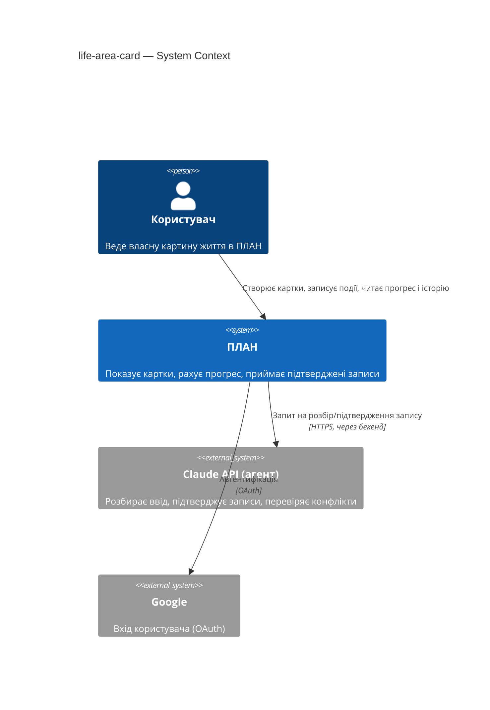

## 4. Solution strategy

**Top strategic choices (the seeds for ADRs):**

1. **Поверхні фічі — успадковано, не нове рішення.** `target_surfaces: [backend-service, web-frontend]` — веб-інтерфейс картки (PWA) + власні дані-ендпоінти на вже наявному мінімальному бекенді (D-24). Обидві поверхні й сам факт бекенда вже зафіксовані на рівні продукту (продуктовий [ADR-0001 «Стек фронтенду»](../../adr/0001-frontend-stack.md), D-3, D-24), тут лише успадковуються. UI-архітектура (SPA, клієнтський рендер, встановлюваний PWA) так само успадкована з продуктового ADR-0001 — нового ADR немає.
2. **Прогрес рахується завжди з сирих подій, ніколи не кешується готовим числом — і рахується ОДНИМ спільним кодом, а не окремо на клієнті й на бекенді.** — [ADR-0001 «Recompute progress from raw events»](adr/0001-recompute-progress-from-raw-events.md) (фічевий, не плутати з продуктовим вище). Історія записів (US-12) все одно вимагає сирих даних; кешоване число було б другим джерелом правди. Бекенд лишається джерелом правди (записує підтверджені події); клієнт кешує ті самі сирі події офлайн і виконує **той самий** чистий розрахунок локально — не другу незалежну реалізацію (деталі — §5).
3. **Неперевірені й конфліктні записи мають статус `pending`, не рахуються в прогресі до підтвердження агентом** — [ADR-0002 «Hold unconfirmed records as pending»](adr/0002-hold-unconfirmed-records-pending.md). Покриває і AC-06 (конфлікт пристроїв), і AC-11 (агент був недоступний).
4. **Вікно виявлення «близьких за часом» конфліктів — коротке, точне число визначається пізніше** (spec AC-06). Тактична деталь під пунктом 3, окремого ADR не потребує — зміна самого числа згодом не є переробкою на дні (не 2 з 3 критеріїв blast radius: змінюється легко, зачіпає модуль конфлікту, альтернатива не принципова).

Кожне тактичне рішення в розділах нижче простежується до одного з цих чотирьох.

## 5. Building block view

Шарова архітектура всередині картки (`domain/` + `ui/`), як і решта продукту ([ADR-0004 «Scaffold архітектура»](../../adr/0004-scaffold-architecture.md), продуктовий): чиста доменна логіка (розрахунок прогресу, статуси записів) окремо від UI-компонентів.

**Спільна доменна логіка клієнт/бекенд (закриває F1 критика):** `domain/progress.ts`, `domain/conflict.ts`, `domain/entry.ts` — це **один і той самий** чистий код (без залежності від React чи мережі), який імпортують і бекенд (авторитетний розрахунок над базою — джерело правди), і PWA (офлайн-розрахунок над кешем сирих подій). Не дві реалізації одного правила — одна бібліотека, підключена в двох місцях. Технічно: пакується як окремий internal-модуль, який бере на вхід масив сирих подій і повертає прогрес/конфлікти/статуси — без побічних ефектів.

**Internal decomposition (клієнт, PWA):**

```
plan/app/src/cards/life-area-card/
├── domain/
│   ├── progress.ts       # частка виконання цілі з сирих подій (ADR-0001), capping при перевищенні (AC-05b) — спільний з бекендом
│   ├── entry.ts          # модель запису: confirmed | pending | rejected (ADR-0002) — спільний з бекендом
│   ├── conflict.ts        # виявлення близьких за часом записів (AC-06) — спільний з бекендом
│   └── card.ts             # стани картки (created/filled/in_use/archived) — "некоректні дані" (AC-10) сюди НЕ входять: тимчасовий прапорець із T20/T12, не стан життєвого циклу
├── ui/
│   ├── CardFace.tsx        # лицьова сторона: назва, Опис, попередження (без alert)
│   ├── CardBack.tsx        # зворот: Відстеження, прогрес (перерахований локально з кешу)
│   └── EntryHistory.tsx    # US-12: розгортна історія останніх N записів
└── index.ts                # реєстрація картки в app-shell (одна картка-тип назавжди, D-23)
```

**Internal decomposition (бекенд, `backend-service`):** конкретна структура папок серверного коду ще не встановлена на рівні продукту — мінімальний бекенд (D-24) досі не піднімався жодного разу (DELIVERY-PLAN «Розробка» 5%). Тут фіксуються лише відповідальності, які ця фіча додає до нього (реалізація й точна структура — рішення, коли бекенд вперше scaffold-иться, можливо разом із фічею `agent`):

- Ендпоінти картки: створити картку, записати подію, прочитати історію/прогрес.
- Перевірка власника на кожному читанні/записі картки (AC-04) — використовує вхід через Google (D-33).
- Виявлення близького за часом конфлікту (`domain/conflict.ts`, спільний з клієнтом) і статус `pending`/`confirmed`/`rejected` (ADR-0002) над базою-джерелом правди.
- Звернення до Claude API для розбору/підтвердження/уточнення конфлікту.

Відкрите архітектурне питання (де саме на диску/в репозиторії живе цей код) зафіксовано в §11.

**C4 Container (L2):**

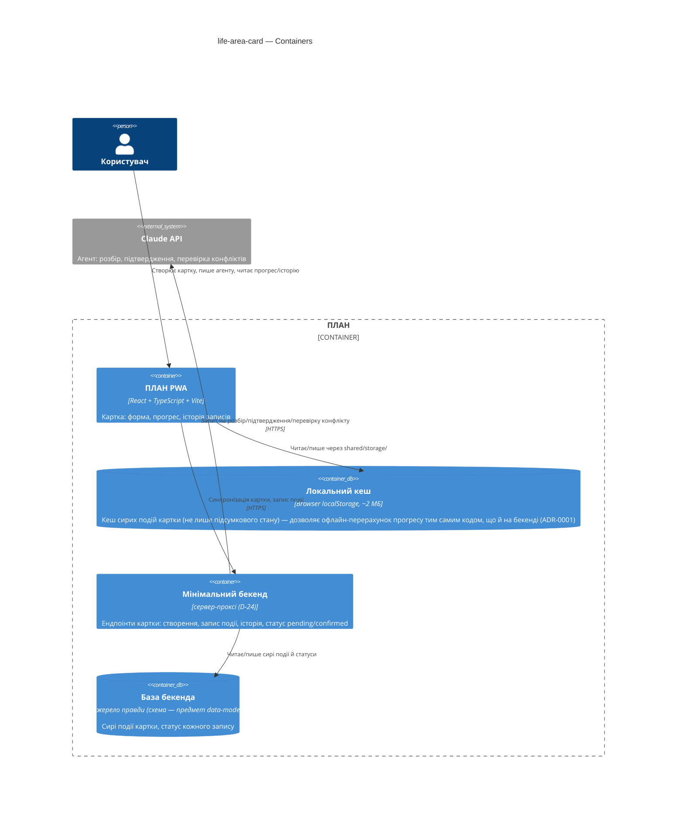

## 6. Runtime view

**Critical flow 1: Створення картки без назви — блокується (AC-02)**

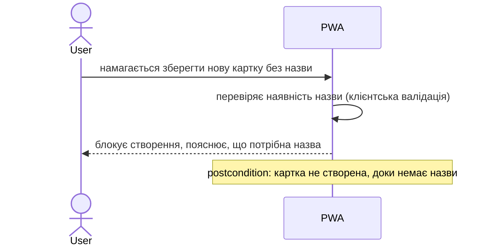

**Critical flow 2: Оновлення картки — назва/Опис/позначення «заповнена» (AC-03, AC-19)**

```mermaid
sequenceDiagram
    actor User
    participant PWA
    participant Backend
    participant Store as База бекенда

    User->>PWA: змінює назву, Опис, чи намагається позначити картку заповненою
    PWA->>Backend: запит на оновлення (name/description/markFilled)
    alt markFilled=true, Опис порожній (ні збережений раніше, ні переданий зараз)
        Backend->>Backend: перевіряє наявність Опису (T9, AC-03) -- ДО будь-якого запису
        Backend-->>PWA: блокує, пояснює, що потрібен короткий «навіщо»
        PWA-->>User: бачить пояснення, картка лишається «створена»
    else Опис є (чи не запитували markFilled)
        Backend->>Store: оновлює назву/Опис; якщо markFilled -- пише подію "filled"
        Store-->>Backend: ok
        Backend-->>PWA: оновлена картка
        PWA-->>User: бачить нову назву/Опис одразу (AC-19 -- зміна назви відображається в колоді)
    end
```

**Critical flow 3: Запис події з підтвердженням (happy path, AC-01)**

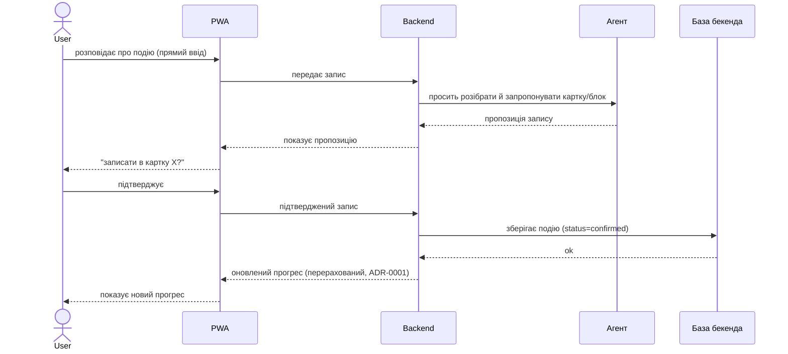

**Critical flow 4: Перегляд прогресу, включно з capping при перевищенні цілі (AC-09/AC-09b)**

Уточнено 2026-09-06 ([D-106](../../DECISIONS.md#d-106), закриває [ISS-39](../../ISSUES.md)): доданий крок відкриття метаданих блоків (`GET .../metric-blocks`) — до цього потік читав «сирі події» з кешу, не показуючи, звідки PWA взагалі знає перелік блоків-метрик картки (label/unit/targetCount/isOngoing). **Кеш-першим, мережа лише як fallback** — перша версія цього уточнення (той самий день) безумовно вимагала мережевого виклику ПЕРЕД читанням кешу, що ламало [QG-1](#10-quality-requirements) (офлайн-доступність читання, spec.md §6) для картки, відкритої вдруге без мережі; знайдено адверсаріальною перевіркою D-106 одразу після першого чернетки, виправлено тим самим днем. Метадані кешуються ПОВНИМ заміщенням при кожній успішній синхронізації (`local-cache.ts` `cacheMetricBlocks`, T11) — при створенні/перенесенні блоку (T16/T17 вже повертають повний `MetricBlock` у відповіді) чи при явній онлайн-синхронізації; звичайне відкриття картки читає вже кешовані метадані, мережа потрібна лише один раз, на холодний старт.

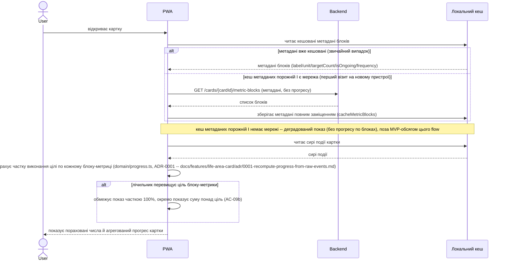

Не плутати з `GET /cards/{cardId}` (`getCard`, backing `Card.aggregateProgress`) — інший клієнтський сценарій (лаконічний агрегат для колоди карток, SCR-01), не цей flow; обидва бекенд-шляхи використовують той самий `listMetricBlocksByCard` (postgres-repo.ts) незалежно один від одного, без дублювання на клієнті.

**Critical flow 5: Агент вказує на підозрілі дані (AC-10)**

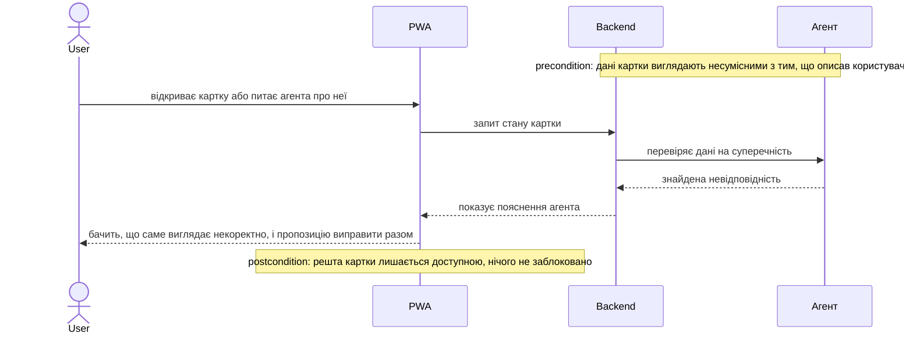

**Critical flow 6: Ціль «постійний процес» — показ без відсотка (AC-05)**

Синхронізація метаданих блоку (`isOngoing`) — той самий крок, що вже показаний у Critical flow 4 (D-106); тут не повторюється окремо, обидва потоки діляться однією синхронізацією при відкритті картки.

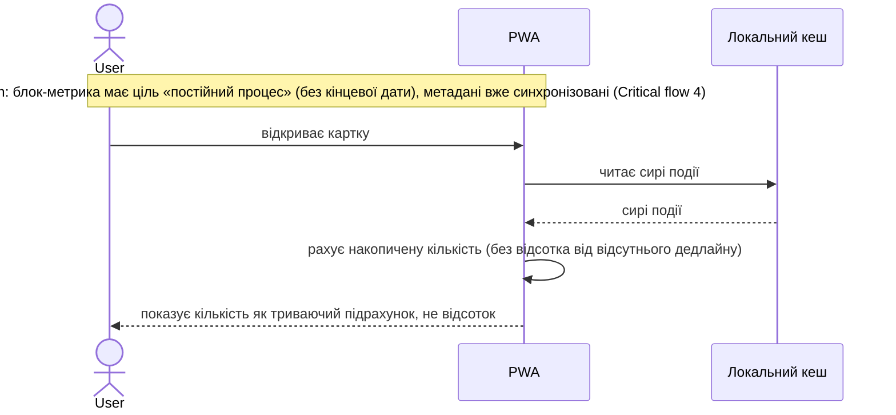

**Critical flow 7: Близький за часом конфлікт і неперевірений запис (AC-06, AC-11, ADR-0002)**

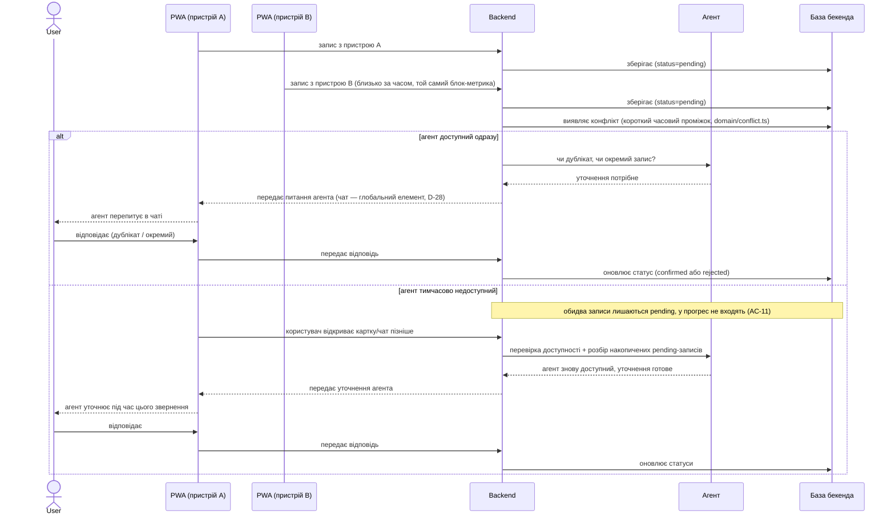

**Critical flow 8: Допомога з невимірною ціллю (AC-07)**

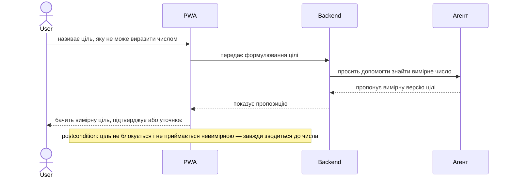

**Critical flow 9: Декларативна картка без метрики (AC-08)**

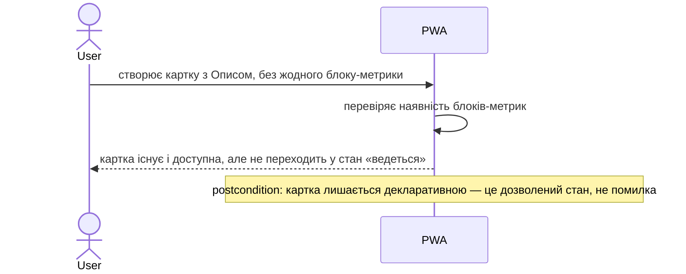

**Critical flow 10: Доступ лише до своїх карток (AC-04)**

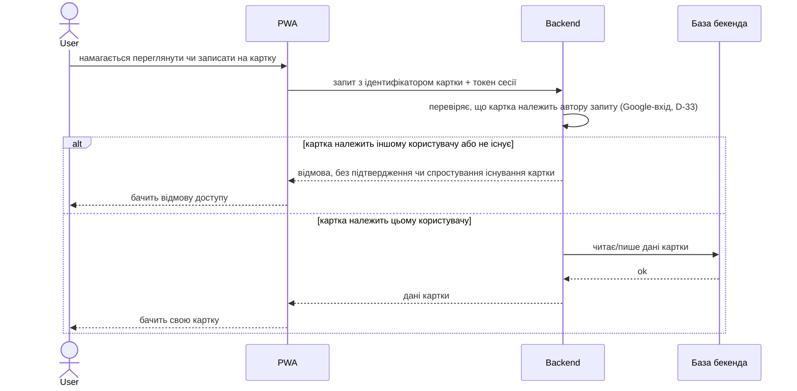

**Critical flow 11: Перегляд і виправлення історії записів (AC-12, AC-13)**

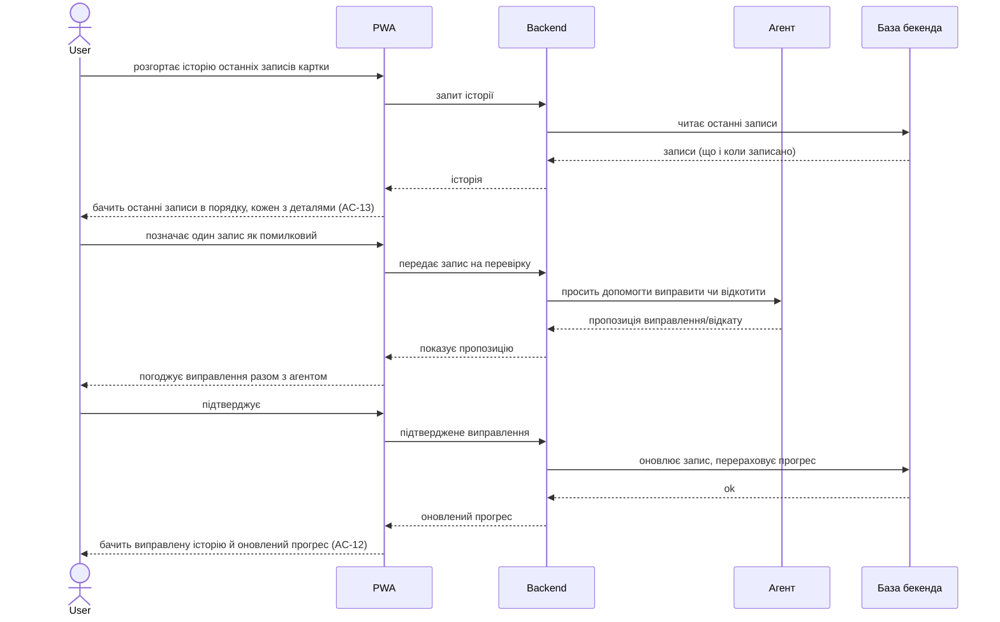

**Critical flow 12: Прийняття перенесеної метрики, включно з колізією назви (AC-14, AC-15)**

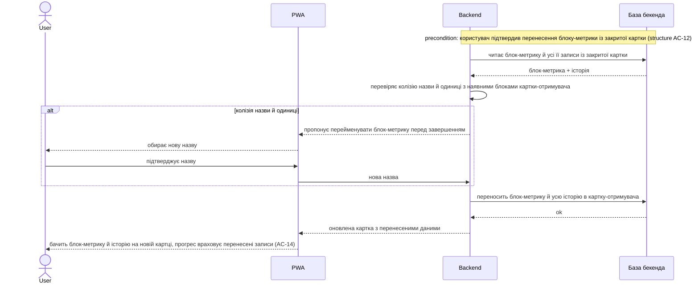

**Critical flow 13: Архівація картки (AC-16)**

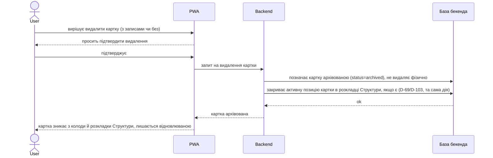

**Critical flow 14: Розархівація картки (AC-17)**

```mermaid
sequenceDiagram
    actor User
    participant PWA
    participant Backend
    participant Store as База бекенда

    User->>PWA: відкриває список архівованих карток, обирає розархівувати
    PWA->>Backend: запит на розархівацію
    Backend->>Store: читає картку
    Store-->>Backend: картка
    alt картка вже active (не в архіві)
        Backend-->>PWA: помилка card.not_archived, нічого не змінено
        PWA-->>User: бачить, що картка не в архіві
    else картка archived
        Backend->>Store: позначає картку active, пише подію "restored"
        Store-->>Backend: ok
        Backend-->>PWA: картка розархівована
        PWA-->>User: картка знову в колоді; в розкладці Структури з'являється внизу екрана без клітинки (D-69/D-104, той самий патерн що зміна режиму розкладки, structure AC-11b) -- перетягує сам
    end
```

**Critical flow 15: Перегляд архівованих карток (AC-18)**

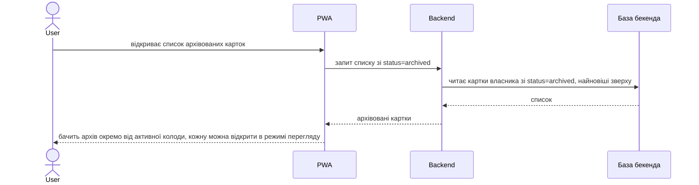

**Coverage check (`/sdd:sequences`, крок 7).**

*Use-case pass (§4):* усі 16 US мають ≥1 потік — US-01→Flow 1, US-02→Flow 2, US-03→Flow 3, US-04→Flow 4, US-05→Flow 5, US-06→Flow 6, US-07→Flow 7, US-08→Flow 8, US-09→Flow 9, US-10→Flow 10, US-11→Flow 7 (AC-11), US-12→Flow 11, US-13→Flow 12, US-14→Flow 13, US-15→Flow 14, US-16→Flow 15.

*AC pass (§5):* усі 20 AC показані — AC-01→Flow 3, AC-02→Flow 1, AC-03→Flow 2, AC-04→Flow 10, AC-05→Flow 6, AC-06→Flow 7, AC-07→Flow 8, AC-08→Flow 9, AC-09/AC-09b→Flow 4, AC-10→Flow 5, AC-11→Flow 7, AC-12/AC-13→Flow 11, AC-14/AC-15→Flow 12, AC-16→Flow 13, AC-17→Flow 14, AC-18→Flow 15, AC-19→Flow 2.

**Оновлено 2026-09-05 ([D-103](../../DECISIONS.md#d-103)), закриває [ISS-27](../../ISSUES.md):** Flow 2 (client-only), Flow 13 (без кроку закриття позиції) і відсутність Flow 14/15 — застаріле з хвилі D-89 (2026-08-29), коли AC-17/18/19 додались у spec.md, а `sad.md` не звірили. Виявив критик хвилі 5 writer+critic (Flow 2), решту знайдено при цій же перевірці.

**Відкрита прогалина, НЕ вирішена цим оновленням:** AC-19 (перейменування) у spec.md прямо каже, що зміна фіксується «подією в Літописі Структури» (`structure/spec.md` AC-15) — окремий сервіс літопису (`structure/adr/0004`, власна база, ще не існує жодним рядком коду). Поточний `update-card.ts` (T14) цього виклику не робить. Не той самий клас прогалини, що D-103 (там бракувало таблиці в тій самій базі; тут бракує цілого окремого сервісу) — записано окремо, не виправлено тут.

**Flagged for review:** жодного нового учасника поза §5 не знадобилось (`Cache` — те саме, що вже задекларований контейнер «Локальний кеш» у C4 Container).

## 7. Deployment view

<!-- N/A: фіча використовує вже заплановану топологію продукту (PWA-хостинг + спільний мінімальний бекенд, D-24) — власної нової інфраструктури не вводить. Сам бекенд ще жодного разу не розгортався (DELIVERY-PLAN «Розробка» 5%) — це продуктовий, не фічевий гоп, топологія визначиться коли бекенд вперше піднімають. -->

## 8. Crosscutting concepts

| Concept | Convention | Where defined |
|---|---|---|
| Logging | успадковано з конвенцій продукту, деталей на рівні картки немає | architecture-map.md |
| Authentication | Google-вхід (OAuth), кожен запит бекенда перевіряє власника картки (AC-04) | D-33, spec.md §6.1 |
| Error handling | валідація й попередження агента — на лицьовій стороні картки, ніколи `alert`/`confirm` | architecture-map.md §Конвенції |
| ID strategy | `crypto.randomUUID()` для картки й кожного запису | architecture-map.md |
| Internationalisation | N/A — лише українська мова на цьому етапі | — |
| Observability | клієнтські таймери для NFR (spec.md §6): p95 запис ≤300ms, p95 читання ≤150ms | spec.md §6 |
| Events | N/A — прямі виклики бекенда, без шини подій | — |

## 9. Architecture decisions

| # | Title | Status | Section |
|---|---|---|---|
| 0001 | Recompute progress from raw events, never store a derived percentage | Accepted | §4 |
| 0002 | Hold unconfirmed records as pending, exclude them from progress until the agent confirms | Accepted | §4 |

ADR files live under `docs/features/life-area-card/adr/NNNN-<title>.md`.

## 10. Quality requirements

**QG-1. Офлайн-доступність**
- **When:** користувач відкриває картку без мережі
- **Then:** читання картки й історії з кешу — 100% (spec.md §6, рядок «Офлайн-доступність (читання)»); запис приймається офлайн, але лишається «в очікуванні» до підтвердження (spec.md §6, рядок «Офлайн-доступність (запис)»)
- **How verify:** ручна перевірка без з'єднання — відкрити картку, записати подію, підключитись, перевірити підтвердження

**QG-2. Цілісність даних**
- **Then:** конфліктні (AC-06) і неперевірені (AC-11) записи ніколи не входять у прогрес до підтвердження агентом (ADR-0002)
- **How verify:** інтеграційний тест, що симулює два близькі за часом записи одного блоку-метрики й перевіряє, що прогрес не змінюється до підтвердження

**QG-3. Швидкість відгуку**
- **When:** користувач підтверджує запис / відкриває картку
- **Then:** p95 запис підтвердженої події ≤ 300 ms (без часу відповіді агента); p95 відкриття картки ≤ 150 ms — spec.md §6, verbatim
- **How verify:** клієнтський таймер від дії до оновленого стану картки

## 11. Risks and technical debt

| Risk / debt | Severity | Mitigation | Owner | Due |
|---|---|---|---|---|
| Перерахунок прогресу на льоту (ADR-0001) може сповільнитись при великій кількості записів на картку | Low | не оптимізуємо зараз (MVP — десятки записів); за потреби — кеш з інвалідацією пізніше | Андрій | після MVP, за потреби |
| Модель картки додає третій статус запису (`pending`) — складніше, ніж «є/немає» | Medium | покрито ADR-0002 явно; UI показує pending видимо, не приховує | Андрій | — (прийнято) |
| Open architectural decision: де саме (шлях/репозиторій) живе код мінімального бекенда — не встановлено на рівні продукту | Open question | зафіксувати при першому scaffold бекенда, ймовірно разом з фічею `agent` | Андрій | перед `/sdd:tasks life-area-card` |
| Open architectural decision: точне число «короткого вікна» виявлення конфлікту (AC-06) | Open question | узгодити на `/sdd:data-model life-area-card` | Андрій | перед `/sdd:data-model life-area-card` |
| ~~Open architectural decision: максимальна кількість карток не визначена~~ | — | перенесено у власника: [`structure/spec.md` §8](../structure/spec.md) («щільність поля розкладки») — питання розкладки, не картки | — | — |
| Open architectural decision: Approach A ще не підтверджений формально, RICE/Feasibility TBD (spec.md §8) | Open question | рухаємось як з робочою гіпотезою | Андрій | перед `/sdd:tasks life-area-card` |

**Accepted debt (acceptable in v1, plan to fix later):**
- Модель картки додає третій статус запису (`pending`) — прийнято свідомо разом з ADR-0002, складність виправдана вимогами AC-06/AC-11.

**Звірка зі spec.md §8 (single source of truth, CLAUDE.md):** питання «чи фіксуємо правило "похідні числа не зберігаємо"» — **закрито цим SAD**, [ADR-0001](adr/0001-recompute-progress-from-raw-events.md) відповідає «так». `spec.md` §8 потребує правки — прибрати цей рядок і додати посилання на ADR-0001 (виконується разом з фіналізацією цього SAD, крок 7).

## 12. Glossary

| Term | Meaning |
|---|---|
| card | картка — один інстанс generic-механізму (CONTEXT.md) |
| metric-block | блок-метрика — кількість + частота + ціль у часі (CONTEXT.md) |
| description | Опис — декларація «навіщо» на картці (CONTEXT.md) |
| tracking | Відстеження — пораховані числа й прогрес (CONTEXT.md) |
| agent | агент — за межами цієї фічі, взаємодія лише через підтвердження (CONTEXT.md) |
| connector | конектор — зовнішнє джерело даних, поза v1 (CONTEXT.md) |
| user | користувач (CONTEXT.md) |
| pending / confirmed / rejected | статуси запису картки (ADR-0002) — `pending`: чекає на перевірку агента; `confirmed`: враховується в прогресі; `rejected`: визначено дублікатом чи помилкою, не враховується |
