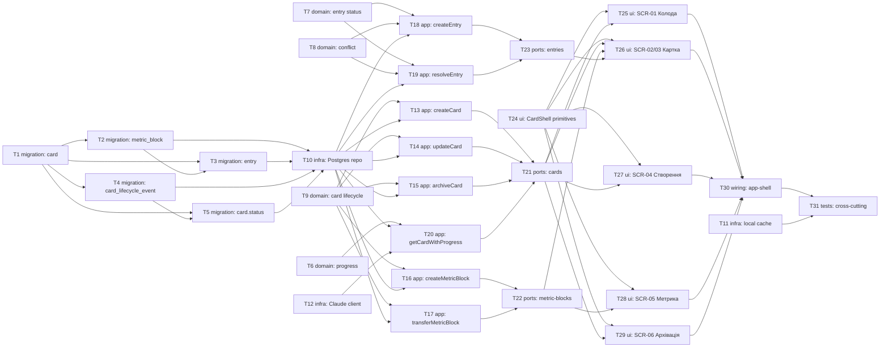

# Epic — life-area-card

> **Spec:** [spec.md](../spec.md) · **Design:** [sad.md](../sad.md) · **Data model:** [data-model.md](../data-model.md) · **API:** [openapi.yaml](../contracts/openapi.yaml) · **Screens:** [screens.md](../screens.md) · **ADRs:** [adr/](../adr/)

## Goal

Реалізувати Картку — generic-механізм зони життя (spec.md §2): назва, Опис, блоки-метрики, Відстеження. Записи потрапляють виключно через підтверджену пропозицію агента (`agent`, поза цим epic). 4 сутності БД, 10 API-ендпоінтів, 6 екранів.

## Scope

- **In:** доменна логіка (прогрес/статус запису/конфлікт/життєвий цикл картки), інфраструктура (Postgres-репо, офлайн-кеш, Claude-клієнт для перевірки даних), use-case шар, HTTP-ендпоінти, 6 UI-екранів, wiring.
- **Out (spec.md §3):** розкладка карток (`structure`), характер/правила/пам'ять агента (`agent`), готові конектори.

## Task map

## Tasks

See [tracker.md](./tracker.md) for status. Machine contract: [tasks.json](../tasks.json).

| # | Task | Layer | Blocked by | DoD (short) |
|---|---|---|---|---|
| T1 | Create card table | migration | — | migration 01 applies/reverts cleanly |
| T2 | Create metric_block table | migration | T1 | migration 02 applies/reverts cleanly |
| T3 | Create entry table | migration | T1, T2 | migration 03 applies/reverts cleanly |
| T4 | Create card_lifecycle_event table | migration | T1 | migration 04 applies/reverts cleanly |
| T5 | Add card.status column (soft archival) | migration | T1, T4 | migration 05 applies/reverts; partial index live |
| T6 | Domain: progress calculation from raw events | domain | — | unit tests for AC-05/09/09b |
| T7 | Domain: entry status model | domain | — | unit tests for AC-01/06/11/12 |
| T8 | Domain: near-simultaneous conflict detection | domain | — | unit tests for AC-06 window |
| T9 | Domain: card lifecycle states | domain | — | unit tests for AC-02/03/08/16 |
| T10 | Infra: Postgres repo | infra | T2, T3, T4, T5 | scoped reads/writes, owner isolation tested |
| T11 | Infra: local offline cache | infra | — | offline cache feeds the same progress.ts |
| T12 | Infra: Claude client for suspicious-data check | infra | — | flag/explain round-trip on stub |
| T13 | App: createCard use-case | app | T9, T10 | name required, tested |
| T14 | App: updateCard use-case | app | T9, T10 | description-required-to-fill tested |
| T15 | App: archiveCard use-case | app | T9, T10 | soft archive tested |
| T16 | App: createMetricBlock use-case | app | T9, T10 | target/ongoing/declarative tested |
| T17 | App: transferMetricBlock use-case | app | T9, T10 | transfer + collision-reject tested |
| T18 | App: createEntry use-case | app | T7, T8, T10 | happy + conflict-pending tested |
| T19 | App: resolveEntry use-case | app | T7, T8, T10 | resolve/correct/rollback tested |
| T20 | App: getCardWithProgress use-case | app | T6, T10, T12 | progress + dataWarning tested |
| T21 | Ports: cards handlers | ports | T13, T14, T15, T20 | matches contract exactly |
| T22 | Ports: metric-blocks handlers | ports | T16, T17 | matches contract exactly (409 collision) |
| T23 | Ports: entries handlers | ports | T18, T19 | matches contract exactly |
| T24 | UI: shared CardShell primitives | ui | — | flip + reused states render |
| T25 | UI: SCR-01 Колода карток | ui | T24, T21 | screens.md SCR-01 states render |
| T26 | UI: SCR-02/SCR-03 Картка (face+back) | ui | T24, T21, T22, T23 | screens.md SCR-02/03 states render |
| T27 | UI: SCR-04 Форма створення | ui | T24, T21 | screens.md SCR-04 states render |
| T28 | UI: SCR-05 Форма блоку-метрики | ui | T24, T22 | screens.md SCR-05 states render |
| T29 | UI: SCR-06 Підтвердження архівації | ui | T24, T21 | screens.md SCR-06 states render |
| T30 | Wiring: register life-area-card module | wiring | T25–T29 | app boots, deck reachable |
| T31 | Tests: cross-cutting integration | tests | T30, T11 | cross-user isolation + offline sync e2e pass |

## Risks / Hard rules

- **ADR-0001 (recompute from raw events, shared code):** T6/T10/T11/T20 ніколи не кешують готовий прогрес — ні на бекенді, ні на клієнті; клієнт і бекенд викликають **той самий** `progress.ts`.
- **ADR-0002 (pending, ніколи мовчки):** T7/T18/T19 — конфліктні й неперевірені записи ніколи не входять у прогрес до підтвердження.
- **D-30 (мовчазного запису не буває):** записи створюються лише через `agent`'s `confirm` (поза цим epic) — T18 не додає власного шляху «записати без підтвердження».
- **Крос-фічева залежність (data-model.md _audit):** `card.owner_user_id` FK на `app_user(id)` — власна майбутня міграція, не написана тут; `agent`'s `agent_proposal`/`imperative_rule` FK на `card(id)`/`metric_block(id)` — T1/T2 мають промотуватись **раніше** за `agent`'s відповідні міграції.
- **T12 (Claude client):** може виявитись тим самим кодом, що й `agent`'s `claude-client.ts`, при `implement` — деталь реалізації, не вирішена жодним upstream-документом.
