# UX flows — life-area-card

> User flows for every UI-touching §4 user story, produced by `ux-flows` (тут — ретроактивно,
> після `api`, той самий порядок, що вже застосований для `structure`/`agent`) і читається
> `design` (уже зафіксовано, evidence post-hoc), `sequences` (SCR-вирівнювання, теж post-hoc),
> `screens` (деталізує кожен рядок інвентарю), `plan-tests` (e2e-через-UI шляхи). Завжди markdown
> + mermaid `flowchart` — рух, не візуальний дизайн.

## Platform decisions

- **Posture:** mobile-first — per `docs/design-system.md`, без відхилення.
- **Модальність:** картка — **один компонент, що перевертається** (`CardShell`, D-28: Опис/Дані/Відстеження), лицьова сторона (`CardFace`) і зворот (`CardBack`) — не дві окремі сторінки, а два стани того самого об'єкта.
- **Запис подій — через чат, не форму.** Флоу US-03/US-07/US-08/US-12 показують точку входу в чат, але сам діалог — територія `agent/ux-flows.md` (SCR-01 Чат), тут лише посилання, без дублювання деталей.

## Screen inventory

| ID | Screen | Purpose | Entry | Exit |
|---|---|---|---|---|
| SCR-01 | Колода карток | Список активних карток користувача | старт застосунку | тап картки → SCR-02 |
| SCR-02 | Картка — лицьова сторона | Назва, Опис, попередження про підозрілі дані | тап картки в SCR-01, або перегортання з SCR-03 | перегортання → SCR-03, або назад → SCR-01 |
| SCR-03 | Картка — зворот (Відстеження) | Прогрес, блоки-метрики, статуси pending, історія записів | перегортання з SCR-02 | перегортання → SCR-02, розгортання історії (той самий екран) |
| SCR-04 | Форма створення картки | Ввід назви нової картки | «+» у SCR-01 | збереження → SCR-02 (нова картка) |
| SCR-05 | Форма блоку-метрики | Ввід label/unit/ціль/«постійний процес» | з SCR-03 («додати метрику») | збереження → SCR-03 |
| SCR-06 | Підтвердження архівації | Підтвердити видалення картки | меню «...» у SCR-02/SCR-03 | підтвердження → SCR-01 (без картки) |

## Flows

### Flow: US-01 — Створити картку

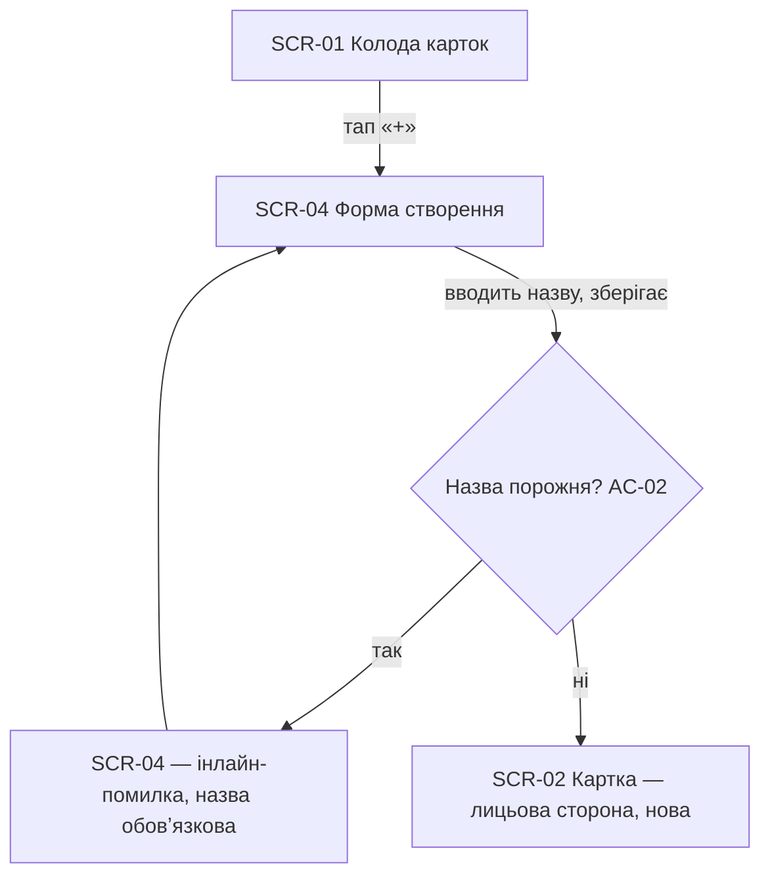

Тап «+» відкриває форму з єдиним обовʼязковим полем — назвою. Спроба зберегти без назви блокується інлайн-помилкою (AC-02); з назвою — картка створюється й одразу відкривається лицьовою стороною.

### Flow: US-02 — Налаштувати картку

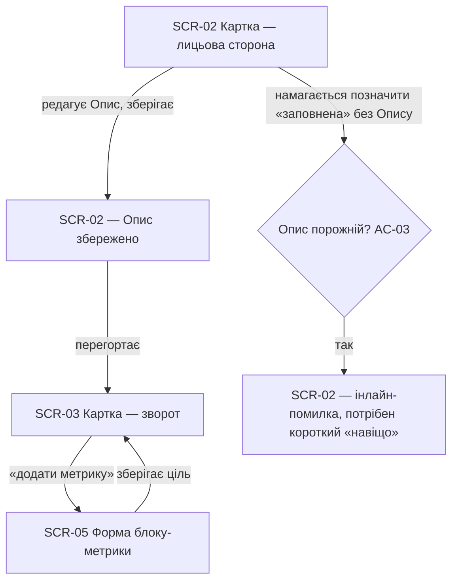

Опис і хоча б один блок-метрика — окремі кроки, не одна форма. Спроба позначити картку заповненою без Опису блокується (AC-03).

### Flow: US-03 — Записати подію через чат

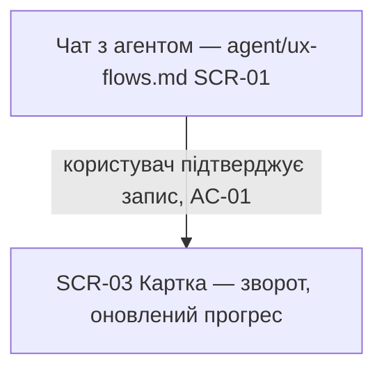

Сам діалог — територія `agent`'s SCR-01 (`agent/ux-flows.md` Flow US-01/US-02), тут не дублюється. З боку Картки видно лише результат: підтверджений запис одразу оновлює Відстеження.

### Flow: US-04 — Побачити прогрес

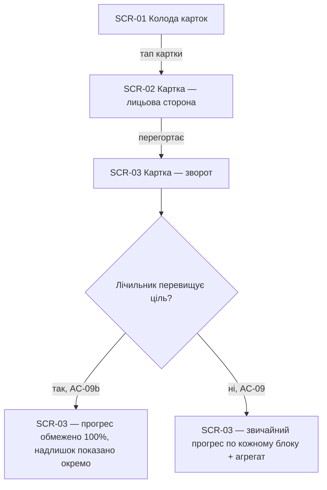

Відкриття картки завжди показує пораховані числа; коли лічильник перевищив ціль, показ обмежується 100% з окремою позначкою надлишку, а не відсотком понад повне виконання (AC-09b).

### Flow: US-05 — Дізнатись про підозрілі дані

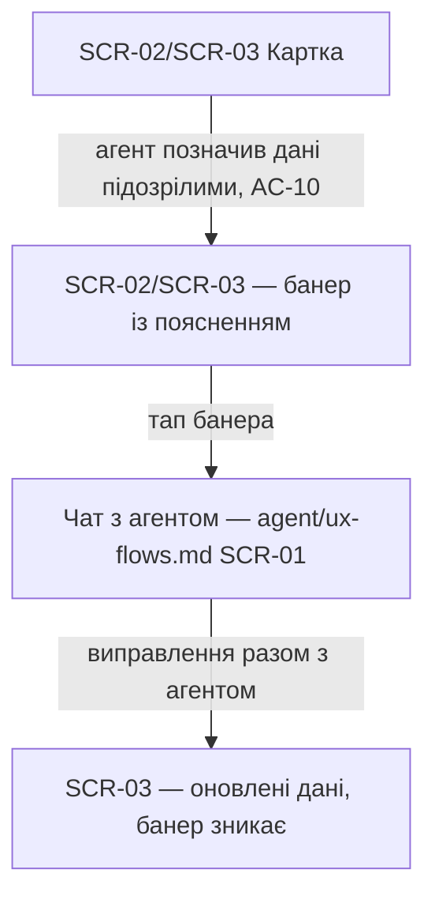

Попередження показується прямо на картці (ніколи `alert`), не блокує решту; виправлення відбувається в чаті, не в окремій формі.

### Flow: US-06 — Вести ціль без кінцевої дати

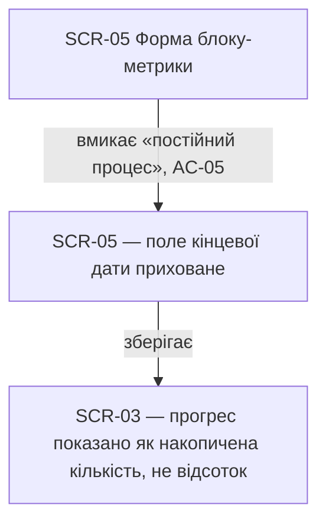

Перемикач «постійний процес» одразу ховає поле дати; на звороті картки такий блок показує лічильник, не відсоток від відсутнього дедлайну.

### Flow: US-07 — Уникнути дублю при близьких за часом записах

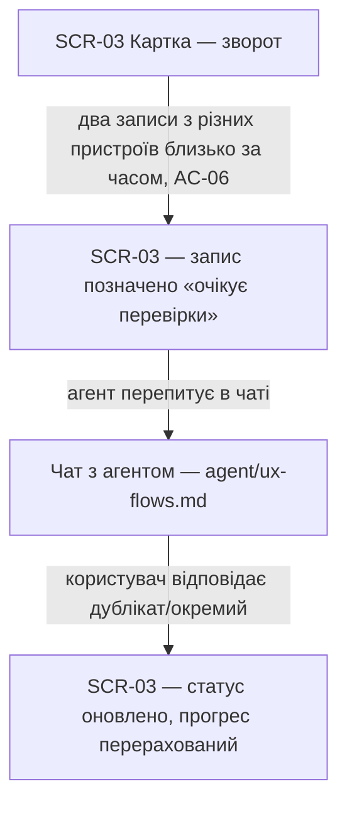

Обидва записи лишаються видимо позначеними «pending» на картці, доки агент не уточнить у чаті — жоден мовчки не враховується.

### Flow: US-08 — Отримати допомогу з невимірною ціллю

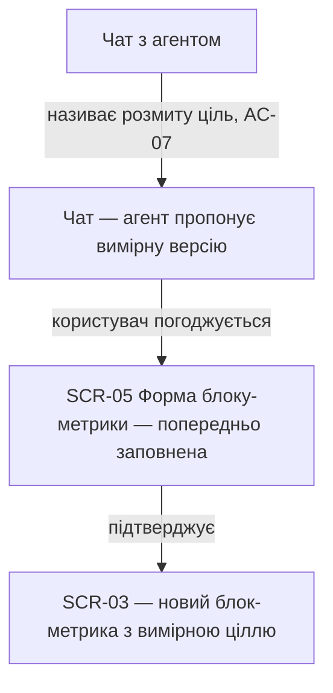

Агент перетворює розмиту ціль на число в діалозі; форма блоку-метрики лише приймає вже узгоджений результат, не бланкує користувача невимірною ціллю.

### Flow: US-09 — Тримати суто декларативну картку

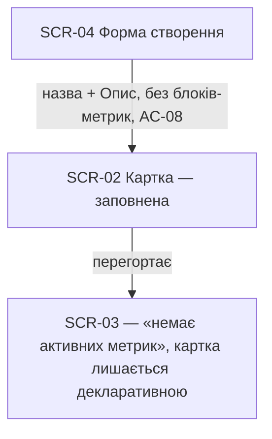

Відсутність жодного виклику «додати метрику» — не помилка: картка існує, доступна, просто ніколи не переходить у стан «ведеться».

### Flow: US-11 — Не втратити запис, поки агент його не перевірив

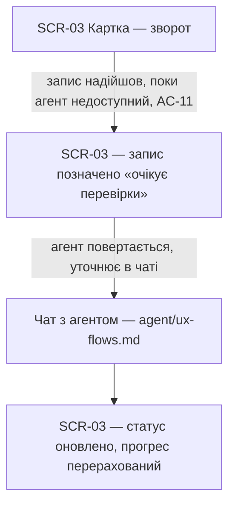

Той самий видимий стан «pending», що й у Flow US-07 — інша причина (недоступність агента, не конфлікт пристроїв), той самий принцип: ніколи не рахується мовчки.

### Flow: US-12 — Переглянути й виправити історію записів

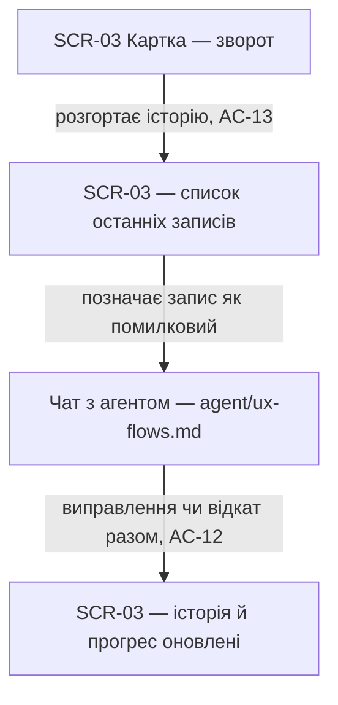

Історія розгортається прямо на звороті картки (не окремий екран); виправлення — завжди діалог з агентом, ніколи пряме редагування числа.

### Flow: US-13 — Прийняти перенесену метрику з іншої картки

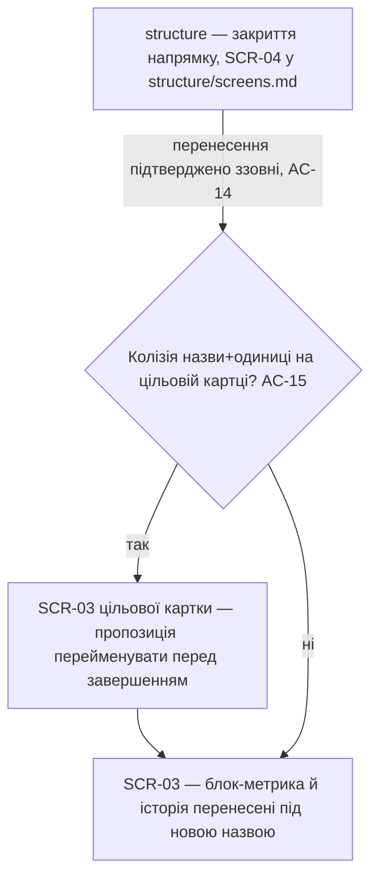

Рішення про перенесення приймається в `structure`'s SCR-04 (закриття напрямку), не тут — Картка лише отримує результат. Колізія назви вирішується прямо на цільовій картці, не мовчазним злиттям.

### Flow: US-14 — Архівувати картку, якою більше не користуюсь

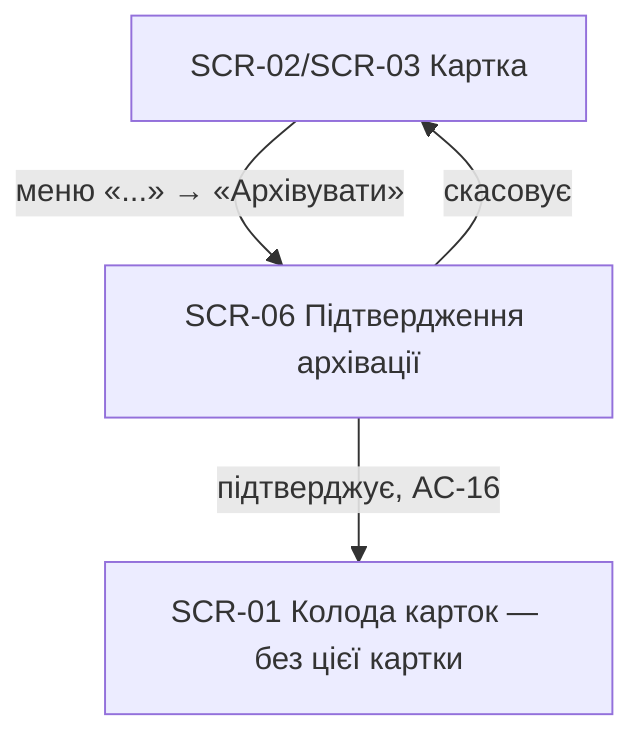

Архівація — завжди з підтвердженням; картка зникає з колоди й будь-якої розкладки Структури, лишається технічно відновлюваною.

## Out of scope (backend-only)

- **US-10 «Мати приватні картки»** — авторизація виконується на бекенді (`401`/`404` non-disclosure на кожному ендпоінті, AC-04); жодного окремого екрана чи візуального стану це не породжує — та сама трактовка, що вже застосована в `agent/ux-flows.md` для AC-06.

## AC coverage

| AC | Shown by | Notes |
|---|---|---|
| AC-01 | Flow US-03 | результат чату, сам діалог — `agent/ux-flows.md` |
| AC-02 | Flow US-01 → інлайн-помилка | |
| AC-03 | Flow US-02 → інлайн-помилка | |
| AC-04 | N/A | backend-only, non-disclosure без UI-гілки (US-10, поза обсягом) |
| AC-05 | Flow US-06 | |
| AC-06 | Flow US-07 | |
| AC-07 | Flow US-08 | |
| AC-08 | Flow US-09 | |
| AC-09 | Flow US-04 → звичайний прогрес | |
| AC-09b | Flow US-04 → capping | |
| AC-10 | Flow US-05 | |
| AC-11 | Flow US-11 | |
| AC-12 | Flow US-12 → виправлення | |
| AC-13 | Flow US-12 → розгортання історії | |
| AC-14 | Flow US-13 → happy | |
| AC-15 | Flow US-13 → колізія назви | |
| AC-16 | Flow US-14 | |
