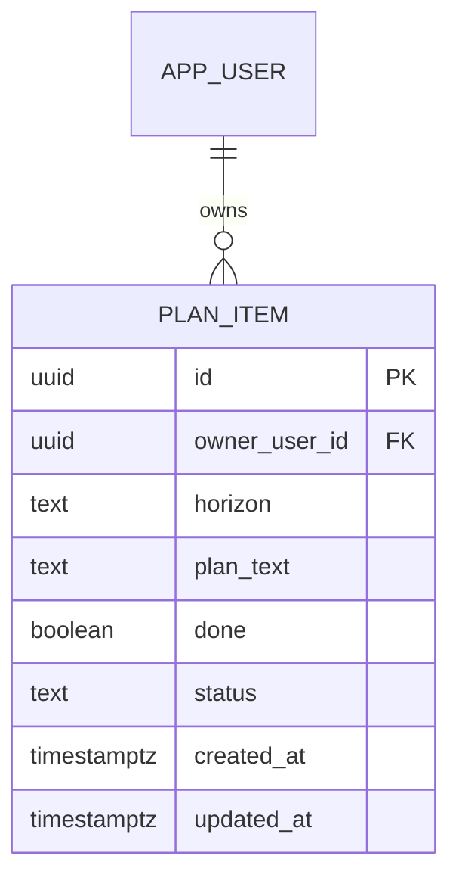

# Data model — life-plan-levels

## ER diagram

## Entities

### `plan_item`

| Column | Type | Constraints | Notes |
|---|---|---|---|
| `id` | UUID | PK, app-generated | `crypto.randomUUID()`, той самий підхід, що `card`/`metric_block` |
| `owner_user_id` | UUID | NOT NULL, FK → `app_user(id)` ON DELETE CASCADE | той самий патерн, що `card.owner_user_id` — вмикає каскадне видалення акаунта |
| `horizon` | TEXT | NOT NULL, CHECK (`horizon` IN ('tactical','operational','strategic')) | три фіксовані горизонти (CONTEXT.md `plan-horizon`); англійські значення enum, як і `layout_mode` в `structure` |
| `plan_text` | TEXT | NOT NULL | текст пункту (CONTEXT.md `plan-item`); порожній рядок не пишеться в БД — очищення тексту переводить `status` в `removed` замість запису порожнього значення (AC-04) |
| `done` | BOOLEAN | NOT NULL DEFAULT false | чекбокс «виконано»; реверсивний тумблер (AC-03/AC-03b), не одноразовий перехід |
| `status` | TEXT | NOT NULL DEFAULT 'active', CHECK (`status` IN ('active','removed')) | м'яке видалення через очищення тексту (AC-04) — той самий підхід, що `card.status`/`metric_block.status`: ніколи фізичне видалення, `removed`-пункти не показуються в списку горизонту |
| `created_at` | timestamptz | NOT NULL DEFAULT now() | це і є «дата додавання», яку показує AC-01/AC-08 |
| `updated_at` | timestamptz | NOT NULL DEFAULT now() | текст/чекбокс/статус можуть редагуватись |

**Aggregate root:** root (самостійна сутність, без батьківської — на відміну від `metric_block`/`entry`, які належать `card`).
**Access patterns:** перегляд сторінки ПЛАН — усі активні пункти власника по трьох горизонтах, у порядку додавання (AC-08, flow 1) → індекс на `(owner_user_id, horizon, created_at)` де `status = 'active'`.
**Constraints:** FK → `app_user(id)`; CHECK на `horizon` (3 значення); CHECK на `status` (2 значення).

## Indexes

| Index | Columns | Query it serves |
|---|---|---|
| `idx_plan_item_owner_active` | `plan_item(owner_user_id, horizon, created_at)` WHERE `status = 'active'` | перегляд сторінки ПЛАН — активні пункти власника, згруповані по горизонту, у порядку додавання (AC-08, sad.md §6 flow 1) |

## Test fixtures

- `buildPlanItem({ ownerUserId, horizon, text, done, status })` — пункт плану з дефолтним власником `user-<uuid>@example.test`, за замовчуванням `status: 'active'`, `done: false`.
