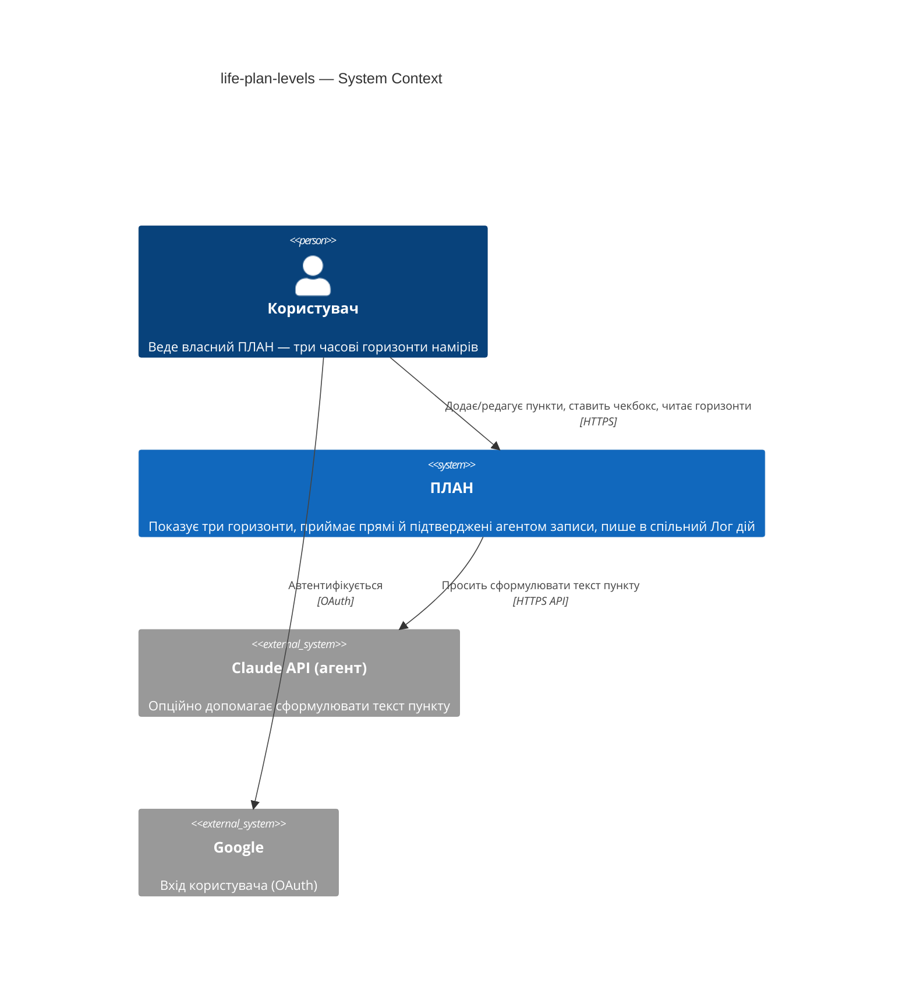
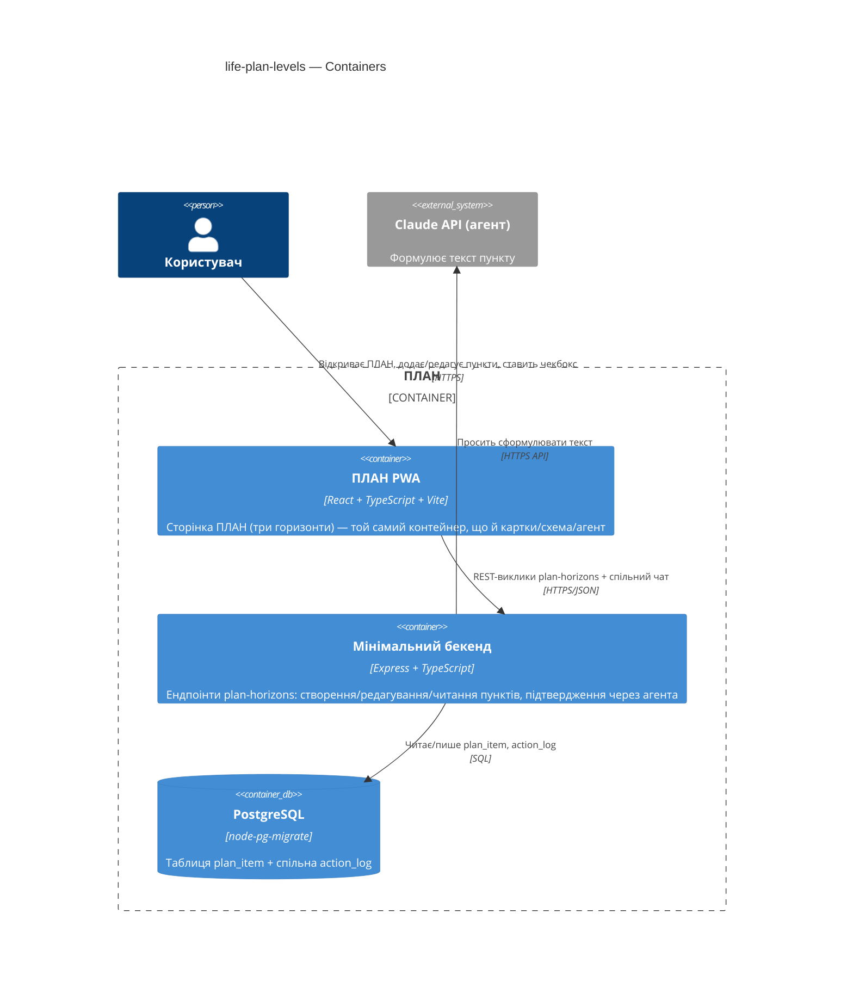
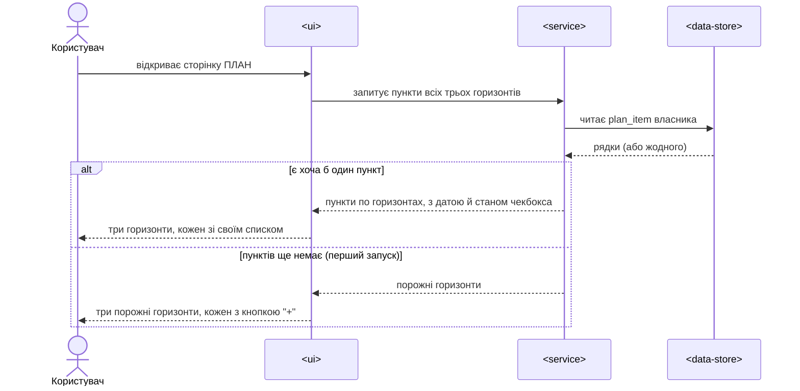
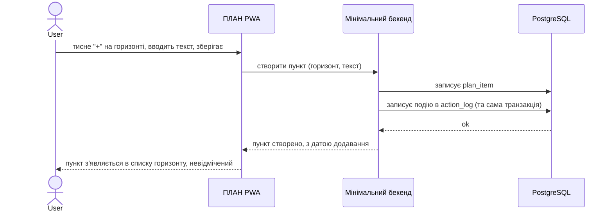
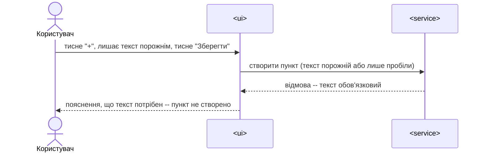
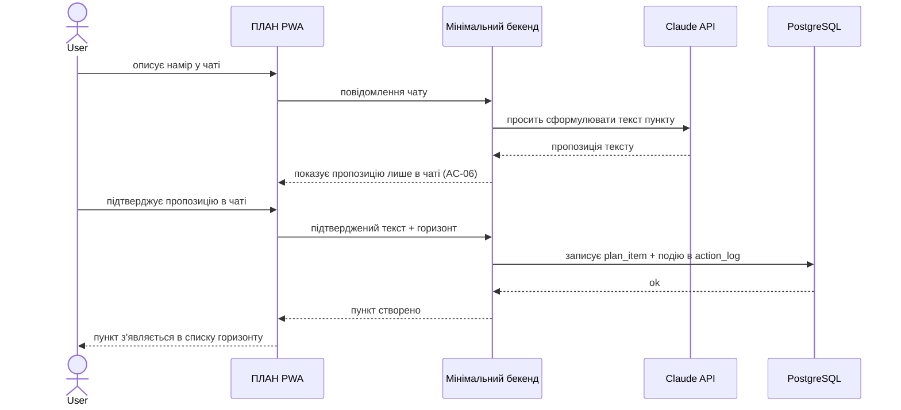
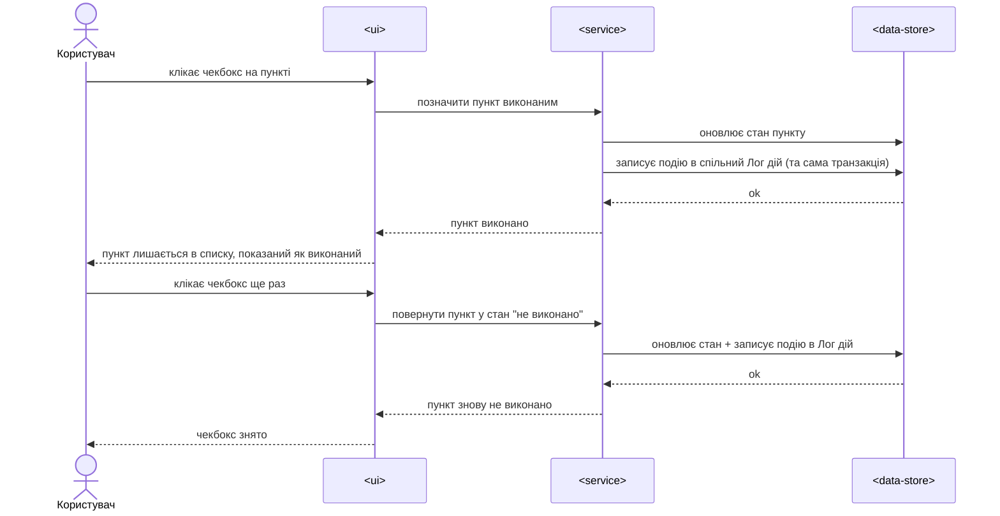
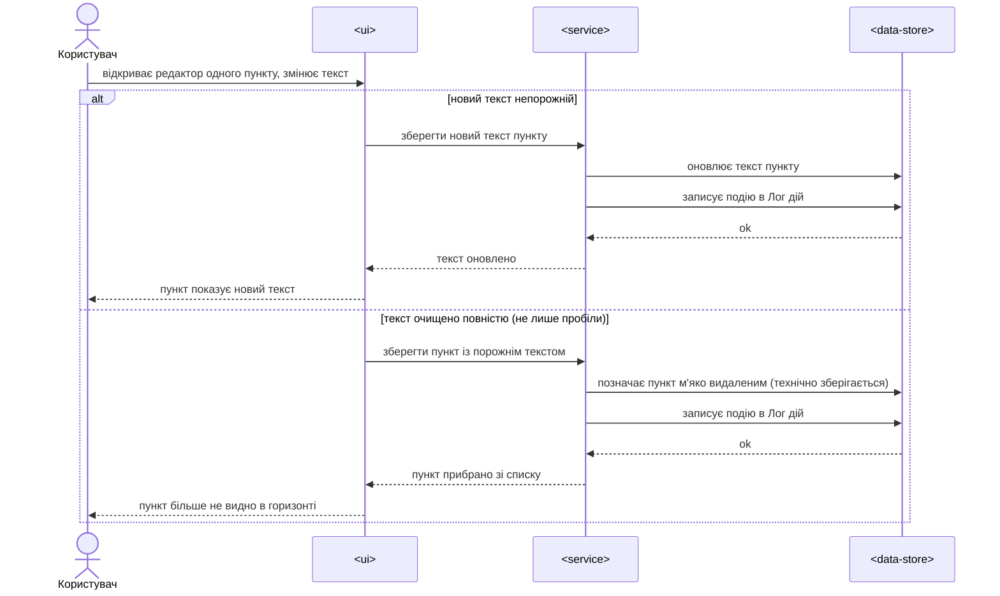

# Software Architecture Document — life-plan-levels

<!-- 12 Arc42 sections. C4 Context (L1) inline §3. C4 Container (L2) inline §5. Numbers in §10 verbatim from spec.md §6 NFR. -->

## 1. Introduction and goals

**Intent.** Нова сторінка «ПЛАН» показує три фіксовані часові горизонти (тактичний/оперативний/стратегічний), кожен — список пунктів-намірів з чекбоксом «виконано». Користувач додає й редагує пункти напряму на сторінці; агент у чаті опційно допомагає сформулювати текст. Закриває логічний розрив: Декларація/Картки/Схема вже показують картину життя, часових горизонтів досі не було (spec.md §1/§2).

**Top-3 quality goals (1-liners; повні сценарії в §10):**

1. Швидкість відповіді — запис (створення/редагування/чекбокс) і завантаження сторінки підтверджуються швидко, без дублів при повторному натисканні.
2. Безпека власності — кожен пункт плану видно й редагує лише той, хто його завів.
3. Простежуваність змін — жодна правка пункту не минає спільний Лог дій продукту.

**Stakeholders.**

| Role | Interest | Sign-off owner? |
|---|---|---|
| Користувач (glossary) | Веде власний ПЛАН — головний і єдиний реальний користувач зараз | No |
| Tech Lead | Затвердження SAD | Yes |

## 2. Constraints

**Technical.**
- TypeScript 5.7 (весь стек)
- Express 5.2 (бекенд), React 18.3 + Vite 6 (фронтенд) — той самий контейнер `ПЛАН PWA`, що й у трьох сусідніх фіч
- PostgreSQL ([ADR-0005](../../adr/0005-backend-datastore.md)), `pg` 8.13 без ORM, `node-pg-migrate` 7.9
- Архітектурна конвенція: шари `domain/app/infra/ports/ui`, власний топ-рівневий модуль на самостійну доменну концепцію ([ADR-0003 structure](../structure/adr/0003-own-top-level-structure-module.md) — прецедент, застосовується тут без нового ADR, п. §4)

**Organisational.**
- Бюджет зусиль: ~1 тиждень (`feature_size: S`, spec.md frontmatter)
- Дедлайн: немає жорсткого — старт залежить від Feasibility Time (spec.md §8, ще не підтверджено)
- Команда: 1 (Андрій + Claude Code)

**Conventions.**
- [`docs/architecture-map.md`](../../architecture-map.md) §Конвенції, `plan/app/CLAUDE.md` (правило залежностей: фіча A ніколи не імпортує `ui/` фічі B напряму, лише через `shared/` чи композицію в `app/`)
- ID: `crypto.randomUUID()` для збережених записів
- Обробка помилок: доменні sentinel-помилки → маппінг помилок у `ports/` → спільний error middleware (`server/app.ts`)

**Regulatory / external.**
- N/A — жодного комплаєнс-режиму в продукті немає; клас даних «confidential» (spec.md §6.1), той самий рівень, що Опис картки й декларація Структури.

## 3. Context and scope

Користувач веде свій ПЛАН — три фіксовані часові горизонти з пунктами-намірами. Кожен пункт має текст і чекбокс «виконано»; агент у чаті опційно допомагає сформулювати текст, підтвердження в чаті одразу створює пункт.

<!-- brownfield: три сусідні фічі (life-area-card, structure, agent) вже в `main` на тому самому стеку; life-plan-levels перевикористовує ті самі два контейнери (ПЛАН PWA + мінімальний бекенд), додає власний модуль + таблицю (розвідка коду, 2026-09-20). -->

**External systems (in / out):**

| Actor or system | Type | Interaction |
|---|---|---|
| Користувач | Person | Додає/редагує пункти, ставить чекбокс, читає горизонти |
| Claude API (агент) | System (external) | Опційно формулює текст пункту за проханням у чаті (AC-09) |
| Google | System (external) | Вхід користувача (OAuth) — спільний для всього продукту |

**C4 Context (L1):**



## 4. Solution strategy

**Top strategic choices:**

1. **Жодного нового контейнера — той самий стек, що й у трьох сусідніх фіч.** `target_surfaces: [backend-service, web-frontend]` — ПЛАН PWA (React SPA) + мінімальний бекенд (Express) лишаються тими самими двома контейнерами, що обслуговують `life-area-card`/`structure`/`agent`. Реальної альтернативи нема — інший стек для однієї нової сторінки того самого продукту суперечив би вже встановленому constraint (§2).
2. **Власний топ-рівневий модуль `plan/app/src/plan-horizons/`.** За прецедентом `structure` ([ADR-0003](../structure/adr/0003-own-top-level-structure-module.md)): пункти плану — самостійна доменна концепція (glossary: `plan-horizon`/`plan-item`), не розширення `cards/life-area-card/` чи `structure/`. П'ять шарів (domain/app/infra/ports/ui), як в усіх трьох сусідніх фічах.
3. **Пряме API поруч із наявним чат-механізмом, без нового способу підтвердження.** Пряме створення/редагування (AC-01, AC-04) — звичайний REST-ендпоінт нового модуля. Розмова з агентом (AC-09) іде через бекенд так само, як і решта чату (ключ до Claude API захований на сервері) — але пункт плану створюється лише ОДНИМ окремим запитом у момент підтвердження користувачем у чаті, без проміжного стану «очікує підтвердження» на сервері. Це НЕ та сама модель, що «запис на картці чекає підтвердження агента» (AC-11 `life-area-card`, де запис лежить у стані `pending`) — там ідеться про затримку доступності агента, тут про підтвердження користувача, це різні задачі.
4. **Онлайн-only, як і решта продукту в v1.** Запис пункту працює лише за наявності мережі — той самий компроміс, що вже ухвалено для `structure` ([D-114](../../DECISIONS.md#d-114)). Офлайн-черга — за межами v1.

## 5. Building block view

Шаровий стиль (`domain → app → infra → ports → ui`), та сама структура, що й `cards/life-area-card/`, `structure/`, `agent/`.

**Internal decomposition:**

```
plan/app/src/plan-horizons/
├── domain/       plan-item сутність, PlanHorizon enum (tactical/operational/strategic),
│                 інваріанти (текст обов'язковий лише при створенні, чекбокс реверсивний,
│                 порожній текст = м'яке видалення)
├── app/          create-plan-item.ts, update-plan-item.ts (текст/чекбокс/soft-remove),
│                 list-plan-items.ts — кожен приймає опційний recordAction DI
├── infra/        postgres-repo.ts — прямі SQL-запити, фільтр owner_user_id,
│                 non-disclosure патерн (як усі сусідні фічі)
├── ports/        plan-item-handlers.ts — Express-обробники + DTO + маппінг помилок
└── ui/           PlanScreen.tsx (три колонки-горизонти), PlanItemEditor.tsx
                  (редактор одного пункту + кнопка «+» на горизонт)
```

**C4 Container (L2):**



## 6. Runtime view

**Critical flow 1: Перегляд сторінки ПЛАН (US-01, AC-08, AC-11)**



**Critical flow 2: Пряме створення пункту (US-02, AC-01)**



**Critical flow 3: Спроба зберегти порожній пункт (US-02, AC-02)**



**Critical flow 4: Створення пункту через агента (US-03/US-08, AC-09, AC-06)**



**Critical flow 5: Чекбокс "виконано" туди-назад (US-04, AC-03, AC-03b)**



**Critical flow 6: Редагування тексту / м'яке видалення (US-05, AC-04, AC-05)**



**Use-case coverage (§4 -> flow):** US-01 -> flow 1. US-02 -> flow 2 (happy) + flow 3 (error). US-03 -> flow 4. US-04 -> flow 5. US-05 -> flow 6. US-06 -> показано в кожному потоці, де є запис (flow 2, 4, 5, 6), без окремого потоку. US-07 -> без потоку, наскрізна перевірка (див. нижче). US-08 -> flow 4.

**Coverage note:** AC-05 (кожна зміна лишає слід у Лозі дій) не має власної окремої діаграми -- показана як крок у кожній з flow 1, 2, 5, 6, де відбувається запис. AC-07 (авторизація -- чужий ПЛАН) не має власної діаграми -- це та сама наскрізна перевірка власника на кожному запиті, що вже вбудована в `structure`/`life-area-card` (§8 Crosscutting), не окремий рантайм-потік цієї фічі.

## 7. Deployment view

<!-- N/A: reuses existing deployment unit, no infra change --> Той самий одноінстансний бекенд + ПЛАН PWA, що й для трьох сусідніх фіч — нового процесу, сервісу чи деплой-юніта не додається.

## 8. Crosscutting concepts

| Concept | Convention | Where defined |
|---|---|---|
| Logging | Той самий структурований формат бекенда, що й інші модулі | `server/app.ts` |
| Authentication | Bearer-токен middleware, `req.ownerUserId` — спільний для всіх модулів | `server/app.ts` |
| Error handling | Доменні sentinel-помилки → маппінг у `ports/` → спільний error middleware | `server/app.ts` |
| ID strategy | `crypto.randomUUID()` для `plan_item` | `architecture-map.md` §Конвенції |
| Internationalisation | N/A, єдина мова (українська) | — |
| Observability | Без змін — той самий рівень, що й решта продукту | — |
| Дії/аудит (action log) | Опційний `recordAction` DI в кожному use-case, що змінює дані; викликається в тій самій транзакції, що й запис `plan_item` (як `structure`), щоб збій запису в Лог дій відкочував і саму зміну — гарантує AC-05 | `agent/data-model.md` `action_log`, `record-action.ts` |

## 9. Architecture decisions

Жодне рішення цієї фічі не перетнуло поріг «варте ADR» (2 з 3: незворотність / вплив на ≥2 модулі / чесна альтернатива) — усі чотири пункти §4 напряму продовжують уже задокументовані рішення сусідніх фіч ([ADR-0003 structure](../structure/adr/0003-own-top-level-structure-module.md), [D-114](../../DECISIONS.md#d-114)) без нової незворотної розвилки. `adr/` цієї фічі лишається порожньою — легітимно для S-фічі, коли архітектура повністю успадкована.

| # | Title | Status | Section |
|---|---|---|---|
| — | (жодного нового ADR — див. пояснення вище) | — | — |

## 10. Quality requirements

**QG-1. Швидкість відповіді на запис**
- **When:** користувач створює/редагує пункт чи ставить чекбокс
- **Then:** система підтверджує збереження з сервера за p95 ≤ 300 ms (spec.md §6, дослівно)
- **How verify:** клієнтський таймер від дії користувача до підтвердження сервера (spec.md §6 Measurement)

**QG-2. Безпека власності**
- **When:** будь-який запит торкається пунктів плану
- **Then:** система перевіряє, що `owner_user_id` кожного зачепленого рядка збігається з автором запиту; чужі пункти — відмова без підтвердження існування (AC-07)
- **How verify:** автоматизований non-disclosure тест (той самий патерн, що `life-area-card`/`structure`)

**QG-3. Простежуваність змін**
- **When:** пункт створено, відредаговано (включно з очищенням = видаленням) чи змінено чекбокс
- **Then:** система записує один рядок у `action_log` у тій самій транзакції, що й саму зміну (AC-05)
- **How verify:** інтеграційний тест — кількість рядків `action_log` збігається з кількістю записів; тест відкату транзакції при збої логування

**QG-4. Швидкість завантаження сторінки**
- **When:** користувач відкриває сторінку ПЛАН
- **Then:** система підтверджує з сервера дані всіх пунктів за p95 ≤ 500 ms (spec.md §6, дослівно)
- **How verify:** клієнтський таймер від відкриття сторінки до підтвердження сервера (spec.md §6 Measurement)

**QG-5. Відсутність дублів при повторному збереженні**
- **When:** користувач двічі тисне «Зберегти» на тому самому пункті в межах 1 секунди
- **Then:** система вважає це одним збереженням, не створює дублю (spec.md §6, дослівно)
- **How verify:** ручна перевірка / тест на debounce з вікном 1 секунда (spec.md §6 Measurement)

## 11. Risks and technical debt

| Risk / debt | Severity | Mitigation | Owner |
|---|---|---|---|
| Списки горизонтів можуть рости без обмеження (пагінації нема) | Low | v1 приймає це свідомо — особистий інструмент одного користувача, малий обсяг; пагінація за потреби пізніше | Backend |
| Запис пункту працює лише онлайн — при збої мережі зміна не зберігається, показується помилка (§4 п.4) | Low | Свідомо успадковано з того самого компромісу, що вже ухвалено для `structure` ([D-114](../../DECISIONS.md#d-114)); офлайн-черга за межами v1 | Backend |
| Історія редагувань — лише факт зміни, без старого тексту (spec.md §1 Decision override) | Medium | Свідомо прийнято на v1; переглянути, коли з'явиться реальне використання | Андрій |
| Open architectural decision: точне визначення KPI «заповнено горизонт» / «активна сесія» | Open question | Resolve before `sdd:tasks`; успадковано з spec.md §8 | Андрій |
| Open architectural decision: Feasibility Time не підтверджено | Open question | Resolve before `sdd:tasks`; успадковано з spec.md §8 | Андрій |

**Accepted debt (acceptable in v1, plan to fix later):**
- Немає версіонування тексту пункту (лише факт зміни в Лозі дій) — прийнятно для v1, можливо доведеться додати в v2 (spec.md §3 non-goal).

## 12. Glossary

| Term | Meaning |
|---|---|
| plan-horizon (рівень плану) | Один з трьох фіксованих проміжків часу на сторінці ПЛАН — тактичний (до року), оперативний (3-5 років), стратегічний (10+ років) |
| plan-item (пункт плану) | Один запис у списку конкретного горизонту, з текстом і чекбоксом «виконано»; позначення виконаним не видаляє пункт |
| action-log (Лог дій) | Наскрізний хронологічний список кожної дії користувача в продукті, спільна таблиця `action_log` (фіча `agent`) |
| PLAN (ПЛАН) | Сам продукт; NOT plan-horizon — нав-кнопка «ПЛАН» лише один із п'яти розділів навігації |
| agent (агент) | Єдиний суцільний агент продукту, з яким розмовляє користувач; тут — опційно формулює текст пункту плану |
