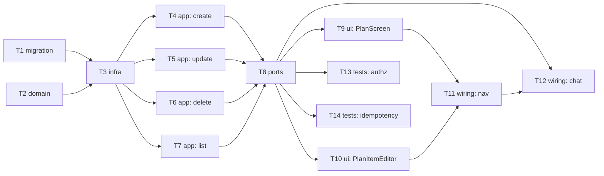

# Epic — life-plan-levels

> **Spec:** [spec.md](../spec.md) · **Design:** [sad.md](../sad.md) · **Data model:** [data-model.md](../data-model.md) · **API:** [openapi.yaml](../contracts/openapi.yaml) · **ADRs:** none (sad.md §9 — жодне рішення не перетнуло поріг «варте ADR», уся архітектура успадкована з `structure`/`life-area-card`)

## Goal

Сторінка «ПЛАН» — три фіксовані часові горизонти (тактичний/оперативний/стратегічний), кожен зі списком пунктів-намірів з чекбоксом «виконано». Закриває логічний розрив продукту: Декларація/Картки/Схема вже показують картину життя, часових горизонтів досі не було (spec.md §2).

## Scope

- **In:** новий модуль `plan/app/src/plan-horizons/` (domain/app/infra/ports/ui), одна таблиця `plan_item`, 4 REST-ендпоінти, UI-сторінка ПЛАН, підключення до наявного чату агента.
- **Out:** зв'язок пункту з карткою, автоматичний каскад між горизонтами, ручне перенесення пункту між горизонтами, повноцінне відновлення попереднього тексту після редагування, окремий екран перегляду історії (усе — spec.md §3 non-goals).

## Task map

## Tasks

See [tracker.md](./tracker.md) for status. Machine contract: [tasks.json](../tasks.json).

| # | Task | Layer | Blocked by | DoD (short) |
|---|---|---|---|---|
| T1 | Промоутити міграцію plan_item | migration | — | Мігрує туди-назад проти реальної Neon |
| T2 | Доменна сутність PlanItem + інваріанти | domain | — | Юніт-тести на створення/чекбокс |
| T3 | postgres-repo для plan_item | infra | T1, T2 | Інтеграційні тести round-trip + non-disclosure |
| T4 | use-case: створити пункт | app | T2, T3 | Юніт-тести на валідацію тексту + Лог дій |
| T5 | use-case: оновити текст/чекбокс | app | T2, T3 | Юніт-тести на реверсивний тумблер |
| T6 | use-case: м'яко видалити пункт | app | T2, T3 | Юніт-тести на статус removed |
| T7 | use-case: прочитати активні пункти | app | T3 | Юніт-тести на порожній/непорожній стан |
| T8 | Express-обробники + маршрути | ports | T4, T5, T6, T7 | Тести за контрактом openapi.yaml |
| T9 | PlanScreen.tsx | ui | T8 | Компонентний тест трьох горизонтів |
| T10 | PlanItemEditor.tsx | ui | T8 | Компонентний тест створення/видалення |
| T11 | Навігація в App.tsx/main.tsx | wiring | T9, T10 | App.test.tsx покриває перехід на ПЛАН |
| T12 | Підключення чату агента | wiring | T8, T11 | Інтеграційний тест підтвердження в чаті |
| T13 | Тест авторизації/non-disclosure | tests | T8 | Чужий токен не бачить пункти |
| T14 | Тест ідемпотентності | tests | T8 | Подвійне збереження = один запис |

## Risks / Hard rules

- Жодного зв'язку з `card`/`structure` в схемі — `plan_item` самостійний aggregate root (spec.md §3, data-model.md).
- Горизонт не редагується після створення (перенесення між горизонтами — v2, spec.md §3).
- Очищення тексту йде через окремий виклик `DELETE`, не через `PATCH` з порожнім текстом (contracts/api-sync-report.md — узгоджено з Андрієм на етапі `api`).
- Онлайн-only — жодної офлайн-черги запису (sad.md §4 п.4, D-114).
