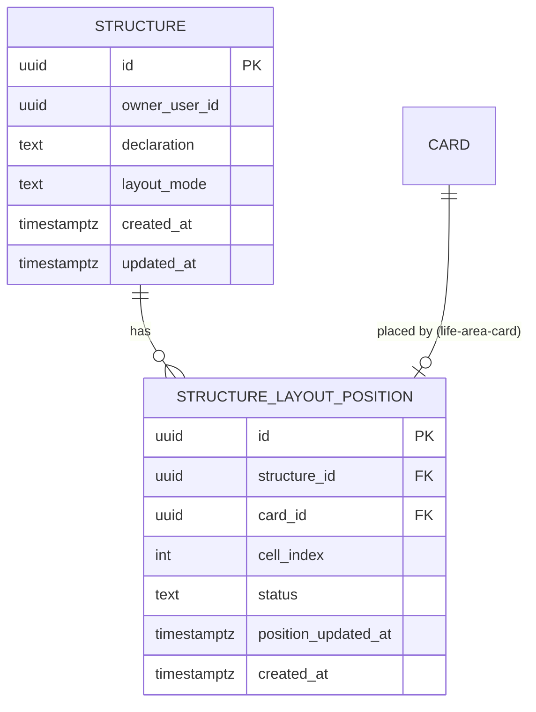
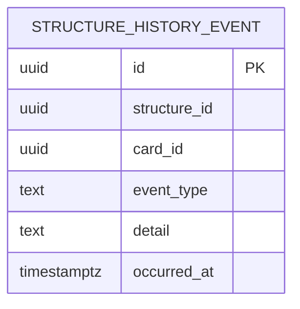

# Data model — structure

> **Дві окремі бази.** Основний бекенд (D-59) і сховище літопису Структури (ADR-0004, [D-67](../../DECISIONS.md#d-67)) — обидва PostgreSQL, але фізично окремі схеми/інстанси, без спільних FK між ними (D-67). Тому нижче — дві секції, кожна зі своєю ER-діаграмою.
>
> PK-стратегія: UUID, генерується в app-шарі через `crypto.randomUUID()` ([architecture-map.md §Конвенції](../../architecture-map.md)) — той самий підхід, що й `life-area-card/data-model.md`. Аудит-колонки й видалення — той самий стиль: `created_at`/`updated_at` де є сенс, **ніколи фізичне видалення**, лише статус ([D-66](../../DECISIONS.md#d-66), той самий підхід, що вже застосований до `entry.status` у `life-area-card`).

## База 1 — основний бекенд (PostgreSQL, D-59)

### ER diagram

`CARD` — таблиця `life-area-card` (не власність цієї фічі; показана лише як зв'язок, схема — в [`life-area-card/data-model.md`](../life-area-card/data-model.md)).

### Entities

#### `structure`

| Column | Type | Constraints | Notes |
|---|---|---|---|
| `id` | UUID | PK, app-generated | `crypto.randomUUID()` |
| `owner_user_id` | UUID | NOT NULL, UNIQUE, FK → `app_user(id)` ON DELETE CASCADE | singleton на користувача (AC-03) — UNIQUE забезпечує «рівно одна Структура на власника». FK додано 2026-08-29, міграція 03 — `agent`'s `app_user` (migration 01) тепер існує. Закриває TBD від 2026-08-24; вмикає каскадне видалення акаунта (agent AC-17, D-89) |
| `declaration` | TEXT | NULL | картина світу / навіщо / пріоритет, вільний текст (AC-10); NULL, доки не написано |
| `layout_mode` | TEXT | NULL, CHECK (`layout_mode` IN ('single','free','logic')) | один із трьох варіантів групування (D-29); **NULL = ще не обрано** — саме так реалізовано AC-09 («не блокує вибором режиму») |
| `created_at` | timestamptz | NOT NULL DEFAULT now() | |
| `updated_at` | timestamptz | NOT NULL DEFAULT now() | джерело часової мітки для last-write-wins при офлайн-конфлікті (ADR-0002) |

**Aggregate root:** root.
**Access patterns:** читання/запис Структури власника (AC-03, кожен запит) → UNIQUE-індекс на `owner_user_id` (створюється автоматично разом з обмеженням).
**Constraints:** UNIQUE на `owner_user_id`; CHECK на `layout_mode`.

#### `structure_layout_position`

| Column | Type | Constraints | Notes |
|---|---|---|---|
| `id` | UUID | PK, app-generated | |
| `structure_id` | UUID | NOT NULL, FK → `structure(id)` ON DELETE CASCADE | індексовано нижче |
| `card_id` | UUID | NOT NULL, FK → `card(id)` ON DELETE CASCADE | справжній cross-feature FK — таблиця `card` уже існує в тій самій базі (`life-area-card`) |
| `cell_index` | INTEGER | NOT NULL | номер клітинки/позиції в межах фіксованої нумерованої схеми — той самий підхід і для вільного порядку, і для сітки «за логікою» ([sad.md §5.2](sad.md#5-building-block-view), «запас вільних клітинок») |
| `status` | TEXT | NOT NULL DEFAULT 'active', CHECK (`status` IN ('active','closed')) | [D-66](../../DECISIONS.md#d-66) — закриття напрямку (AC-12) позначає рядок, ніколи не видаляє фізично |
| `position_updated_at` | timestamptz | NOT NULL DEFAULT now() | часова мітка для last-write-wins (ADR-0002) — та сама позиція, синхронізована з іншого пристрою, порівнюється за цим полем |
| `created_at` | timestamptz | NOT NULL DEFAULT now() | |

**Aggregate root:** `structure`.
**Access patterns:** список активних позицій розкладки (екран Схема) → індекс на `structure_id`; блокування розміщення на зайняту клітинку (AC-02) → частковий унікальний індекс на `(structure_id, cell_index)` де `status = 'active'`; де зараз розташована конкретна картка → індекс на `card_id`.
**Constraints:** UNIQUE на `(structure_id, card_id)` — одна позиція на картку; частковий UNIQUE на `(structure_id, cell_index)` WHERE `status = 'active'` — рівно одна активна картка в клітинці (AC-02, D-62 на рівні БД, не лише UI-перевірки); FK → `structure(id)`; FK → `card(id)`.

## Індекси (База 1)

| Index | Columns | Query it serves |
|---|---|---|
| `idx_layout_position_structure` | `structure_layout_position(structure_id)` | список активних позицій на екрані Схема (US-02, US-03) |
| `uq_layout_position_active_cell` | `structure_layout_position(structure_id, cell_index) WHERE status = 'active'` | блокування розміщення на зайняту клітинку (AC-02) — гарантія на рівні БД, не лише перевірка в PWA (Потік 4) |
| `uq_layout_position_card` | `structure_layout_position(structure_id, card_id)` | одна позиція на картку; швидкий пошук поточної позиції картки (Потоки 2, 6) |
| `idx_layout_position_card` | `structure_layout_position(card_id)` | зворотний пошук — де зараз ця картка (AC-05 крос-контекст, каскад при видаленні картки `life-area-card`) |

## База 2 — сховище літопису Структури (окрема схема/інстанс PostgreSQL, ADR-0004 + D-67)

### ER diagram

`structure_id` і `card_id` тут — **логічні** посилання, не DB-рівня FK: сховище літопису фізично окрема база/інстанс (D-67), FK через межу бази неможливий. Цілісність підтримує застосунок (Backend передає вже перевірені ідентифікатори при записі події).

### Entities

#### `structure_history_event`

| Column | Type | Constraints | Notes |
|---|---|---|---|
| `id` | UUID | PK, app-generated | |
| `structure_id` | UUID | NOT NULL | логічне посилання на `structure.id` з Бази 1, без DB FK (окрема база) |
| `card_id` | UUID | NOT NULL | логічне посилання на `card.id` (`life-area-card`), без DB FK |
| `event_type` | TEXT | NOT NULL, CHECK (`event_type` IN ('renamed','moved','closed')) | AC-12, AC-15 |
| `detail` | TEXT | NULL | вільний опис деталі події (нова назва / новий `cell_index`) — `<!-- TBD: точна форма вирішується разом з майбутнім екраном перегляду літопису, поза v1 (spec.md §3 Non-goals) -->` |
| `occurred_at` | timestamptz | NOT NULL DEFAULT now() | часова мітка події |

**Aggregate root:** root (окрема база — власний, не підпорядкований `structure`).
**Access patterns:** історія однієї картки за часом (майбутній екран перегляду + тренд AC-07) → індекс на `(card_id, occurred_at)`; «яка була розкладка Структури на дату X» (AC-07, D-67 — читання, якого раніше не було) → індекс на `(structure_id, occurred_at)`, запит бере останню подію `moved` кожної картки з `occurred_at <= X`.
**Constraints:** CHECK на `event_type`.

## Індекси (База 2)

| Index | Columns | Query it serves |
|---|---|---|
| `idx_history_card_time` | `structure_history_event(card_id, occurred_at)` | історія конкретної картки за часом (майбутній екран перегляду, поза v1) |
| `idx_history_structure_time` | `structure_history_event(structure_id, occurred_at)` | реконструкція розкладки на дату X для тренду розриву (Потік 9, AC-07, D-67) |

## Test fixtures

- `buildStructure({ ownerUserId, declaration, layoutMode })` — Структура з дефолтним власником `user-<uuid>@example.test`.
- `buildLayoutPosition({ structureId, cardId, cellIndex, status })` — позиція розкладки, за замовчуванням `status: 'active'`.
- `buildStructureHistoryEvent({ structureId, cardId, eventType, detail })` — подія літопису (окрема база) для тестів AC-07/AC-12/AC-15.

## Дрейф (drift)

Greenfield-фіча — жодного домену `structure` в коді ще немає (той самий стан, що й `life-area-card` до свого `data-model`), тож перевірка дрейфу код↔схема неактуальна цього разу.

## Відкриті питання (перенесено в spec.md §8, не дублюю тут)

- Перенесення метрики закритої картки в іншу картку — `life-area-card` ще не має acceptance criterion на прийом ([D-65](../../DECISIONS.md#d-65)).
- Реальне фізичне видалення картки з колоди — окремий приріст `life-area-card` ([D-66](../../DECISIONS.md#d-66)).
- Точна форма `structure_history_event.detail` — вирішується з майбутнім екраном перегляду літопису.
