# Software Architecture Document — structure

<!-- 12 Arc42 sections. Empty section → <!-- N/A: <one-line reason> -->. -->
<!-- C4 Context (L1) lives inline in §3. C4 Container (L2) lives inline in §5. -->
<!-- Numbers in §10 come VERBATIM from spec.md §6 NFR — no inventing, no rounding. -->

## 1. Introduction and goals

**Intent.** Структура — єдиний на користувача об'єкт (spec.md §1), що тримає (а) декларацію «картина світу, навіщо, пріоритет» окремо від Опису картки, (б) розкладку карток за одним із трьох варіантів групування, (в) екран зведеної аналітики — середній прогрес карток із чесним розривом між заявленим і фактичним, без вердикту. Прогрес кожної картки отримується через уже наявну доменну логіку `life-area-card` (spec.md §1) — Структура не рахує власну формулу.

**Top-3 quality goals (1-liners; full scenarios в §10):**

1. Цілісність даних — зведений прогрес Структури ніколи не розходиться з тим, що сама картка показує (AC-05), і не залежить від розкладки/пріоритету (AC-04).
2. Офлайн-доступність — читання 100% офлайн; запис розкладки й декларації приймається офлайн, синхронізується при відновленні з'єднання.
3. Швидкість відгуку — p95 відкриття екрана аналітики ≤300ms, p95 запис зміни розкладки ≤200ms (spec.md §6 NFR).

**Stakeholders.**

| Role | Interest | Sign-off owner? |
|---|---|---|
| user | створює й веде власну Структуру, читає зведену аналітику | No |
| Tech Lead (Андрій) | архітектурні рішення, ADR | Yes |

**Decision override — скасовано.** Літопис Структури тепер живе в тому самому мінімальному бекенді (D-24), без окремого деплой-юніту чи сховища — override більше не діє, [D-113](../../DECISIONS.md#d-113).

## 2. Constraints

**Technical.**
- TypeScript на Node.js (інструменти збірки), React 18+ — той самий стек, що й `life-area-card` (architecture-map.md)
- Vite — збірка й dev-сервер
- PWA — встановлюваний застосунок, частково офлайн
- Tailwind CSS — стилізація
- Vitest + React Testing Library — тести
- ESLint + Prettier — лінт/форматування
- `localStorage` як локальний кеш (~2 МБ, через `shared/storage/`) + мінімальний бекенд на PostgreSQL 16+ (D-24, [D-59](../../DECISIONS.md#d-59)) — джерело правди для singleton Структури й розкладки

**Organisational.**
- Одна людина (Андрій) у темпі ~1–2 год/тиждень — Клод як асистент розробки
- Жорсткого дедлайну немає

**Conventions.**
- [`architecture-map.md`](../../architecture-map.md) — повний перелік конвенцій продукту
- Обробка помилок: на лицьовій стороні, ніколи `alert`/`confirm`
- ID: `crypto.randomUUID()` для будь-яких збережених записів (позиція в розкладці, подія Структури)
- Зберігання: лише через `shared/storage/`

**Regulatory / external.**
- spec.md §6.1: Security review — Required (вільний текст декларації — особисті цінності; нова межа авторизації — singleton на користувача)

## 3. Context and scope

Структура — верхній рівень над картками користувача: тримає декларацію картини світу, розкладку карток одна відносно одної, і екран зведеної аналітики (середній прогрес + чесний розрив). Ця фіча описує лише Структуру — не поля самої картки (`life-area-card`) і не поведінку агента (`agent`, D-56).

<!-- brownfield: N/A — greenfield-фіча; scaffold є (architecture-map.md), робочого коду Структури ще немає -->

**External systems (in / out):**

| Actor or system | Type | Interaction |
|---|---|---|
| user | Person | пише декларацію, обирає й змінює розкладку карток, читає зведену аналітику |
| Google | System (external) | вхід користувача (D-33) — успадковано з `life-area-card`, та сама авторизація |

**C4 Context (L1):**

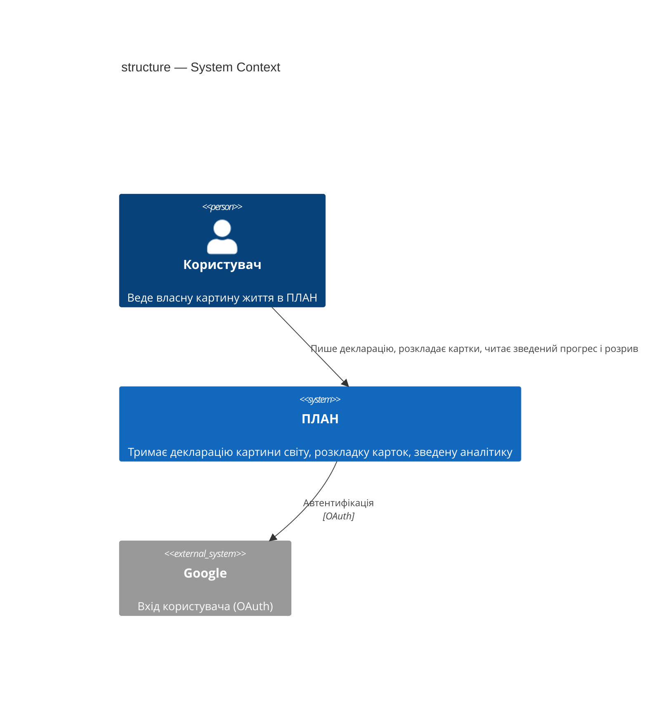

## 4. Solution strategy

**Top strategic choices (the seeds for ADRs):**

1. **Поверхні фічі — успадковано, не нове рішення.** `target_surfaces: [backend-service, web-frontend]` — Структура живе в тому самому PWA-фронтенді й на тому самому мінімальному бекенді, що й `life-area-card` (D-24, продуктовий [ADR-0001](../../adr/0001-frontend-stack.md)). Тут лише успадковується.
2. **Зведений прогрес рахується клієнтом, локально, з кешу — ніколи не кешується бекендом як готове число.** — [ADR-0001 «Recompute Structure's aggregate progress client-side from cached card events»](adr/0001-recompute-structure-aggregate-client-side.md). Вимога spec.md «100% офлайн-читання» технічно виключає окремий бекенд-агрегат без другого кешованого числа — а це відтворило б проблему, яку `life-area-card` ADR-0001 уже вирішив на рівні картки.
3. **Конфлікт офлайн-синхронізації розкладки/декларації — last-write-wins за часовою міткою, без явного конфлікт-флагу.** — [ADR-0002 «Resolve offline Structure sync conflicts by last-write-wins timestamp»](adr/0002-resolve-structure-sync-conflicts-last-write-wins.md). На відміну від `life-area-card` ADR-0002 (метрика-записи, де мовчазна втрата спотворила б вимірюване), дані Структури низькоризикові й легко відтворювані вручну.
4. **UI-архітектура (web-frontend) — успадковано.** Той самий клієнтський SPA-рендер, що й у `life-area-card` (продуктовий ADR-0001) — нового ADR немає.
5. **Літопис Структури — таблиця в тому самому мінімальному бекенді, без окремого деплой-юніту (D-24, [D-113](../../DECISIONS.md#d-113)).** Спершу розглядався окремий деплой-юніт поруч із мінімальним бекендом — [ADR-0004 «Run the Structure history log as a separate deployable service»](adr/0004-separate-service-for-structure-history-log.md), тепер Superseded. Запис і читання події літопису — звичайний виклик функції та SQL-запит у тій самій транзакції backend-процесу, нової інфраструктури не додається.

Кожне тактичне рішення в розділах нижче простежується до одного з цих п'яти.

## 5. Building block view

Шарова архітектура, як і решта продукту (`domain/` + `ui/`, [ADR-0004 «Scaffold архітектура»](../../adr/0004-scaffold-architecture.md), продуктовий): чиста доменна логіка окремо від UI-компонентів. Структура отримує власний топ-рівень модуль, окремо від `cards/` — [ADR-0003](adr/0003-own-top-level-structure-module.md).

**Навігація (чотири напрямки, узгоджено з Андрієм):**
1. **Декларація** — картина світу, навіщо, обраний тип пріоритетності.
2. **Схема** — фактична розкладка карток (drag-and-drop), картки показані лише назвами; тап на картку веде всередину неї (`life-area-card`, Структура туди не втручається).
3. **Літопис / Аналітика** — у v1 показує лише зведені числа (середній прогрес, розрив на картку, тренд — AC-01, AC-04, AC-06, AC-06b, AC-07, AC-13). Сирий перелік подій (хто/коли перейменував, переклав, закрив) НЕ показується екраном у цій версії (spec.md §3 Non-goals, D-39) — дані пишуться з першого дня (AC-15), перегляд лишається майбутнім розширенням.
4. **Картки** — навігація всередину окремої картки, поза межами цієї фічі.

**Internal decomposition (клієнт, PWA):**

```
plan/app/src/structure/
├── domain/
│   ├── declaration.ts     # декларація "картина світу, навіщо, пріоритет" — окрема модель від Опису картки
│   ├── layout.ts          # розкладка карток: 5 режимів, кожен зі своїм авто-розкладом координатами x/y (0-100% канви) + за потреби зв'язками (D-132) — клітинки прибрані повністю
│   ├── aggregate.ts       # середній прогрес + розрив + тренд, зводить life-area-card/domain/progress.ts — ADR-0001
│   └── history.ts         # локальна модель подій Структури для офлайн-кешу (AC-15) — самі події пише backend у таблицю structure_history_event (D-113)
├── ui/
│   ├── DeclarationScreen.tsx  # картина світу + чому саме така розкладка — окремий навігаційний екран
│   ├── LayoutBoard.tsx        # схема: вільне полотно (canvas), драг Pointer Events (миша й дотик), SVG-шар зв'язків (лінія/стрілка); зміна способу розкладки застосовує авто-розклад нового режиму одразу (AC-11b, D-132)
│   └── AnalyticsScreen.tsx    # зведені числа v1 (Літопис-Аналітика): прогрес, розрив, тренд — не показує сирий літопис подій
└── index.ts                    # реєстрація Структури в app-shell (singleton, не картка) + 3 навігаційні вкладки
```

**Internal decomposition (бекенд, `backend-service`):** ендпоінти Структури (singleton read/write, розкладка, декларація) і запис/читання подій літопису (AC-12, AC-15) додаються до вже наявного мінімального бекенда (D-24) — без нового деплой-юніту.

**Літопис Структури** — таблиця `structure_history_event` у тій самій базі мінімального бекенда (D-24, [D-113](../../DECISIONS.md#d-113)); спеціально під майбутнє розширення (перегляд, автозвіти — поза v1). Спершу планувався як окремий деплой-юніт — [ADR-0004](adr/0004-separate-service-for-structure-history-log.md), тепер Superseded. Бекенд приймає події (перейменовано / переміщено «за логікою» / закрито — AC-12, AC-15) і пише їх з часовою міткою в цю таблицю звичайним SQL-запитом, у тій самій транзакції. Заведення картки НЕ записується тут удруге — воно вже є в історії самої картки (`life-area-card`), AC-15.

**C4 Container (L2):**

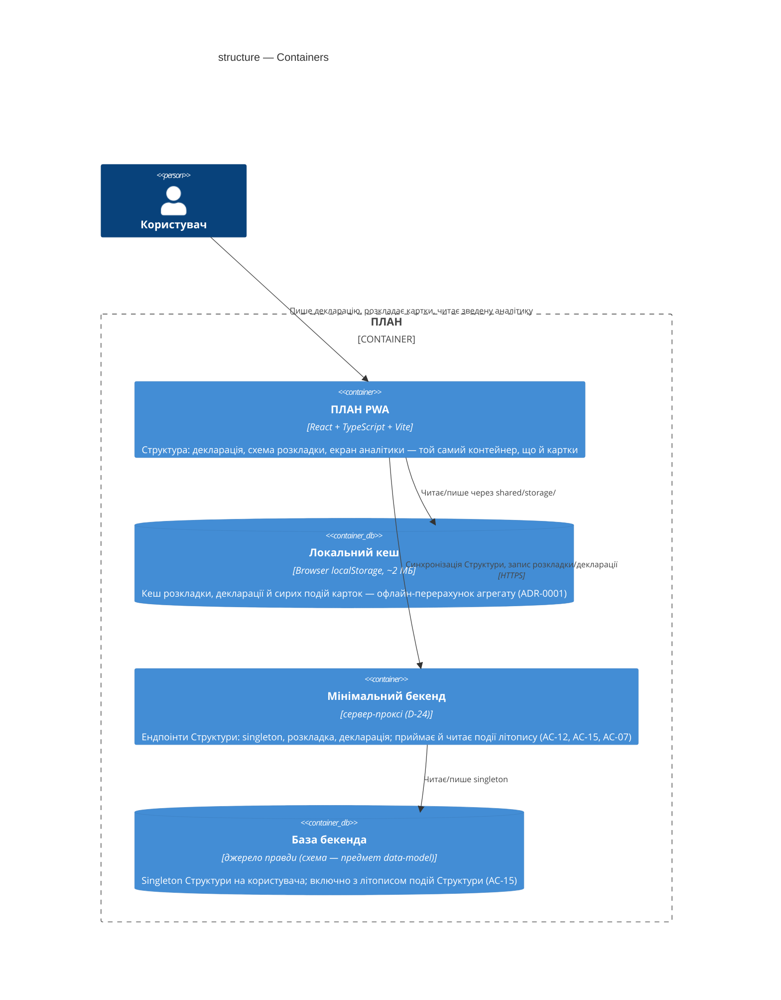

## 6. Runtime view

**Critical flow 1: Читання зведеної аналітики (happy path, AC-01, офлайн — ADR-0001)**

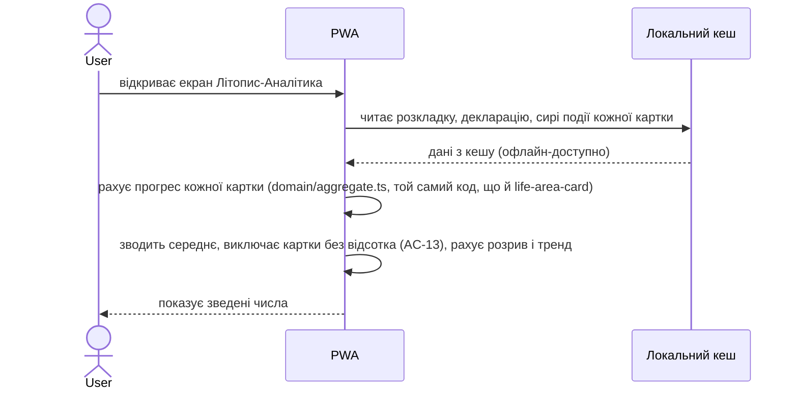

**Critical flow 2: Офлайн-переміщення картки, синхронізація з конфліктом і подія літопису (AC-08, ADR-0002, D-113, AC-15)**

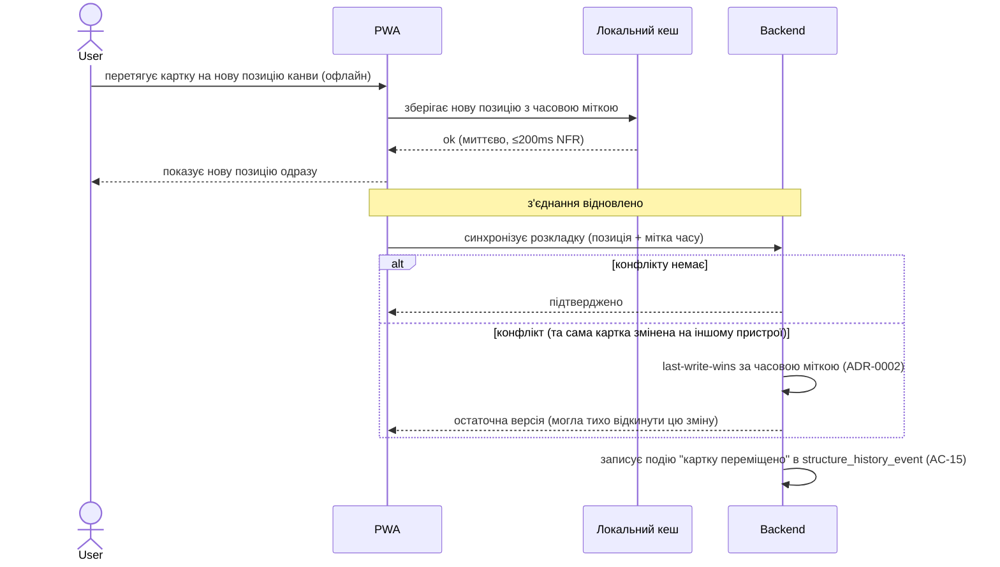

**Critical flow 3: Запис декларації Структури або вибору способу розкладки (AC-10, AC-11)**

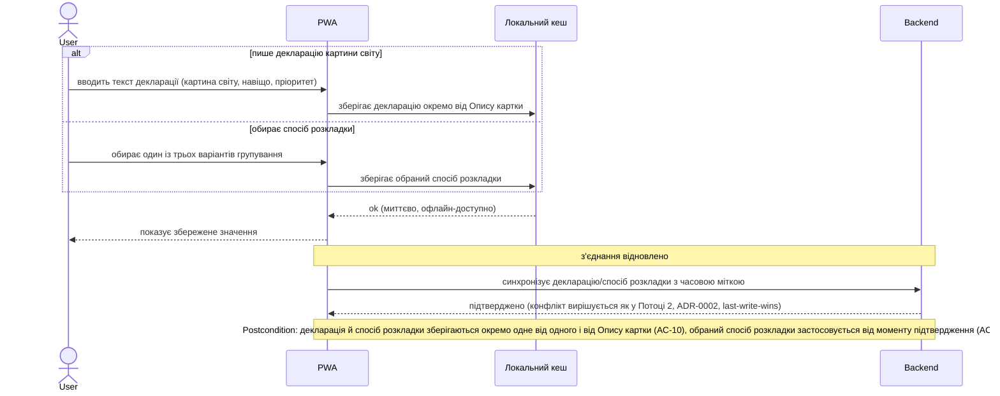

<!-- Critical flow 4 (AC-02, блокування розміщення картки на зайняту клітинку) навмисно відсутній з 2026-09-15:
     клітинкова сітка ("за логікою" тримала по одній картці на клітинку) прибрана повністю рішенням D-132
     (Андрій, чат: "Пропоную прибрати повністю оті клітинки") -- Схема стала вільним полотном
     (position_x/position_y, 0-100% канви), картки можуть перекриватись, інваріанту "клітинка зайнята"
     більше немає. AC-02 у spec.md позначене скасованим тим самим рішенням. Номер потоку не
     перевикористовується, щоб не плутати з git-історією цього флоу (той самий принцип, що Потік 5 нижче). -->

<!-- Потік 5 навмисно відсутній: чернетка "переміщення без перетягування" (AC-14) намальована й відхилена
     Андрієм того самого дня — AC-14/US-10 повністю скасовані рішенням D-64. Номер не перевикористовується,
     щоб не плутати з git-історією чернетки. -->

**Critical flow 6: Подія літопису — перейменування картки або закриття напрямку (AC-12, AC-15)**

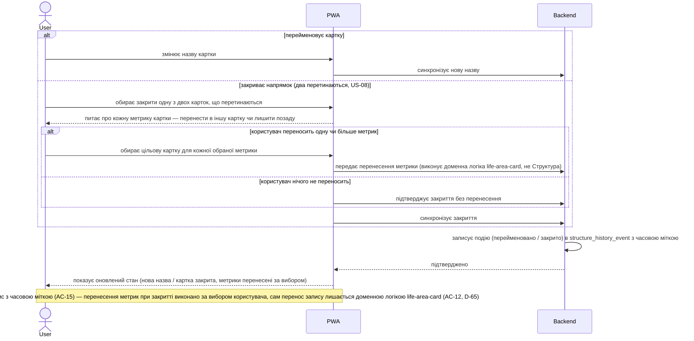

**Critical flow 7: Відмова в доступі до чужої Структури (AC-03)**

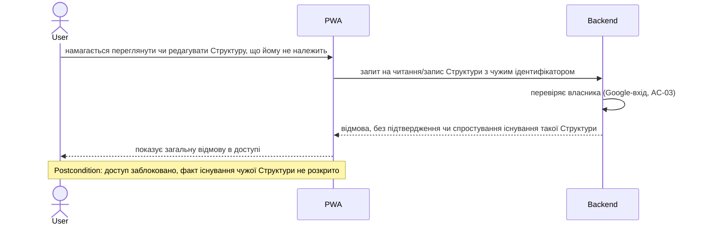

**Critical flow 8: Нова картка без обраного способу розкладки отримує дефолтну позицію (AC-09)**

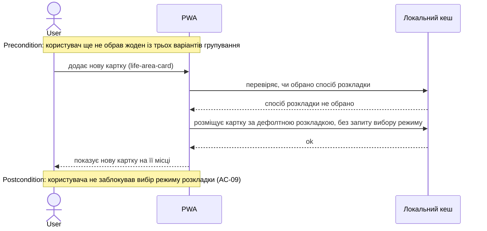

**Critical flow 9: Розрив і тренд на екрані аналітики за типом розкладки (AC-06, AC-06b, AC-07, AC-13)**

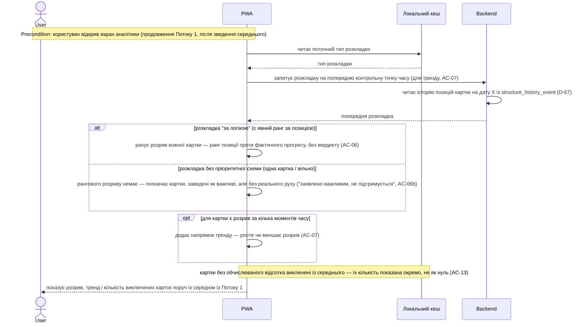

**Critical flow 10: Виправлення запису на картці одразу відображається в аналітиці Структури (AC-05)**

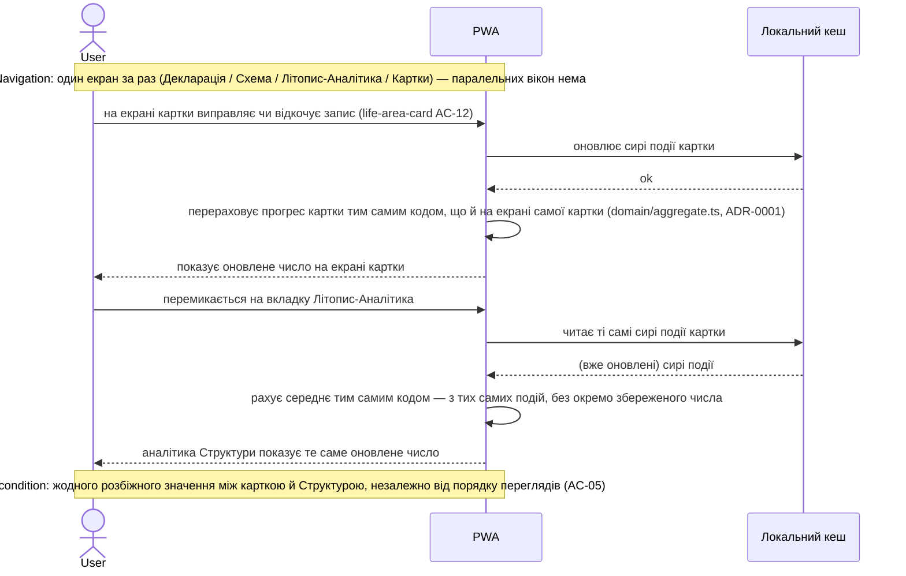

**Critical flow 11: Зміна способу розкладки застосовує авто-розклад нового режиму (AC-11b, оновлено [D-132](../../DECISIONS.md#d-132))**

> Раніше (до D-132) перемикання способу скидало всі картки вниз екрана в базовий порядок і чекало, поки користувач розкладе їх заново по клітинках нової сітки. Вільне полотно прибрало сітку — тепер `app/apply-layout-mode.ts` сам рахує й одразу записує координати кожної картки за формулою нового режиму (`domain/layout.ts computeAutoLayout`), однією атомарною дією.

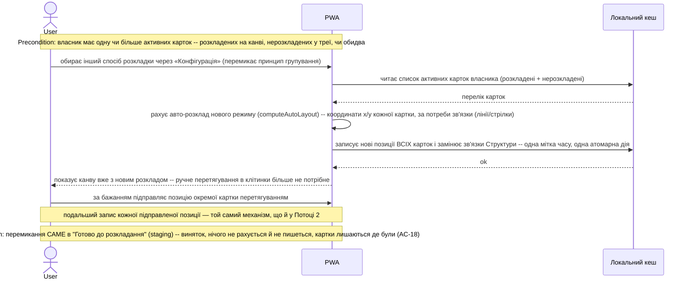

**Не рантайм-потік:** AC-04 (позиція картки в розкладці ніколи не впливає на середній прогрес) — обчислювальний інваріант усередині `domain/aggregate.ts`, перевіряється звичайним unit-тестом, а не окремою послідовністю дій користувача.

## 7. Deployment view

PWA й мінімальний бекенд (D-24) — та сама топологія, що й у `life-area-card`, без змін. Бекенд приймає й пише історію Структури (`structure_history_event`, AC-12, AC-15) у тій самій базі — без нового деплой-юніту (D-24, [D-113](../../DECISIONS.md#d-113)). Конкретний хостинг-провайдер не обраний (той самий стан, що й у самого мінімального бекенда — «жодного разу не піднімався», architecture-map.md §Migrations). Односібний застосунок — на MVP-обсязі достатньо одного інстансу бекенда, без горизонтального масштабування.

**Monitoring:**
- Клієнтські таймери для NFR (spec.md §6): p95 відкриття аналітики ≤300ms, p95 запис розкладки ≤200ms.

**Scaling thresholds:** N/A на MVP-обсязі (один користувач, десятки карток) — бекенд працює комфортно в одному інстансі.

## 8. Crosscutting concepts

| Concept | Convention | Where defined |
|---|---|---|
| Logging | успадковано з конвенцій продукту | architecture-map.md |
| Authentication | Google-вхід (OAuth), кожен запит перевіряє власника Структури — singleton на користувача (AC-03) | D-33, spec.md §6.1 |
| Error handling | валідація й попередження на лицьовій стороні, ніколи `alert`/`confirm` | architecture-map.md §Конвенції |
| ID strategy | `crypto.randomUUID()` для позицій розкладки й подій літопису | architecture-map.md |
| Internationalisation | N/A — лише українська мова | — |
| Observability | клієнтські таймери для NFR (spec.md §6) | spec.md §6 |
| Events | подія Структури (AC-15): звичайний запис у `structure_history_event` у тій самій транзакції бекенда — не окремий виклик і не шина подій | D-113 |

## 9. Architecture decisions

| # | Title | Status | Section |
|---|---|---|---|
| 0001 | Recompute Structure's aggregate progress client-side from cached card events | Accepted | §4 |
| 0002 | Resolve offline Structure sync conflicts by last-write-wins timestamp | Accepted | §4 |
| 0003 | Give Structure its own top-level module, not shared/priority | Accepted | §5 |
| 0004 | Run the Structure history log as a separate deployable service | Superseded → [D-113](../../DECISIONS.md#d-113) | §5 |

ADR files live under `docs/features/structure/adr/NNNN-<title>.md`.

## 10. Quality requirements

Each top-3 goal from §1 expanded into a full scenario:

**QG-1. Цілісність даних**
- **When:** користувач переглядає екран аналітики
- **Then:** зведений прогрес Структури завжди дорівнює тому, що показує сама картка (AC-05); розкладка/пріоритет ніколи не впливає на розрахунок середнього (AC-04)
- **How verify:** інтеграційний тест — виправити/відкотити запис на картці (`life-area-card` AC-12), перевірити, що аналітика Структури одразу показує те саме оновлене число

**QG-2. Офлайн-доступність**
- **When:** користувач відкриває застосунок без мережі / редагує розкладку чи декларацію офлайн
- **Then:** читання екрана аналітики — 100% офлайн (spec.md §6); запис розкладки й декларації приймається офлайн, синхронізується при відновленні з'єднання (spec.md §6)
- **How verify:** ручна перевірка без з'єднання — відкрити аналітику, перемістити картку, підключитись, перевірити синхронізацію

**QG-3. Швидкість відгуку**
- **When:** користувач відкриває екран аналітики / записує зміну розкладки
- **Then:** p95 відкриття екрана зведеної аналітики ≤300ms (spec.md §6, verbatim); p95 запис зміни розкладки ≤200ms (spec.md §6, verbatim)
- **How verify:** клієнтський таймер від дії до оновленого стану екрана

## 11. Risks and technical debt

| Risk / debt | Severity | Mitigation | Owner |
|---|---|---|---|
| Last-write-wins (ADR-0002) тихо відкидає ранішу зміну при одночасному офлайн-редагуванні з двох пристроїв | Low | Прийнятий борг — дані Структури низькоризикові й легко відтворювані (ADR-0002); переглянути, якщо колись з'явиться спільний доступ до однієї Структури | Андрій |
| Клієнтський перерахунок агрегату (ADR-0001) — вартість O(N) карток при кожному відкритті екрана аналітики | Low | Не оптимізуємо на MVP-обсязі (десятки карток); кеш з інвалідацією пізніше, якщо знадобиться | Андрій |

**Accepted debt (acceptable in v1, plan to fix later):**
- Last-write-wins синхронізація Структури — прийнято свідомо (ADR-0002), відповідає низькому ризику даних.

**Звірка зі spec.md §8 (single source of truth, CLAUDE.md):** ця сесія `design` закрила два прострочені відкриті питання — «щільність поля розкладки» (→ §5.2, запас вільних клітинок) і «структурне розділення декларації Структури й Опису картки» (→ §5.3, три різні екрани/файли). spec.md §8 вже позначено закритим із посиланням сюди.

## 12. Glossary

| Term | Meaning |
|---|---|
| structure | Структура — єдиний на користувача об'єкт: декларація, розкладка, аналітика (CONTEXT.md) |
| card | картка — один інстанс generic-механізму `life-area-card` (CONTEXT.md) |
| description | Опис — декларація «навіщо» на картці, структурно окремо від декларації Структури (CONTEXT.md, §5.3) |
| gap | розрив — різниця між заявленим і фактичним (CONTEXT.md) |
| structure-history | літопис Структури — подія зміни картини світу з часовою міткою (CONTEXT.md); у v1 записується (AC-15), але не показується власним екраном перегляду сирих подій |
| Літопис-Аналітика (екран) | навігаційний екран v1: показує лише зведені числа (прогрес/розрив/тренд) — не сирий літопис подій. Назва навмисно перегукується з `structure-history`, бо в майбутній версії цей самий екран розшириться до перегляду самого літопису |
| singleton | один об'єкт на користувача, не список — архітектурний термін цього SAD |
| last-write-wins | правило вирішення конфлікту синхронізації: пізніший за часовою міткою запис перемагає, ранішній тихо відкидається (ADR-0002) |
