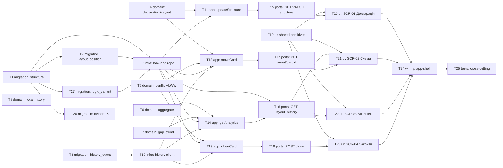

# Epic — structure

> **Spec:** [spec.md](../spec.md) · **Design:** [sad.md](../sad.md) · **Data model:** [data-model.md](../data-model.md) · **API:** [openapi.yaml](../contracts/openapi.yaml) · **Screens:** [screens.md](../screens.md) · **ADRs:** [adr/](../adr/)

## Goal

Реалізувати Структуру — декларацію картини світу, розкладку карток і зведену аналітику з чесним розривом (spec.md §2). Дві бази (основний бекенд + окремий сервіс літопису, ADR-0004), 6 API-ендпоінтів, 4 екрани.

## Scope

- **In:** доменна логіка (декларація/розкладка/агрегат/розрив-тренд/літопис), інфраструктура для двох баз, use-case шар, HTTP-ендпоінти, 4 UI-екрани, wiring в app-shell.
- **Out (spec.md §3):** поля самої картки (`life-area-card`), поведінка агента, екран перегляду сирого літопису, повноцінний інструмент об'єднання карток.

## Task map

**Доповнено 2026-08-29** ([D-89](../../../DECISIONS.md#d-89)): T26 — крос-фічева FK-міграція, вмикає каскадне видалення акаунта (`agent` AC-17).
**Доповнено 2026-08-30** ([D-83](../../../DECISIONS.md#d-83), закриває [ISS-7](../../../ISSUES.md)): T27 — три підвиди варіанта «за логікою» (баланс навколо ядра / фокус і спостереження / причина і наслідок) отримали поле в схемі, задачі T4/T9/T11/T15/T20/T21 доповнено відповідними AC-16/AC-16b.

## Tasks

See [tracker.md](./tracker.md) for status. Machine contract: [tasks.json](../tasks.json).

| # | Task | Layer | Blocked by | DoD (short) |
|---|---|---|---|---|
| T1 | Create structure table (backend DB) | migration | — | migration 01 applies/reverts cleanly |
| T2 | Create structure_layout_position table (backend DB) | migration | T1 | migration 02 applies/reverts, partial unique index live |
| T3 | Create structure_history_event table (history-service DB) | migration | — | migration applies/reverts in history-service DB |
| T4 | Domain: declaration + layout core models | domain | — | unit tests for AC-09/10/11/11b |
| T5 | Domain: layout position conflict + last-write-wins resolution | domain | — | unit tests for AC-02/08/12 |
| T6 | Domain: aggregate progress calculation | domain | — | unit tests for AC-01/04/13 |
| T7 | Domain: gap + trend calculation | domain | — | unit tests for AC-06/06b/07 |
| T8 | Domain: local history cache model | domain | — | unit tests for AC-15 local queue |
| T9 | Infra: backend repository for structure + layout positions | infra | T1, T2 | scoped reads/writes, owner isolation tested |
| T10 | Infra: history service client (write + asOf read) | infra | T3 | write+asOf round-trip tested |
| T11 | App: updateStructure use-case | app | T4, T9 | PATCH + AC-11b reset side-effect tested |
| T12 | App: moveCard use-case | app | T4, T5, T9, T10 | move + collision + LWW + history event tested |
| T13 | App: closeCard use-case | app | T5, T9, T10 | close + history event tested |
| T14 | App: getAnalytics use-case | app | T6, T7, T9, T10 | AC-05 no-drift + trend asOf tested |
| T15 | Ports: GET/PATCH /structure handlers | ports | T11 | handler matches contract |
| T16 | Ports: GET /structure/layout + /structure/layout/history handlers | ports | T9, T14 | cursor page + asOf validation |
| T17 | Ports: PUT /structure/layout/{cardId} handler | ports | T12 | 200/404/409 exactly per contract |
| T18 | Ports: POST /structure/layout/{cardId}/close handler | ports | T13 | 200/404/422 exactly per contract |
| T19 | UI: shared primitives (Spinner, Banner, ConfirmDialog, EmptyState) | ui | — | every primitive renders its states |
| T20 | UI: SCR-01 Декларація screen | ui | T19, T15 | screens.md SCR-01 states rendered |
| T21 | UI: SCR-02 Схема screen | ui | T19, T16, T17 | screens.md SCR-02 states rendered |
| T22 | UI: SCR-03 Літопис-Аналітика screen | ui | T19, T16 | screens.md SCR-03 states rendered |
| T23 | UI: SCR-04 Закрити напрямок dialog | ui | T19, T18 | screens.md SCR-04 states rendered |
| T24 | Wiring: register Структура module in app-shell | wiring | T20–T23 | 3 nav tabs boot and navigate |
| T25 | Tests: cross-cutting integration (AC-05 + offline sync) | tests | T24 | AC-05 + offline-sync e2e pass |
| T26 | Migration: add owner_user_id FK | migration | T1 | FK applies/reverts; enables cascading account deletion |
| T27 | Migration: add logic_variant column | migration | T1 | column + CHECK applies/reverts cleanly |

## Risks / Hard rules

- **ADR-0001 (recompute client-side):** T6/T7/T14 ніколи не кешують готове число агрегату/розриву на бекенді — лише сирі події.
- **ADR-0002 (last-write-wins):** T5/T12 не вводять явний конфлікт-флаг — мовчазне прийняття пізнішого запису.
- **D-66 (м'яке закриття):** T5/T13/T9 ніколи не виконують фізичний DELETE рядка позиції.
- **`sad.md §11` відкрите питання:** T10/T12/T13 не вирішують поведінку при недоступності сервісу літопису — це поза обсягом цього tasks.json, лишається TBD (той самий стан, що в `api-sync-report.md`).
- **Спец. NFR (spec.md §6):** T21 (перетягування) ≤200ms, T22 (відкриття аналітики) ≤300ms — DoD кожної UI-задачі має клієнтський таймер-тест.
