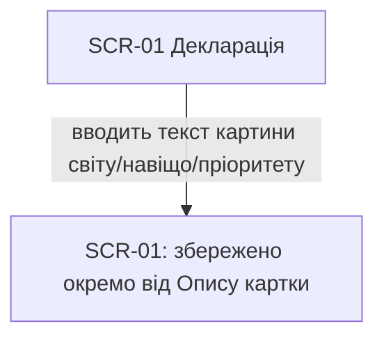
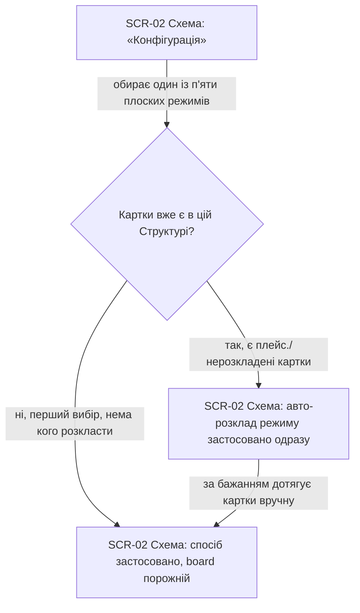
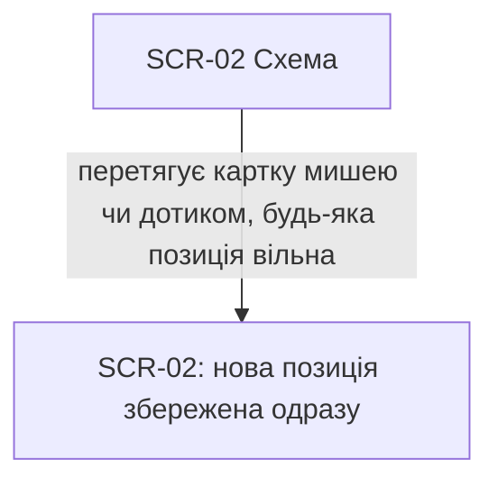
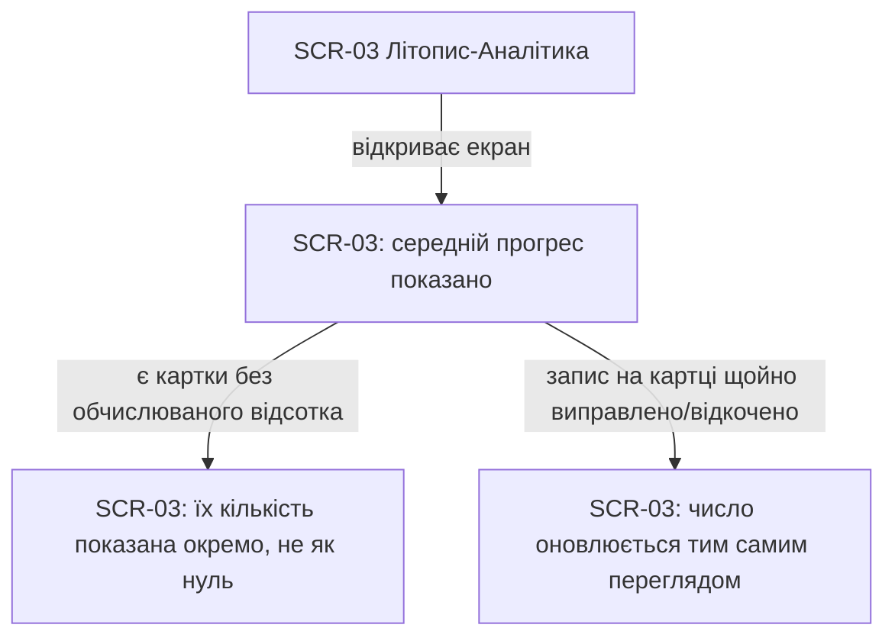
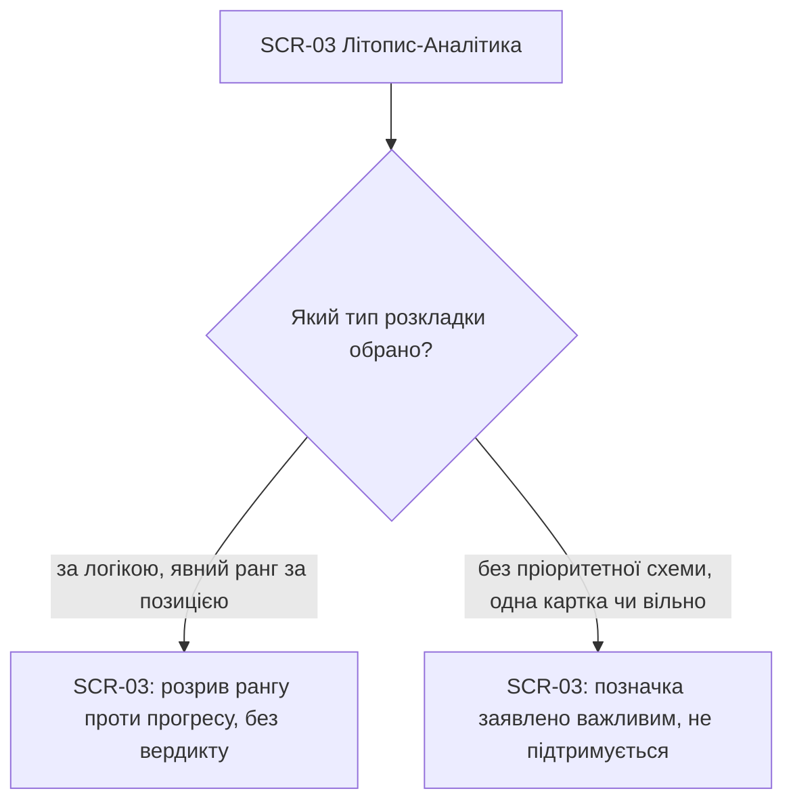
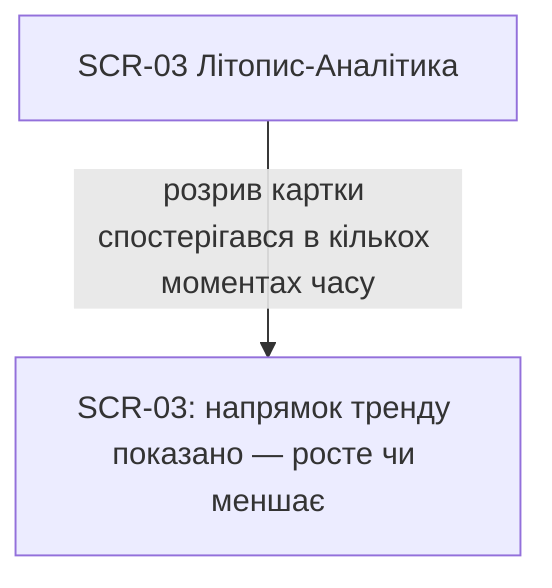
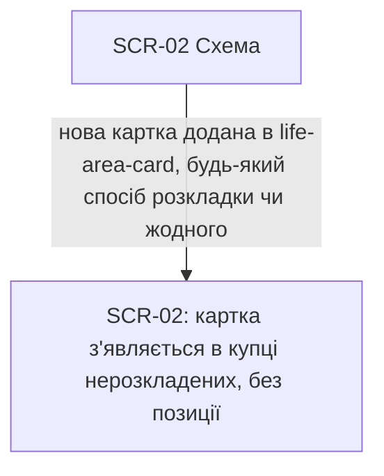
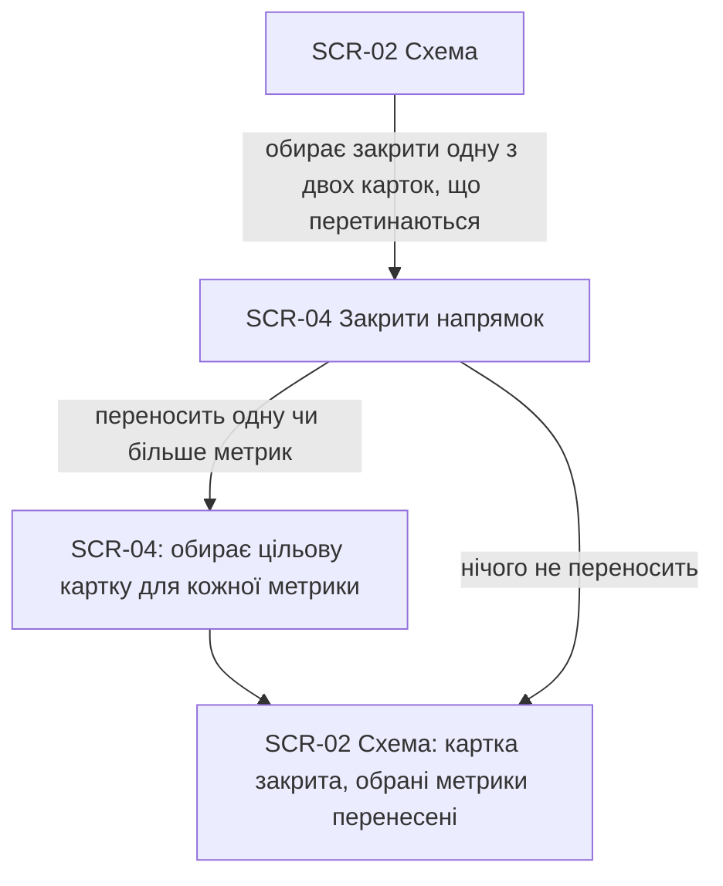

# UX flows — structure

> User flows for every UI-touching §4 user story, produced by `ux-flows` and read by `design`
> (already ran — this pass is retroactive evidence, confirming what §5 of `sad.md` already
> declared), `sequences` (already aligned on SCR ids retroactively), `screens` (details every
> inventory row next) and `plan-tests`.

## Platform decisions

- **Posture:** mobile-first — per [`docs/design-system.md`](../../design-system.md), PWA
  встановлюється на телефон (D-24), головний сценарій — телефон.
- **Navigation shape:** нижнє меню, чотири напрямки (Декларація / Схема / Літопис-Аналітика /
  Картки — останній поза межами цієї фічі), один екран відкрито за раз, без паралельних вікон
  (узгоджено з Андрієм при `/sdd:design`, `sad.md §5`).
- **Modality:** закриття напрямку (US-08) — крок/діалог поверх Схеми (SCR-04), не окрема
  навігаційна вкладка.

## Screen inventory

| ID | Screen | Purpose | Entry | Exit |
|---|---|---|---|---|
| SCR-01 | Декларація | написати картину світу/навіщо/пріоритет | нижнє меню | нижнє меню |
| SCR-02 | Схема | розкладка карток, перетягування, вхід до закриття напрямку, обрати спосіб розкладки (`config`-стан, живе тестування — переїхало сюди з SCR-01) | нижнє меню | нижнє меню, картка (`life-area-card`, поза межами), SCR-04 |
| SCR-03 | Літопис-Аналітика | зведений прогрес, розрив, тренд | нижнє меню | нижнє меню |
| SCR-04 | Закрити напрямок | вибір: перенести метрики закритої картки чи ні | дія на картці в SCR-02 | назад у SCR-02 |

**Поза межами малювання (не пропущено мовчки):**
- **US-09 (приватна Структура)** — не окремий флоу з власним екраном; це наскрізна гарантія
  авторизації (AC-03), що спрацьовує всередині будь-якого запиту, а не навігаційний крок. У
  продукті немає механізму «поділитись посиланням на чужу Структуру» — сценарію, де легітимний
  користувач фізично потрапляє на цей запит, не існує.
- **US-11 (надійний слід змін)** — запис у літопис відбувається як побічний ефект інших дій
  (перейменування картки, переміщення в SCR-02, закриття в SCR-04); власного екрана перегляду
  немає (non-goal, spec.md §3, D-39) — нема що малювати окремим флоу.

## Flows

### Flow: US-01 — Задекларувати картину світу

Користувач відкриває Декларацію, пише вільний текст, застосунок зберігає його одразу (офлайн-доступно) окремо від Опису будь-якої картки (AC-10). Явних гілок помилки в цій історії немає — жодного AC-помилки на неї не спирається.

### Flow: US-02 — Обрати спосіб розкладки

> **Оновлено (живе тестування, Андрій).** Вибір способу розкладки переїхав з SCR-01 на SCR-02 (плаваюча кнопка «Конфігурація» відкриває той самий пікер прямо на екрані Схеми) — «Налаштування розкладки схеми переносимо в сторінку схеми». Сам вибір (AC-11) і наслідок для вже розкладених карток (AC-11b) не змінились, змінилось лише ЯКИЙ екран його показує.

Користувач відкриває «Конфігурацію» на екрані Схеми й обирає спосіб розкладки. Якщо картки в Структурі вже є (розкладені під іншим способом чи ще нерозкладені) — застосунок питає підтвердження (`ConfirmDialog`), і одразу після нього сам рахує й записує авто-розклад нового режиму координатами (`domain/layout.ts computeAutoLayout`) для КОЖНОЇ активної картки власника, замінюючи й попередні позиції, і зв'язки Структури ([D-132](../../DECISIONS.md#d-132), AC-11b) — ручне перетягування вже не обов'язкове, користувач лише підправляє за бажанням. Перемикання САМЕ в «Готово до розкладання» (staging) — виняток: нічого не рахується, картки лишаються де були (AC-18).

### Flow: US-03 — Перекласти картки будь-коли

На екрані Схеми користувач вільно перетягує картку (Pointer Events, миша чи дотик) — позиція зберігається миттєво (AC-08). Вільне полотно не має клітинок і не блокує перекриття карток ([D-132](../../DECISIONS.md#d-132)) — колишня гілка «клітинка зайнята» (AC-02) скасована разом із самою сіткою.

### Flow: US-04 — Побачити зведений прогрес

Користувач відкриває Літопис-Аналітику й бачить середній прогрес по картках з обчислюваним відсотком (AC-01). Картки без відсотка не входять у середнє — їх кількість показана окремо (AC-13). Якщо перед цим було виправлено запис на самій картці — число тут одразу відображає ту саму зміну, без розбіжності (AC-05).

### Flow: US-05 — Побачити розрив

На екрані аналітики розрив показується по-різному залежно від типу розкладки. У розкладці «за логікою» — це різниця між рангом позиції картки й фактичним прогресом, чесно, без оцінки «добре/погано» (AC-06). У розкладках без пріоритетної схеми рангового розриву немає — натомість система позначає картки, заведені як важливі, але без реального руху (AC-06b).

### Flow: US-06 — Побачити тренд розриву

Якщо для картки є розрив, зафіксований у кількох точках часу, екран аналітики додатково показує, чи він росте, чи меншає — не лише поточне значення (AC-07).

### Flow: US-07 — Почати без обраного способу розкладки

Коли користувач додає нову картку (дія в `life-area-card`, поза межами цієї фічі) — картка з'являється в купці нерозкладених унизу екрана Схеми, БЕЗ позиції, незалежно від того, обрано спосіб розкладки чи ні (`defaultPositionForNewCard`, [D-132](../../DECISIONS.md#d-132)) — жодного запиту «спочатку обери спосіб групування», але й жодного автоматичного розміщення (AC-09). Користувач перетягує картку на канву сам, або дочекається наступного запуску «Конфігурація» (AC-11b), яка розкладе й цю картку разом з рештою.

### Flow: US-08 — Закрити напрямок замість об'єднання

З екрана Схеми користувач обирає закрити картку, що перетинається з іншою. На кроці закриття (SCR-04) система питає про кожну метрику картки — переносити її в іншу картку чи лишити позаду. Якщо користувач обирає перенести — вказує цільову картку для кожної; якщо ні — просто підтверджує закриття. В обох випадках закриття записується подією в літопис (AC-12).

## AC coverage

| AC | Shown by | Notes |
|---|---|---|
| AC-01 | Flow US-04 → B | happy path зведеного прогресу |
| AC-02 | N/A — скасовано D-132 | клітинкова сітка прибрана повністю, колишню гілку "зайнята клітинка" видалено з Flow US-03 |
| AC-03 | N/A — не окремий флоу | наскрізна авторизація, спрацьовує в будь-якому запиті, немає навігаційного сценарію легітимного користувача до чужої Структури (див. вище) |
| AC-04 | N/A — обчислювальний інваріант | не рантайм-гілка й не UI-гілка (те саме, що вже позначено в `sad.md §6`), не має видимого стану екрана |
| AC-05 | Flow US-04 → гілка "виправлено запис" | |
| AC-06 | Flow US-05 → гілка "за логікою" | |
| AC-06b | Flow US-05 → гілка "без схеми" | |
| AC-07 | Flow US-06 → B | |
| AC-08 | Flow US-03 → B | |
| AC-09 | Flow US-07 → B | |
| AC-10 | Flow US-01 → B | happy path, окремого AC-помилки немає |
| AC-11 | Flow US-02 → гілка "перший вибір" | |
| AC-11b | Flow US-02 → гілка "зміна способу" | |
| AC-12 | Flow US-08 → B/C/D | |
| AC-13 | Flow US-04 → гілка "картки без відсотка" | |
| AC-15 | N/A — немає власного екрана | запис відбувається побічно (перейменування/переміщення/закриття вже показані в інших флоу), перегляд літопису — non-goal v1 (spec.md §3) |
